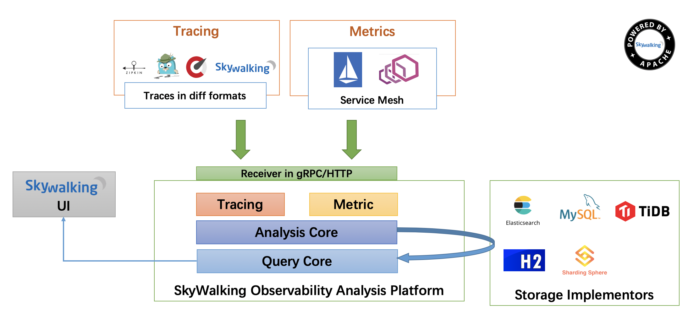
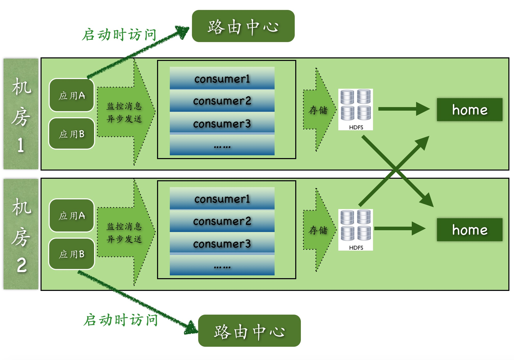
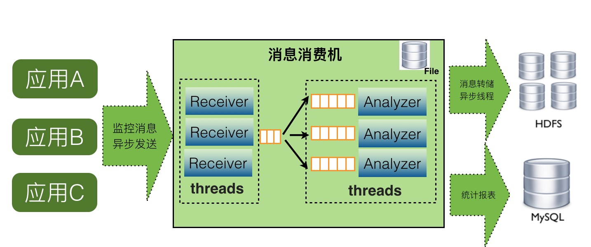

市面上有很多分布式链路监控的工具，各有优点，可根据具体情况选择。
<!--more-->

- [调研](#%e8%b0%83%e7%a0%94)
  - [整体架构](#%e6%95%b4%e4%bd%93%e6%9e%b6%e6%9e%84)
    - [zipkin](#zipkin)
    - [skywalking](#skywalking)
    - [cat](#cat)
  - [基本原理](#%e5%9f%ba%e6%9c%ac%e5%8e%9f%e7%90%86)
    - [zipkin](#zipkin-1)
    - [skywalking](#skywalking-1)
    - [cat](#cat-1)
  - [接入方式](#%e6%8e%a5%e5%85%a5%e6%96%b9%e5%bc%8f)
  - [数据收集](#%e6%95%b0%e6%8d%ae%e6%94%b6%e9%9b%86)
  - [UI](#ui)
  - [数据存储方案](#%e6%95%b0%e6%8d%ae%e5%ad%98%e5%82%a8%e6%96%b9%e6%a1%88)
  - [支持语言](#%e6%94%af%e6%8c%81%e8%af%ad%e8%a8%80)
  - [使用者](#%e4%bd%bf%e7%94%a8%e8%80%85)
  - [版本迭代速度](#%e7%89%88%e6%9c%ac%e8%bf%ad%e4%bb%a3%e9%80%9f%e5%ba%a6)
  - [其它](#%e5%85%b6%e5%ae%83)
  - [总结](#%e6%80%bb%e7%bb%93)
  - [参考文档](#%e5%8f%82%e8%80%83%e6%96%87%e6%a1%a3)

## 调研
市面上的APM（Application Performance Management）理论模型大多都是借鉴Google Dapper论文。

我最近也在选取使用哪一个工具，这里的对比是在Spring Cloud 中的使用。

对比三种工具：
- zipkin：Twitter公司开源的一个分布式追踪工具，被Spring Cloud Sleuth集成，使用广泛而稳定
- skywalking：中国人吴晟（华为）开源的一款分布式追踪，分析，告警的工具，现在是Apache旗下开源项目
- cat：大众点评开源的一款分布式链路追踪工具。

### 整体架构

#### zipkin


zipkin分为zipkin服务端和客户端，每一个被监控的服务都是客户端。

组件：
- 追踪器：位于客户端，并记录有关发生的操作的时间和元数据，对用户透明
- Reporter： 将数据发送到Zipkin的检测应用程序
- Transport ：传输数据：HTTP, Kafka and Scribe.
- Collector：位于服务端中，收集传输来的数据
- Storage ：存储数据，默认存储在内存中
- search ：查询api，JSON应用编程接口，被UI调用
- UI ：Web UI提供了一种基于服务，时间Annotation查看跟踪的方法。UI中没有内置身份验证

#### skywalking



组件：
skywalking分为四个部分:探针，平台后端，存储，UI
- Probes,探针，探针因使用的语言不同而不通，收集数据并且格式化为skywalking所需的格式。
- Platform backend 平台后端，对应于zipkin server，可以集群部署，聚合，分析，将数据展示在UI中
- Storage：存储，可扩展的存储，可以使es，H2，MySQL集群
- UI 丰富的可视化功能，提供身份验证


#### cat



- cat-client 业务模块，埋点，发送消息给consumer
- cat-consumer，分析从client接收的数据
- cat-home 将数据展示在控制端
- 存储

### 基本原理

#### zipkin

```
┌─────────────┐ ┌───────────────────────┐  ┌─────────────┐  ┌──────────────────┐
│ User Code   │ │ Trace Instrumentation │  │ Http Client │  │ Zipkin Collector │
└─────────────┘ └───────────────────────┘  └─────────────┘  └──────────────────┘
       │                 │                         │                 │
           ┌─────────┐
       │ ──┤GET /foo ├─▶ │ ────┐                   │                 │
           └─────────┘         │ record tags
       │                 │ ◀───┘                   │                 │
                           ────┐
       │                 │     │ add trace headers │                 │
                           ◀───┘
       │                 │ ────┐                   │                 │
                               │ record timestamp
       │                 │ ◀───┘                   │                 │
                             ┌─────────────────┐
       │                 │ ──┤GET /foo         ├─▶ │                 │
                             │X-B3-TraceId: aa │     ────┐
       │                 │   │X-B3-SpanId: 6b  │   │     │           │
                             └─────────────────┘         │ invoke
       │                 │                         │     │ request   │
                                                         │
       │                 │                         │     │           │
                                 ┌────────┐          ◀───┘
       │                 │ ◀─────┤200 OK  ├─────── │                 │
                           ────┐ └────────┘
       │                 │     │ record duration   │                 │
            ┌────────┐     ◀───┘
       │ ◀──┤200 OK  ├── │                         │                 │
            └────────┘       ┌────────────────────────────────┐
       │                 │ ──┤ asynchronously report span     ├────▶ │
                             │                                │
                             │{                               │
                             │  "traceId": "aa",              │
                             │  "id": "6b",                   │
                             │  "name": "get",                │
                             │  "timestamp": 1483945573944000,│
                             │  "duration": 386000,           │
                             │  "annotations": [              │
                             │--snip--                        │
                             └────────────────────────────────┘
```

当发起一个调用，Trace Instrumentation会拦截请求，添加tag，添加traceID和spanID进http头，当服务返回时，它会异步地向Collector发送数据。Collector受到数据后存储，分析，同时UI会展示数据在界面上。

#### skywalking

探针将数据通过gRPC或者HTTP传输给后端平台（server），后端平台将数据存储在Storage中，并且分析数据将结果展示在UI中

#### cat
客户端：收集数据通过ThreadLocal，将数据存在ThreadLocal中，当结束时发送数据给服务端。

举例：


序列化与通信：自定义的序列化协议，Netty数据传输

服务端：



监控模型：
- Transaction：适合记录跨越系统边界的程序访问行为,比如远程调用，数据库调用，也适合执行时间较长的业务逻辑监控，Transaction用来记录一段代码的执行时间和次数
- Event：用来记录一件事发生的次数，开销较小
- Heartbeat：表示程序内定期产生的统计信息, 如CPU利用率, 内存利用率, 连接池状态, 系统负载等
- Metric：用于记录业务指标、指标可能包含对一个指标记录次数、记录平均值、记录总和，业务指标最低统计粒度为1分钟


| 类别       | 实现方式   |
| -----      | --------- |
| zipkin     |    拦截请求     |
| skywalking | java探针，字节码增强  |
| cat        | 代码埋点  |


### 接入方式

| 类别         | 接入方式               | agent到collector的协议  | 
| -----       | ---------              | ----------  |
| zipkin      | sleuth，引入依赖和配置  |  http，mq |
| skywalking  | javaanent              | gRPC，http |
| cat         | 代码侵入                | http/tcp  |


### 数据收集

| 类别       | 数据 |
| ----- | --------- |
| zipkin     |  链路，耗时  |
| skywalking | 链路，耗时，cpu，mem，JVM  |
| cat        | 链路，耗时，cpu，mem，JVM |


### UI

| 类别 | 丰富度  |
| ----- | --------- |
| zipkin | 一般   |
| skywalking | 丰富 |
| cat    |  丰富|


### 数据存储方案


| 类别   | 存储方案  |
| ----- | --------- |
| zipkin | 内存，mysql，es，Cassandra   |
| skywalking | es，mysql，h2,TiDB |
| cat    |  mysql，hdfs |


### 支持语言

| 类别 | 语言 |
| ----- | --------- |
|zipkin |  C#,Go,Java,JS,Ruby,Scala,PHP;社区支持c++，Python |
| skywalking | Java，c#，PHP，Node.js |
| cat |  Java, C/C++, Node.js, Python, Go |


### 使用者

| 类别 | 使用者 |
| ----- | --------- |
| zipkin |   多   |
| skywalking | 多 |
| cat  | 较多  |

### 版本迭代速度

| 类别    | 速度 |
| ----- | --------- |
| zipkin   |   快  |
| skywalking | 快  |
| cat       | 慢   |

### 其它

| 类别       |作者    | 粒度 | traceID查询 | 告警    | 依赖分析 | OpenTracing标准 |
| ----- | --------- | ----- | --------- | -----   | --------- | ------------ | 
| zipkin     | twitter  | 接口级 |     yes   | no     | yes     |   部分支持 |
| skywalking | 吴晟，华为| 方法级 |     yes   | yes    | yes     |  完全支持 |
| cat        | 吴其敏，尤勇，大众点评 | 代码级  |    no    | yes    |   no     | 不支持 |

注：OpenTracing通过提供平台无关、厂商无关的API，使得开发人员能够方便的添加（或更换）追踪系统的实现。 

### 总结

zipkin

- 优点：轻量级，springcloud集成，使用人数多，成熟
- 不足：功能简单，只有链路监控

skywalking
- 优点：采集数据丰富，UI友好，扩展性高，使用者多，支持中间件以及框架多，社区活跃
- 缺点：

cat
- 优点采集数据非常丰富，UI友好，粒度最细
- 代码侵入，需改动业务代码，git不够活跃，更新缓慢，存储支持不够广泛


这些工具各有长短，根据实际场景不同选择之。

### 参考文档
[https://zipkin.io/](https://zipkin.io/)   
[https://github.com/apache/skywalking](https://github.com/apache/skywalking)   
[https://github.com/dianping/cat/wiki](https://github.com/dianping/cat/wiki)   
[https://juejin.im/post/5a274614518825592c07f8b8](https://juejin.im/post/5a274614518825592c07f8b8)   
[https://www.jianshu.com/p/0fbbf99a236e](https://www.jianshu.com/p/0fbbf99a236e)    