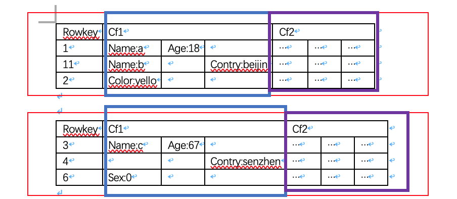

HBase是一个分布式，可扩展，多版本，大数据存储的非关系型数据库。
<!--more-->

- [简介](#%e7%ae%80%e4%bb%8b)
- [特点](#%e7%89%b9%e7%82%b9)
- [缺点](#%e7%bc%ba%e7%82%b9)
- [架构](#%e6%9e%b6%e6%9e%84)
  - [HMaste](#hmaste)
  - [HRegionServer](#hregionserver)
    - [对外提供的接口](#%e5%af%b9%e5%a4%96%e6%8f%90%e4%be%9b%e7%9a%84%e6%8e%a5%e5%8f%a3)
  - [zookeeper](#zookeeper)
  - [客户端](#%e5%ae%a2%e6%88%b7%e7%ab%af)
- [数据模型](#%e6%95%b0%e6%8d%ae%e6%a8%a1%e5%9e%8b)
- [存储](#%e5%ad%98%e5%82%a8)
- [使用](#%e4%bd%bf%e7%94%a8)
- [shell命令](#shell%e5%91%bd%e4%bb%a4)
- [脚本使用](#%e8%84%9a%e6%9c%ac%e4%bd%bf%e7%94%a8)
  - [hbase脚本参数](#hbase%e8%84%9a%e6%9c%ac%e5%8f%82%e6%95%b0)
- [java api](#java-api)
  - [操作表](#%e6%93%8d%e4%bd%9c%e8%a1%a8)
  - [操作数据](#%e6%93%8d%e4%bd%9c%e6%95%b0%e6%8d%ae)
- [参考](#%e5%8f%82%e8%80%83)

## 简介
首先HBase是一个数据库，和MySQL类似，为了存储数据而存在，不过它适用的场景是大数据领域，当MySQL在单台机器或者经过分库分表之后都还是难以满足需求的情况，就可以考虑使用HBase了。

针对它的特点：
1. 分布式：它依赖HDFS（hadoop分布式文件系统），进行分布式存储
2. 可扩展：HBase的存储可以通过添加机器，添加RegionServer来进行扩展
3. 多版本：一条数据被更新多次后依旧可以查询到之前的版本，它会保留多个版本
4. 非关系型数据库：关系型数据库就是二维表，非关系型就是非二维表结构，在HBase中都是kv键值对存储

## 特点
1. 可扩展
2. 严格一致性读写，在cap理论中保证了CP
3. 自动或者可配置的表切片
4. regionServer之间故障转移
5. 块缓存（BlockCache）和布隆过滤器加快查询效率
6. wal预写日志，几乎所有的数据库都会采用wal技术
7. 支持通过Hadoop指标子系统将指标导出到文件或Ganglia；或者jmx

## 缺点
1. 单一rowkey导致多维查询效率低下
2. 不直接支持SQL
3. 仅支持行级事务

当然，这些都可以被其他中间件解决，比如phoenix
## 架构


hbase是一个分布式的系统，基于master/slaver架构，并且依赖zookeeper。屏蔽底层依赖的HDFS，也就剩下三个组件：HMaster，RegionServer，zookeeper。它们的作用分别如下：

### HMaste
Hmaster是master，通常运行在有namenode的机器上，功能：
- 处理用户的各种管理请求：建表，修改表，删除表，权限操作，切分表，合并分片，compactions
- 管理所有的RS，包括Region的负载均衡，RS的宕机恢复，Region的迁移
- 清理过期日志以及文件，每隔一段时间会检查hdfs上的hlog，hfile是否过期，过期则删除

HMaster提供的接口：
- Table (createTable, modifyTable, removeTable, enable, disable)
- ColumnFamily (addColumn, modifyColumn, removeColumn)
- Region (move, assign, unassign)
可以认为是ddl

HMaster是一个领导整个集群的作用，它管理RegionServer，管理表结构信息，表的元数据信息，因此当它down掉后，会损失部分功能。由此可见在设计上需要避免单点故障，因此在上图中虽然只有一个HMaster，但实际上会配置多个HMaster，在同一时刻只有一个HMaster是活跃（active）状态，其它的HMaster只是备胎（standby），当zk发现现有的HMaster挂掉了之后会从备胎中选出一个作为active。

那么如何保证active和standby之间的数据一致性呢：热备

### HRegionServer

HRegionServer 是slaver，通常放在datanode的机器上,主要响应用户的IO请求，管理一些Region（Region就是一张表的横向切片）。RegionServer是真正的对数据操作的执行者，包括增删改查；还有合并HFile，当一个Region太大的时候还会切分。

放在datanode上是因为可以更好的让数据本地化，也就是这个RegionServer管理的Region就在此台机器上。

#### 对外提供的接口
- Data (get, put, delete, next, etc)
- Region (splitRegion, compactRegion, etc) 

### zookeeper
功能：
- 实现master的高可用：为了避免单点故障，启动多个master，但是只有一个master是active；当zk观测到master宕机时，会选举出一个master
- 管理元数据：hbase:meta的所在RegionServer的位置等
- 参与RegionServer宕机恢复，存储各种中间过程状态，在比如切分过程中，必定存在各种状态，zk就是用来让RegionServer和HMaster通信
- 实现分布式表锁

### 客户端
通过客户端向hbase发送指令。

可以看见在HMater和Regionserver上做了职责切分，HMater总览全局，RegionServer是执行者。在正常情况下HMaster的压力是比较小的。整体架构如上，数据真实存在各个RegionServer管理的Region上。

## 数据模型
在MySQL上，分为database，table，row，col。这是MySQL数据的逻辑结构，在hbase上逻辑结构如下：

在hbase中，分为命名空间（namespace），表（table），行（row），列簇（column family），列（column Qualifier），cell，timestamp

1. namespace：表的逻辑分组，用来区分表在哪一个命名空间，类似MySQL中的database
2. table：属于一个namespace，一个table由很多行（row）组成，类似MySQL中的table
3. row：一行由多个列的值组成，每一行有一个唯一的rowkey，按照**字典序升序排列**
4. column family（列簇）：每一个表有多个列簇，一个列簇可以包含多个列，在创建表时需要指定，因为在表结构中会定义列簇而不会定义列；
5. column Qualifier：每一个列都属于一个列簇，由“列簇：列标识”标识，创建表的时候不指定列标识
6. cell，一个单元格，由rowkey，(column family:column),timestamp,value确定，标识一个版本；时间戳表示写入数据时在RegionServer上的时间，在将数据放入单元格时也可以指定其他时间戳值。
7. timestamp，时间戳，用来确定一个值的版本，一个cell可有由多个版本，但是只有最新的有效
8. version：一个单元格可以有多个版本，并且按照时间戳降序排序；可以设置版本数
9. 排序：HBase的所有数据模型操作均按排序顺序返回数据。首先是按行，然后是ColumnFamily，然后是column qualifier，最后是时间戳（按相反顺序排序，因此首先返回最新记录）。

以一张图举例:   


这是一张表，有两个横向切分，红色部分是两个Region，在Region中有两个Region分别用蓝色和紫色指出，每一个都是一个Store。在一个列簇中可以有多个不同的列。

例子：
```sh
# 创建表名为test，包含一个列簇cf1
# 没有指定命名空间，默认为default
create 'test','cf1'
# 存入rowkey为1，列为cf1:name，值为liunn，当前时间错得数据
put 'test','rowkey1','cf1:name','liunn'
put 'test','rowkey1','cf1:age','18'
put 'test','rowkey2','cf1:addr','china'
put 'test','rowkey2','cf1:color','yello'
# 查看test存储的所有的数据，2行，一个列簇，4列，4个单元格
ROW                           COLUMN+CELL
 rowkey1                      column=cf1:age, timestamp=1572506321932, value=18
 rowkey1                      column=cf1:name, timestamp=1572506338839, value=liunn
 rowkey2                      column=cf1:addr, timestamp=1572507573798, value=china
 rowkey2                      column=cf1:color, timestamp=1572507585208, value=yello
2 row(s)

```
可以看见数据并非像mysql一样按行存储，而是按列存储，每一个单元格就是一个**key-value**对

## 存储
表的数据存储在hdfs上，也就是datanode上，它的物理结构如下

1. Region：表的**横向切分**，当表过大的时候就会分片，分为多个region。比如一张表的rowkey是1--100，那么它可以1--50一个region,50-100一个region。
2. store，一个Store是属于一个region，在一个Region中按照列簇切分为多个store。比如一张表有两个列簇，那么每个Region都有两个store。store又分为内存和磁盘。
3. memStore：内存中的数据，为了加快写的速度而存在
4. storeFile：在store内部，包含多个storeFile，sotreFile是由memStore一次flush产生的，每一次flush都会产生一个storeFile
5. Hlog:wal中的预写日志
6. HFile：数据格式

如下图所示：   


## 使用
1. 安装
2. 启动`start-dfs.sh start-hbase.sh`
3. 使用shell操作

## shell命令
可以参考 https://blog.csdn.net/vbirdbest/article/details/88236575

以`hbase shell`启动shell

```
hbase(main):013:0> help

COMMAND GROUPS:
  Group name: general
  Commands: processlist, status, table_help, version, whoami

  Group name: ddl
  Commands: alter, alter_async, alter_status, clone_table_schema, create, describe, disable, disable_all, drop, drop_all, enable, enable_all, exists, get_table, is_disabled, is_enabled, list, list_regions, locate_region, show_filters

  Group name: namespace
  Commands: alter_namespace, create_namespace, describe_namespace, drop_namespace, list_namespace, list_namespace_tables

  Group name: dml
  Commands: append, count, delete, deleteall, get, get_counter, get_splits, incr, put, scan, truncate, truncate_preserve

  Group name: tools
  Commands: assign, balance_switch, balancer, balancer_enabled, catalogjanitor_enabled, catalogjanitor_run, catalogjanitor_switch, cleaner_chore_enabled, cleaner_chore_run, cleaner_chore_switch, clear_block_cache, clear_compaction_queues, clear_deadservers, close_region, compact, compact_rs, compaction_state, flush, hbck_chore_run, is_in_maintenance_mode, list_deadservers, major_compact, merge_region, move, normalize, normalizer_enabled, normalizer_switch, split, splitormerge_enabled, splitormerge_switch, stop_master, stop_regionserver, trace, unassign, wal_roll, zk_dump

  Group name: replicat‘ion
  Commands: add_peer, append_peer_exclude_namespaces, append_peer_exclude_tableCFs, append_peer_namespaces, append_peer_tableCFs, disable_peer, disable_table_replication, enable_peer, enable_table_replication, get_peer_config, list_peer_configs, list_peers, list_replicated_tables, remove_peer, remove_peer_exclude_namespaces, remove_peer_exclude_tableCFs, remove_peer_namespaces, remove_peer_tableCFs, set_peer_bandwidth, set_peer_exclude_namespaces, set_peer_exclude_tableCFs, set_peer_namespaces, set_peer_replicate_all, set_peer_serial, set_peer_tableCFs, show_peer_tableCFs, update_peer_config

  Group name: snapshots
  Commands: clone_snapshot, delete_all_snapshot, delete_snapshot, delete_table_snapshots, list_snapshots, list_table_snapshots, restore_snapshot, snapshot

  Group name: configuration
  Commands: update_all_config, update_config

  Group name: quotas
  Commands: list_quota_snapshots, list_quota_table_sizes, list_quotas, list_snapshot_sizes, set_quota

  Group name: security
  Commands: grant, list_security_capabilities, revoke, user_permission

  Group name: procedures
  Commands: list_locks, list_procedures

  Group name: visibility labels
  Commands: add_labels, clear_auths, get_auths, list_labels, set_auths, set_visibility

  Group name: rsgroup
  Commands: add_rsgroup, balance_rsgroup, get_rsgroup, get_server_rsgroup, get_table_rsgroup, list_rsgroups, move_namespaces_rsgroup, move_servers_namespaces_rsgroup, move_servers_rsgroup, move_servers_tables_rsgroup, move_tables_rsgroup, remove_rsgroup, remove_servers_rsgroup

```

常用命令

| 命名 | 描述 | 语法 |
| --- | --- | --- |
| help ‘命名名’ | 查看命令的使用描述 | help ‘命令名’ |
| whoami | 我是谁 | whoami |
| version | 返回hbase版本信息 | version |
| status | 返回hbase集群的状态信息 | status |
| table_help | 查看如何操作表 | table_help |
| create | 创建表 | create ‘表名’, ‘列族名1’, ‘列族名2’, ‘列族名N’ |
| alter | 修改列族 | 添加一个列族：alter ‘表名’, ‘列族名’ ;删除列族：alter ‘表名’, {NAME=> ‘列族名’, METHOD=> ‘delete’} |
| describe | 显示表相关的详细信息 | describe ‘表名’ |
| list | 列出hbase中存在的所有表 | list |
| exists | 测试表是否存在 | exists ‘表名’ |
| put | 添加或修改的表的值 | put ‘表名’, ‘行键’, ‘列族名:列名’, ‘列值’ |
| append |在一个单元格内追加数据| append 'talbeName','rowkey','cf:col','val'|
| scan | 通过对表的扫描来获取对用的值 | scan ‘表名’ ; 扫描某个列族： scan ‘表名’, {COLUMN=>‘列族名’} ;扫描某个列族的某个列： scan ‘表名’, {COLUMN=>‘列族名:列名’} ;查询同一个列族的多个列： scan ‘表名’, {COLUMNS => [ ‘列族名1:列名1’, ‘列族名1:列名2’, …]} |
| get | 获取行或单元（cell）的值 | get ‘表名’, ‘行键’ ;get ‘表名’, ‘行键’, ‘列族名’ |
| count | 统计表中行的数量 | count ‘表名’ |
| incr | 增加指定表行或列的值 | incr ‘表名’, ‘行键’, ‘列族:列名’, 步长值 |
| get_counter | 获取计数器 | get_counter ‘表名’, ‘行键’, ‘列族:列名’ |
| delete | 删除指定对象的值（可以为表，行，列对应的值，另外也可以指定时间戳的值） | 删除列族的某个列： delete ‘表名’, ‘行键’, ‘列族名:列名’ |
| deleteall | 删除指定行的所有元素值 | deleteall ‘表名’, ‘行键’ |
| truncate | 重新创建指定表 | truncate ‘表名’ |
| enable | 使表有效 | enable ‘表名’ |
| is_enabled | 是否启用 | is_enabled ‘表名’ |
| disable | 使表无效 | disable ‘表名’ |
| is_disabled | 是否无效 | is_disabled ‘表名’ |
| drop | 删除表 | drop的表必须是disable的 ,disable ‘表名’ ,drop ‘表名’ |
| clone_snapshot| 从snapshot中克隆一个新表| clone_snapshot 'snapshotName', 'tableName'|
| snapshot | 创建一个快照| snapshot 'namespace:sourceTable', 'snapshotName', {SKIP_FLUSH => true}|
| restore_snapshot | 从快照中恢复，快照点之后的数据被删除 | restore_snapshot 'snapshotName'|
| list_snapshots, list_table_snapshots | 列出快照 | |
| delete_all_snapshot, delete_snapshot, delete_table_snapshots |删除快照 | |
| shutdown | 关闭hbase集群（与exit不同） |  |
| tools | 列出hbase所支持的工具 |  |
| exit | 退出hbase shell |  |

这些命令都可以通过help 'xxx'查询，并且都是Ruby格式的脚本。


## 脚本使用
1. 开启集群`start-hbase.sh`
2. 关闭集群`stop-hbase.sh`
3. 开启/关闭所有rs，zk`hbase-daemons.sh start/stop regionserver/zookeeper`
4. 开启/关闭单个rs，zk`hbase-daemon.sh start/stop regionserver/zookeeper`
5. 开启/关闭master`hbase-daemon.sh start/stop master`，是否成为active取决于当前是否存在active master

### hbase脚本参数
1. hbase shell
2. hbase hbck,运维时候用，检查集群数据一致性状态，执行是直接调用org.apache.hadoop.hbase.util.HBaseFsck中的main函数
3. hbase hlog，log分析工具，其执行是直接调用org.apache.hadoop.hbase.regionserver.wal.HLogPrettyPrinter中的main函数
4. hbase hfile， hfile分析工具，其执行是直接调用org.apache.hadoop.hbase.io.hfile.HFile中的main函数
5. hbase zkcli,查看/管理ZK的shell工具
6. hbase classpath，打印classpath
7. hbase version，打印版本


## java api
java api就是将shell中的命令封装成了java对象。

通常在操作之前先获取配置，然后获取连接

```java
    private static Configuration conf;
    private static Connection conn;
    private static Logger logger= LoggerFactory.getLogger(Two.class);
    static {
        conf=HBaseConfiguration.create();
        try {
            conn= ConnectionFactory.createConnection(conf);
        } catch (IOException e) {
            e.printStackTrace();
        }
    }
```
### 操作表
对表的操作，ddl，需要类`HBaseAdmin`
```java
HBaseAdmin admin= (HBaseAdmin) conn.getAdmin();

// HTableDescriptor对应对表信息的描述
//HColumnDescriptor对应对列簇的描述

 /**
     * 预分区创建表
     * @param tableName
     * @param splitsKeys
     * @param columnFamily
     * @throws IOException
     */
    public static void createTablePreSplit(String tableName,byte[][] splitsKeys,String... columnFamily) throws IOException {
        HBaseAdmin admin= (HBaseAdmin) conn.getAdmin();
        HTableDescriptor descriptor=new HTableDescriptor(TableName.valueOf(tableName));
        //添加列簇
        for(String cf:columnFamily){
            descriptor.addFamily(new HColumnDescriptor(cf));
        }
        admin.createTable(descriptor,splitsKeys);
        logger.info("table: {} create success",tableName);;
    }


```

### 操作数据
对表中的数据的操作，dml，需要类`HTable`；
```java
HTable table= (HTable) conn.getTable(TableName.valueOf(tableName));
```

对于put操作，先用rowkey构造put对象，然后添加cf，col，val；
```java
        Put put=new Put(rowkey.getBytes());
        put.addColumn(cf.getBytes(),col.getBytes(),val.getBytes());
        table.put(put);
```

对于Scan操作，先构造Scan对象，然后添加限定条件;  
获得的结果是一个集合ResultScanner，每一个集合的元素Result(代表一行)又包含多个cell
```java
public static void scan(String tableName,String cf,String col) throws IOException {
        HTable table= (HTable) conn.getTable(TableName.valueOf(tableName));
        Scan scan=new Scan();
        if(cf!=null) {
            scan.addFamily(cf.getBytes());
        }
        if (col!=null){
            scan.addColumn(cf.getBytes(),col.getBytes());
        }

        ResultScanner scanner = table.getScanner(scan);
        for (Result result:scanner){
            Cell[] cells = result.rawCells();
            for (Cell cell:cells){
                System.out.println(Bytes.toString(CellUtil.cloneFamily(cell)));
                System.out.println(Bytes.toString(CellUtil.cloneQualifier(cell)));
                System.out.println(Bytes.toString(CellUtil.cloneValue(cell)));
                System.out.println(Bytes.toString(CellUtil.cloneRow(cell)));
            }
        }
    }
```

对于get操作，用rowkey构造get对象，设置条件，得到结果Result
```java
public static void get(String tableName,String rowkey,String cf,String col) throws IOException {
        HTable table= (HTable) conn.getTable(TableName.valueOf(tableName));
        Get get=new Get(Bytes.toBytes(rowkey));
        if (cf!=null){
            get.addFamily(Bytes.toBytes(cf));
        }
        if (col!=null){
            get.addColumn(cf.getBytes(),col.getBytes());
        }
        get.setMaxVersions();
        Result result = table.get(get);
        Cell[] cells=result.rawCells();
        System.out.println(cells.length);
        for (Cell cell:cells){
            System.out.println(Bytes.toString(CellUtil.cloneFamily(cell)));
            System.out.println(Bytes.toString(CellUtil.cloneQualifier(cell)));
            System.out.println(Bytes.toString(CellUtil.cloneValue(cell)));
            System.out.println(Bytes.toString(CellUtil.cloneRow(cell)));
        }
    }
```

delete操作
```java
public static void delete(String tableName,String cf,String col,String rowkey) throws IOException {

        HTable table= (HTable) conn.getTable(TableName.valueOf(tableName));
        Delete delete=new Delete(rowkey.getBytes());
        delete.addColumn(cf.getBytes(),col.getBytes());
        table.delete(delete);
    }
```

这就是hbase的基础知识了，了解了基础架构就可以搭建环境，并且开始创建表，增删改查。   

## 参考
1. http://hbasefly.com/
2. https://hbase.apache.org/book.html
3. https://juejin.im/post/5c666cc4f265da2da53eb714
