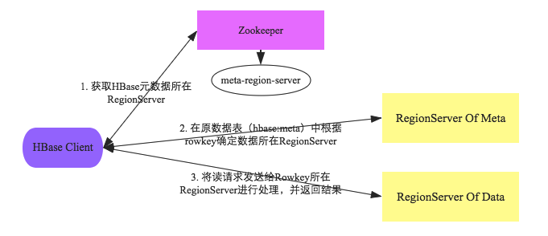
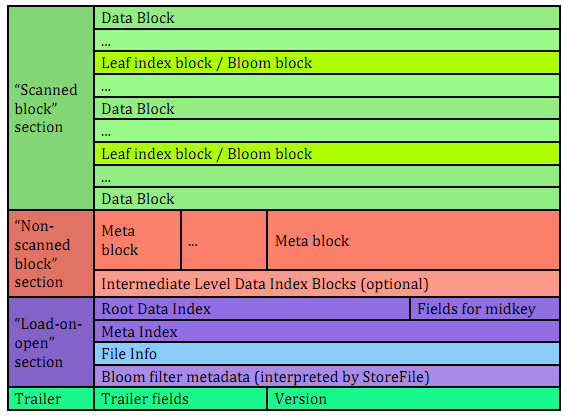
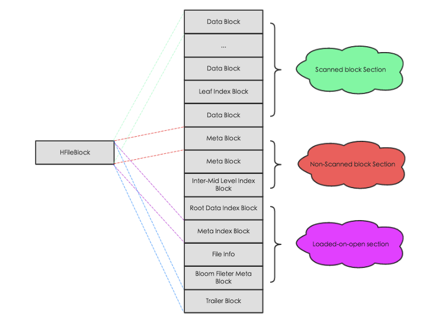
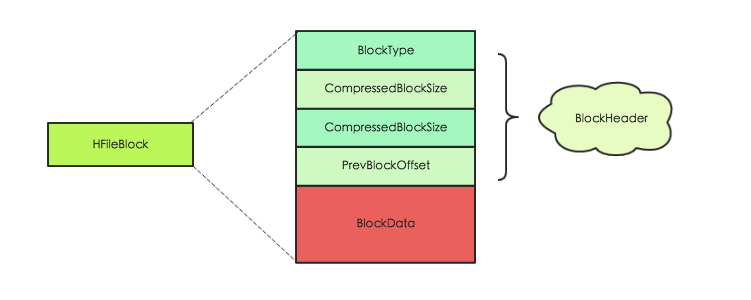

HBase作为一个数据库，如何写入数据，读出数据，如何写日志，如何做快照，Region如何切分，数据结构是什么，在磁盘上又是如何存储？本文是一篇概览，适合新手，每个操作都很复杂，如果都详尽就需要一本书了。

<!--more-->

- [读写流程](#%e8%af%bb%e5%86%99%e6%b5%81%e7%a8%8b)
  - [写数据流程](#%e5%86%99%e6%95%b0%e6%8d%ae%e6%b5%81%e7%a8%8b)
    - [HLog持久化等级](#hlog%e6%8c%81%e4%b9%85%e5%8c%96%e7%ad%89%e7%ba%a7)
    - [写入memstore](#%e5%86%99%e5%85%a5memstore)
    - [memStore Flush](#memstore-flush)
  - [读流程](#%e8%af%bb%e6%b5%81%e7%a8%8b)
    - [如何过滤HFile](#%e5%a6%82%e4%bd%95%e8%bf%87%e6%bb%a4hfile)
- [数据结构](#%e6%95%b0%e6%8d%ae%e7%bb%93%e6%9e%84)
- [Compaction](#compaction)
  - [分类](#%e5%88%86%e7%b1%bb)
  - [触发时机](#%e8%a7%a6%e5%8f%91%e6%97%b6%e6%9c%ba)
- [切分](#%e5%88%87%e5%88%86)
- [HFile](#hfile)
  - [HFile 索引](#hfile-%e7%b4%a2%e5%bc%95)
- [宕机恢复](#%e5%ae%95%e6%9c%ba%e6%81%a2%e5%a4%8d)
  - [Master宕机恢复](#master%e5%ae%95%e6%9c%ba%e6%81%a2%e5%a4%8d)
  - [RS宕机](#rs%e5%ae%95%e6%9c%ba)
- [快照](#%e5%bf%ab%e7%85%a7)
- [参考](#%e5%8f%82%e8%80%83)

## 读写流程
读写流程都依赖一个'hbase:meta'表，该表也存储在**一个**RS上，该表存储了集群中所有Region的信息，可以通过zk来查询该表的RegionServer位置。

以其中一张表'name:t2'来举例，在下方的'hbase:meata'表中，在除了第一行，其他的每一个rowkey都是一个Region的元数据。rowKey由（tableName，startRow，timestamp,encodeName(前3个字段产生的md5的hex值)）拼接而成，比如`name:t2,,1572571990517.0f0688ba5bcb156bc56220`由于是第一个Region因此没有startRow，包含如下几列：
- info:regioninfo:存储了4个信息：encodeName，regionName，startRow，stopRow
- info:seqnumDuringOpen:Region打开时的sequenceID值
- info:server:对应的region的RS的地址
- info:serverstartcode:所在的RS启动时的timestamp
- info:sn
- info:state

客户端会缓存meta表的信息，当然，meta表的信息如果改变了，那么客户端访问对应的RS可能得到错误的结果，此时客户端会重新获取meta表的信息并缓存

```
 name:t2                                       column=table:state, timestamp=1572571991554, value=\x08\x00                                                                           
 name:t2,,1572571990517.0f0688ba5bcb156bc56220 column=info:regioninfo, timestamp=1572762820832, value={ENCODED => 0f0688ba5bcb156bc562205d59b0ab9e, NAME => 'name:t2,,1572571990517.0
 5d59b0ab9e.                                   f0688ba5bcb156bc562205d59b0ab9e.', STARTKEY => '', ENDKEY => ''}                                                                      
 name:t2,,1572571990517.0f0688ba5bcb156bc56220 column=info:seqnumDuringOpen, timestamp=1572762820832, value=\x00\x00\x00\x00\x00\x00\x00"                                            
 5d59b0ab9e.                                                                                                                                                                         
 name:t2,,1572571990517.0f0688ba5bcb156bc56220 column=info:server, timestamp=1572762820832, value=localhost:16020                                                                    
 5d59b0ab9e.                                                                                                                                                                         
 name:t2,,1572571990517.0f0688ba5bcb156bc56220 column=info:serverstartcode, timestamp=1572762820832, value=1572762793141                                                             
 5d59b0ab9e.                                                                                                                                                                         
 name:t2,,1572571990517.0f0688ba5bcb156bc56220 column=info:sn, timestamp=1572762820397, value=localhost,16020,1572762793141                                                          
 5d59b0ab9e.                                                                                                                                                                         
 name:t2,,1572571990517.0f0688ba5bcb156bc56220 column=info:state, timestamp=1572762820832, value=OPEN                                                                                
 5d59b0ab9e.  
 ```

为什么meta表存在一个Region上：meta表很小，不会被切分；当之后如果真的需要切分的时候，在加一层索引即可。

读写数据流程大概如下图：   


### 写数据流程
当我们使用shell或者其他api写入一条数据，比如`put 'test','rowkey1','cf1:age','18'`,实际上我们是在与hbase的客户端进行交互，客户端会与HBase集群交互，最终得到数据。流程如下：

1. 客户端获取`hbase:meta`表的内容：先读本地缓存；如果本地缓存中的信息有误或者没有缓存内容，再与zk进行交互，查找`hbase:meta`表所在RegionServer的位置，然后获取表内容。这样做的好处是减少了zk的压力。
2. 在进行put的时候，根据要写入的rowkey以及`hbase:meta`表中的内容可以在`info:server`中找到管理该Region的RegionServer的地址
3. 命令对应的RegionServer写数据，先将数据写入HLog,然后将数据写入对应的Region的对应的列簇的memStore，最后将memStore中的数据刷到hdfs上

Region写入阶段：
1. 反序列化put对象，执行检查操作
2. 获取行锁，获取当前系统的时间
3. 将此操作编辑为一条WALEdit记录，sync写入HLog中
4. 写入memstore
5. 释放行锁
6. 结束事务，修改对外可见

至此，写入结束，但是之后还有其他的流程，比如memstore太大了，就需要将内存中的数据写到hdfs上等。

#### HLog持久化等级
说道sync，类比MySQL的日志写入的级别(0,1,n),HBase中也有对应的级别来适应不同的业务场景：
- SKIP_WAL:不写Hlog，当然可能丢数据
- ASYNC_WAL：异步写入Hlog，也可能丢数据
- SYNC_WAL：同步写入文件系统，但是不一定就落盘了；注意：写入文件系统不等于持久化到了磁盘，因为文件系统也有缓存，这个缓存是内存，也就是如果操作系统崩了，依旧可能造成数据的丢失
- FSYNC_WAL：同步写入磁盘，最严格的等级
- USER_DEFAULT：用户没有指定，使用默认的等级SYNC_WAL

#### 写入memstore
写内存是一个数据库为了提升写入效率必做的事情：
- 无论是在内存还是在HFile上，数据都是按照rowkey字符串升序排序的；为了能够保证有序且写入的速度，使用了`ConcurrentSkipListMap`，类似redis中的有序集合（跳跃表+map）
- 当内存不够了，会将数据刷到hdfs，见下节
- 刷内存的就是将内存中的对象写入到磁盘，那么这些对象也就没有了价值，会进行垃圾回收，这样会造成内存碎片。为了防止内存碎片，使用了`MemStore-Local Allocation Buffer(MSLAM)`:预先申请一个大的（2M）内存（Chunk），然后将对象写入这里面，如果满了，就新建Chunk。这样数据落盘后，gc之后剩下的碎片比较规整，也比较大，减少full gc。

#### memStore Flush
触发条件：
- memStore到达了一定的大小（memStore级别，Region级别，RS级别），可以通过配置参数修改阈值
- HLog数量达到了上限。
- 定期flush
- 手动flush

### 读流程

读流程比较复杂，因为可能会跨Region，而且更新数据和删除数据，都没有真正的删除，只是标记，比如标记的delete，所以还需要过滤。

整体流程：
1. 与读数据的前两个流程一样
3. 然后每个RegionServer会查数据，然后将数据返回

具体流程：
1. 构造Scanner Iterator体系

每一个Region都有一个单独的查询逻辑：构造三层Scanner：RegionScanner，StoreScanner，MeMStoreScanner,StoreFileScanner

一个RegionScanner由多个StoreScanner,一个StoreScanner对应该Region的一个列簇   
一个StoreScanner包含了MemstoreScanner和StoreFileScanner，对应内存和HFile   
前两个Scanner都是调度而非真正的查，真正的查询会落在MeMStoreScanner和StoreFileScanner上。   
分别查内存和文件，然后将结果合并，在查文件之前会查CacheBlock，如果存在对应的Block，就不用查文件，减少磁盘IO

2. 淘汰一些Scanner
3. 每个Scanner seek到startKey
4. key-value构建最小堆
5. 执行next函数进行过滤：
6. 检查keyValue的KeyType是否是Deleted/DeletedColumn/DeleteFamily，如果是，跳过此Key列（列簇）
7. 检查key-value的timestamp是否在范围，如果不是，忽略
8. 执行其他的各种用户设置的filter
9. 检查版本数是否满足设定的版本

 #### 如何过滤HFile
 三种方式：KeyRange，TimeRange，布隆过滤器
 1. KeyRange：如果要查找的key不在此该HFile的范围，那么过滤
 2. 在StoreFile中有一个元数据[miniTimestamp,maxTimestamp],根据待查询的time条件过滤
 3. 布隆过滤器：布隆过滤器可以判断一个数据”一定不在“或者”可能存在“在该文件，系统会获取对应的布隆过滤器（每个Hile都有一个数组，就是布隆过滤器）加载到内存中，热点会缓存到内存

## 数据结构
整体上Hbase基于lsm树，这种树增加了写的效率，直接写内存；但是却降低了读的效率，读会访问很多的HFile。

## Compaction
定义：多个HFile合并为一个

目的；
- 为了提高读效率，一般基于lsm的系统都会compaction,将多个file合并为一个文件
- 为了减轻namenode的压力，Hfile多了会造成namenode的压力增大，因此namenode会会存储文件的元数据信息；HFile多了会造成读数据的效率低下，因为读数据会访问多个HFile，会增加随机磁盘访问
- 删除过期的，超时的，超版本的数据
- 提高数据本地化率


### 分类
1. minor Compaction：选取部分小的，相邻的HFile合并
2. major Compation：将所有的HFile合并为一个大的，并且清除：被删除的，过期的，版本号超过的数据。这样做带来IO压力，网络带宽压力，而且读操作可能会超时。

### 触发时机
最常见的三种
1. memstore flush,判断HFile是否超过了阈值
2. 后台线程检查
3. 手动触发


## 切分

读写操作都落到了Region上，因此如果一个Region太大，Region会进行切分，类似分表。

具体流程很复杂，简单流程如下
1. 寻找分裂点，最大的store中的最大文件中心的一个Block的首个rowkey
2. 分裂，修改‘hbase:meta’表，父Region下线，子Region上线。注意新的Region获得新的文件的时候是在Compaction阶段。


## HFile

HFile是hbase文件在hdfs上的存储格式。所有的操作都离不开它的格式，正如`程序=数据结构+算法`,HFile就是数据结构，好的数据结构能够省下复杂的操作。

HFile分为v1，v2，v3。这里介绍v2



一个HFile可以分为四个部分：Scanned block section，Non-scanned block section,Opening-time data section,Trailer
1. Scanned block section:在需要顺序扫描的时候会读取其中的数据块，包括三种Block：Data Block,Leaf Index Block,Bloom Block
2. No-scanned block section:在顺序扫描时不会读取，主要包括：meta block，intermediate level data index block
3. load-on-open-section:在RS启动时会加载到内存中，包括：FileInfo，Bloom filter block，data block index，meta block index
4. Trailer：包含了HFile的基本信息，各部分的偏移量，寻址信息



可以看见各个区域都是由大小相同的block构成的（默认64k，可以指定），block拥有相同的数据结构，因此统一抽象为HFileBlock。其中又包含带有checksum和不带checksum的。



HFileBlock分为header和data部分，header存储该block的元数据信息，主要是BlockType标注了是哪一种Block。data部分各不相同。

8中BlockType
| BlockType                | 介绍                                            |
| ------------------------ | ----------------------------------------------- |
| Trailer Block            | 记录HFile的基本信息，各部分的偏移量寻址信息     |
| meta Block               | 记录布隆过滤器元数据信息                        |
| data Block               | 存储用户的kv                                    |
| root index               | datablock的根索引以metaBloc和Bloom Filter的索引 |
| Intermediate Level Index | dataBlock 中的二级索引                          |
| Leaf Level Index         | dataBlock的三级索引，也就是叶子节点             |
| Bloom meta Block         | Bloom的相关元数据                               |
| Bloom Block              | Bloom的相关数据                                 |

HFile在读取的时候首先会解析Trailer Block并加载到内存，然后再进一步加载LoadOnOpen区的数据。


### HFile 索引
数据在memStore中使用的是map+跳跃表，保证有序和读写性能。在磁盘上HFile上，索引是一颗多叉树，最高三层索引。


## 宕机恢复

### Master宕机恢复
master的压力较低，因此宕机情况比较少。

故障恢复原理：一般至少存在两个master，并且以热备的方式实现高可用。master会在zk上注册一个临时节点，只有一个master能够成为active，其他成为backup-master，但是依旧会关注active master，当active宕机时，它们能够立即得到通知，并且再次竞争成为active节点


### RS宕机
常见的宕机原因：
- full gc导致超时
- hdfs异常
- 机器宕机
- hbase bug

故障恢复原理：
1. 检查故障，通过zk的心跳实现：设置合理的timeout
2. 切分为持久化数据的HLog，因为回放log是按照Region为单位
3. master分配宕机的RS上的Region给其他RS
4. 回放HLog
5. 对外提供服务

## 快照

snapshot并没有真正的复制数据，而是存储了当前需要复制的文件的元数据，可以通过这一系列元数据找到复制时的文件。

那么当源文件删除或者合并消失了呢，是不是就找不到了。当compaction或者delete 表的时候，会将原文件复制到archive目录下。

shell 操作：
- 为表’sourceTable’打一个快照’snapshotName’：`snapshot 'sourceTable', ‘snapshotName'`
- 恢复指定快照，恢复过程会替代原有数据，将表还原到快照点，快照点之后的所有更新将会丢失。需要注意的是原表需要先disable掉，才能执行restore_snapshot操作:`restore_snapshot ‘snapshotName'`
- 根据快照恢复出一个新表，恢复过程不涉及数据移动，可以在秒级完成。`clone_snapshot 'snapshotName', ‘tableName'`

## 参考
1. http://hbasefly.com/
2. https://hbase.apache.org/book.html
3. 《hbase原理与实践》，作者：胡争，范欣欣