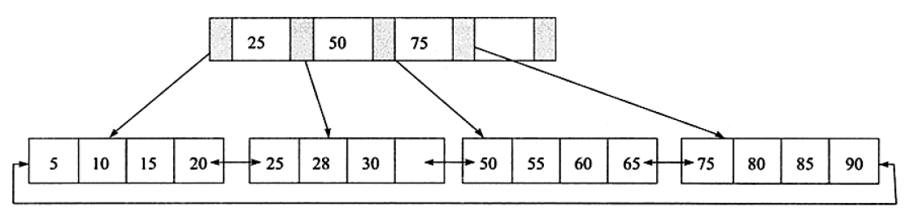

- [常见的索引数据结构](#%E5%B8%B8%E8%A7%81%E7%9A%84%E7%B4%A2%E5%BC%95%E6%95%B0%E6%8D%AE%E7%BB%93%E6%9E%84)
  - [有序数组](#%E6%9C%89%E5%BA%8F%E6%95%B0%E7%BB%84)
  - [hash](#hash)
  - [二叉树，红黑树](#%E4%BA%8C%E5%8F%89%E6%A0%91%E7%BA%A2%E9%BB%91%E6%A0%91)
  - [lsm树](#lsm%E6%A0%91)
  - [b树](#b%E6%A0%91)
  - [b+树](#b%E6%A0%91)
- [索引分类](#%E7%B4%A2%E5%BC%95%E5%88%86%E7%B1%BB)
  - [是否唯一](#%E6%98%AF%E5%90%A6%E5%94%AF%E4%B8%80)
  - [是否聚集](#%E6%98%AF%E5%90%A6%E8%81%9A%E9%9B%86)
  - [是否单列](#%E6%98%AF%E5%90%A6%E5%8D%95%E5%88%97)
  - [其他](#%E5%85%B6%E4%BB%96)
- [innodb中的索引](#innodb%E4%B8%AD%E7%9A%84%E7%B4%A2%E5%BC%95)
  - [小知识点](#%E5%B0%8F%E7%9F%A5%E8%AF%86%E7%82%B9)
  - [b+树索引](#b%E6%A0%91%E7%B4%A2%E5%BC%95)
    - [索引管理](#%E7%B4%A2%E5%BC%95%E7%AE%A1%E7%90%86)
- [实践](#%E5%AE%9E%E8%B7%B5)
  - [优化器不是用索引的情况](#%E4%BC%98%E5%8C%96%E5%99%A8%E4%B8%8D%E6%98%AF%E7%94%A8%E7%B4%A2%E5%BC%95%E7%9A%84%E6%83%85%E5%86%B5)
  - [自增主键](#%E8%87%AA%E5%A2%9E%E4%B8%BB%E9%94%AE)
  - [联合索引](#%E8%81%94%E5%90%88%E7%B4%A2%E5%BC%95)
  - [唯一索引与非唯一索引的差别](#%E5%94%AF%E4%B8%80%E7%B4%A2%E5%BC%95%E4%B8%8E%E9%9D%9E%E5%94%AF%E4%B8%80%E7%B4%A2%E5%BC%95%E7%9A%84%E5%B7%AE%E5%88%AB)
  - [给字符串加索引](#%E7%BB%99%E5%AD%97%E7%AC%A6%E4%B8%B2%E5%8A%A0%E7%B4%A2%E5%BC%95)
- [参考](#%E5%8F%82%E8%80%83)

索引是一种帮助加快查询速度的数据结构。
<!--more-->

## 常见的索引数据结构

### 有序数组

|操作|时间复杂度|说明|
| -- | ------ | -- |
|查询 | O(logN) | 二分法 |
| 插入 | O(N)   |  |
| 删除 | O(logN) | 标记删除（软删除）|

- 优势：有序数组的等值查询与范围查询在性能上都很优秀；占用空间少；实现简单；天然有序
- 劣势：插入性能太差

适用环境：插入较少的情况，不在变化的数据，比如去年的销售情况

### hash

|操作|时间复杂度|说明|
| -- | ------ | -- |
|查询 | O(1) |  |
| 插入 | O(1）|  |
| 删除 | O(1) | |

以key-value存储,可以拉链来解决冲突

- 优势：增删改查性能卓越
- 劣势：只能用于等值查询，不能范围查询，联合索引的前缀匹配失效，排序性能差

适用环境：范围查询较少


### 二叉树，红黑树

|操作|时间复杂度|说明|
| -- | ------ | -- |
|查询 | O(logN) |  |
| 插入 |O(logN)|   |
| 删除 | O(logN)|  |

- 优势：增删改查性能较高；范围查询，排序性能较好
- 劣势：对于数据库来说，IO次数太多

适用环境：内存

### lsm树

### b树

|操作|时间复杂度|说明|
| -- | ------ | -- |
|查询 | O(logmN) |  |
| 插入 |O(logmN)|   |
| 删除 | O(logmN)|  |

- 优势：m会很大，因此IO次数少；范围查询，排序性能较好
- 劣势：不稳定


### b+树

|操作|时间复杂度|说明|
| -- | ------ | -- |
|查询 | O(logmN) |  |
| 插入 |O(logmN)|   |
| 删除 | O(logmN)|  |

- 优势：m很大，IO次数少；稳定：每一次查询都要访问叶子节点；范围查询简单：双向链表
- 劣势：数据页分裂会造成页空洞

## 索引分类

### 是否唯一

- 唯一索引
- 非唯一索引

是否是唯一索引在查询，加锁，插入等情况的性能是不同的。

### 是否聚集

- 聚集索引：叶子节点上存储着数据项，比如Innodb中的主键索引，在逻辑上真实数据项按照索引组织
- 非聚集索引：叶子节点上不是数据项，比如二级索引叶子节点上是主键

### 是否单列

- 单列索引
- 组合索引：多个字段组合的索引，能利用前缀匹配，索引覆盖；但是会使用更多的空间

### 其他

- 全文索引：一种用于全文搜索关键子的索引，通常使用倒排索引
- 倒排索引

## innodb中的索引

### 小知识点

1. innodb支持b+树索引，hash索引，全文索引。
2. b+树索引用的最多
3. b+树索引只能根据键找到对应的数据页而不能找到对应的行，需要将该数据页加载到内存中，然后查找对应的行
4. 如果创建表的时候没有指定主键，如果有非空的唯一索引，那么选取第一个定义的非空唯一索引作为主键；如果不存在会自动生成一个rowid；可以查询`select _rowid from xxx;`
5. 索引页在逻辑上是有序的，也就是数据在逻辑上按照索引组织，但是索引页在物理上可以是无序的
6. 当优化器选错索引是，可以使用`force index(xxx)`强制使用某个索引


### b+树索引



b+树索引通常在生成上的树高为2-4，那么逻辑IO只有2-4，假如机械硬盘每秒100次IO，那么一次查询最快只需要0.02-0.04秒，很快了。

辅助索引又称之为二级索引，也是采用b+树实现，当根据二级索引查询的时候，如果要查找的数据不是二级索引树上叶子节点上的数据（索引值本身，主键），那么会根据主键值进行回表：扫描主键索引树。

在组合索引中，可以使用前缀匹配：匹配前n个字符或者前m个字段，组合索引的排序方式是先排第一个字段，第一个字段相同在排其他字段。假如组合索引不是主键，在查询的时候也需要回表，但是在5.6之后引入了索引下推，如果要查询的值是主键或者是组合索引中的值，就可以不回表。

#### 索引管理

```
mysql> show index from test1;
+-------+------------+----------+--------------+-------------+-----------+-------------+----------+--------+------+------------+---------+---------------+
| Table | Non_unique | Key_name | Seq_in_index | Column_name | Collation | Cardinality | Sub_part | Packed | Null | Index_type | Comment | Index_comment |
+-------+------------+----------+--------------+-------------+-----------+-------------+----------+--------+------+------------+---------+---------------+
| test1 |          0 | PRIMARY  |            1 | id          | A         |          10 |     NULL | NULL   |      | BTREE      |         |               |
| test1 |          1 | a        |            1 | a           | A         |          10 |     NULL | NULL   | YES  | BTREE      |         |               |
+-------+------------+----------+--------------+-------------+-----------+-------------+----------+--------+------+------------+---------+---------------+
2 rows in set (0.00 sec)
```
通过`show index from xxx;`查看索引。
- table：表名
- Non_unique:不是唯一索引
- key_name:索引名字
- seq_in_index索引在该列中的位置
- column_name:索引列名
- collation列以什么方式存储。A:有序，NULL：无序
- cardinality：索引中唯一值数目的估值
- sub_part，索引是不是列的部分，在构造索引的时候如果选取的是一个长的字符串字段，那么数据页的利用率就不高，因此可以选择该列的一部分作为索引
- packed；如何被压缩
- null：是否允许null
- ubdex_type:索引类型
- comment：注释


## 实践

### 优化器不是用索引的情况

1. 如果对字段做函数、计算，无法使用索引树搜索，因为可能改变索引的有序性，但是即使该函数不会改变有序性也不会使用索引
2. 隐式类型转化：相当于使用了函数，比如字符串与数字的比较；可以使用比较的方法来判断类型如何转换`select "10">9 `，返回1表示转换为数字
3. 编码转换
```
mysql> select d.* from tradelog l, trade_detail d where d.tradeid=l.tradeid and l.id=2; 
```
假如l表的编码是utf-8，而d表示utf8mb64，这条语句首先会使用l表的索引查出一条语句，然后去d表中查询，但是由于编码不同，涉及到了编码自动转换的问题，也就是需要一个转换的函数，由于utf8mb64是utf8的超集，因此d表中的索引需要一个函数转换为utf8mb64，也就违反了第一条规则。   

但是如果使用的字符集相反，那么就只使用一次编码转换，依旧可以使用第二个索引

### 自增主键
主键最好使用递增的值，较小的值，比如自增主键。

如果使用无序的值，插入会使得数据页经常分裂，导致数据页镂空，不能有效的利用IO。在这个时候可以重建表。

### 联合索引

建立联合索引的时候:考虑索引的复用能力，来确定是否建立索引，索引字段的顺序

查询的时候也需要考虑能否利用前缀匹配，覆盖索引

### 唯一索引与非唯一索引的差别

查询时:
- 唯一索引,查到一个就返回;普通索引,还需要判断是否有其它的相同的索引
- 影响:微乎其微,因为MySQL每次读都是读一页,一页有很多数据;相同的索引不在此页的概率小

插入时:
- 如果数据页在内存中，唯一索引直接插入，非唯一索引页直接插入
- 如果数据页不在内存中，唯一索引需要加载磁盘上的数据页，因为不能判断是否唯一;非唯一索引直接写入change buffer的insert buffer中。

加锁时：
- 如果是间隙锁，对于唯一索引会退化为lock锁，但是非唯一索引是直接加间隙锁

### 给字符串加索引

1. 字符串过长,考虑前缀索引`alter table t add index index1(email(6));`,前缀索引会带来多次搜索的代价,因此可以使用`count(distinct left(email,5)) as l5,count(distinct left(email,6)) as l6,count(distinct left(email,7)) as l7`来判断最好的长度,只要超过95%就行
2. 使用部分前缀索引就会导致覆盖索引失效,因为不能确定是够在该索引树上找到的就是完整的
3. 如果前缀区分不明显,可是使用倒叙存储,在查询的时候采用`reverse()`函数
4. 也可以使用hash字段,再在表上创建一个整数字段,保存`crc32()`产生的校验码,同时给这个字段加上索引;但是校验码可能会冲突,因此还需在查询的时候同时比较校验码与源字段
5. 倒叙和hash不支持范围查询,倒叙有reverse()函数的消耗,hash多占存储.hash冲突毕竟小.


## 参考

《MySQL技术内幕：InnoDB存储引擎》   
《MySQL实战45讲》
