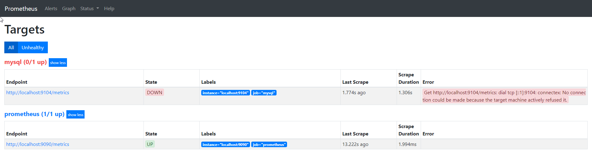
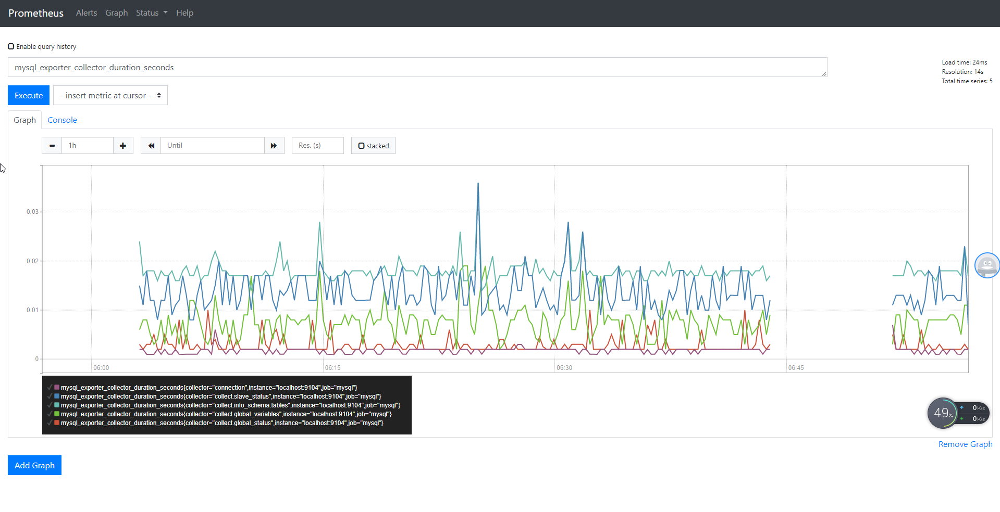
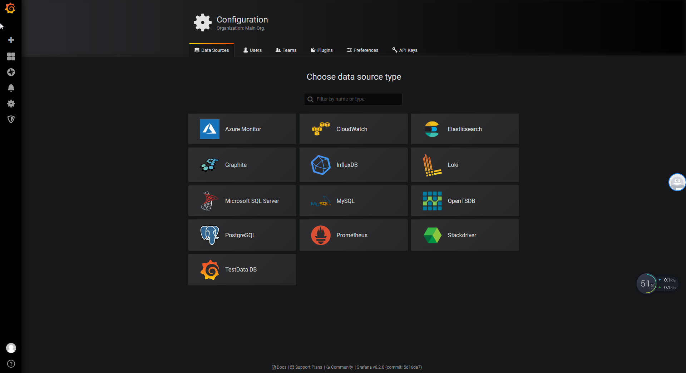
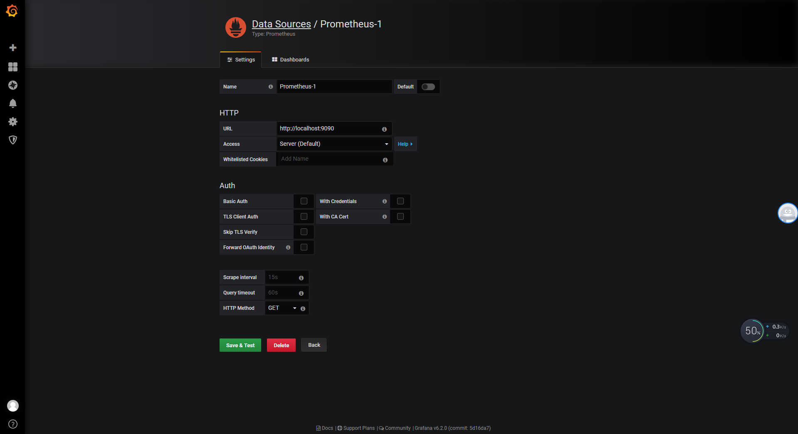
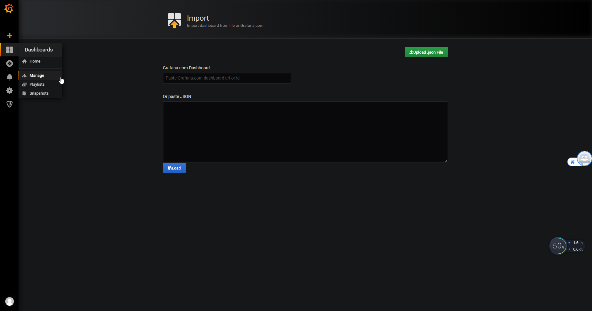
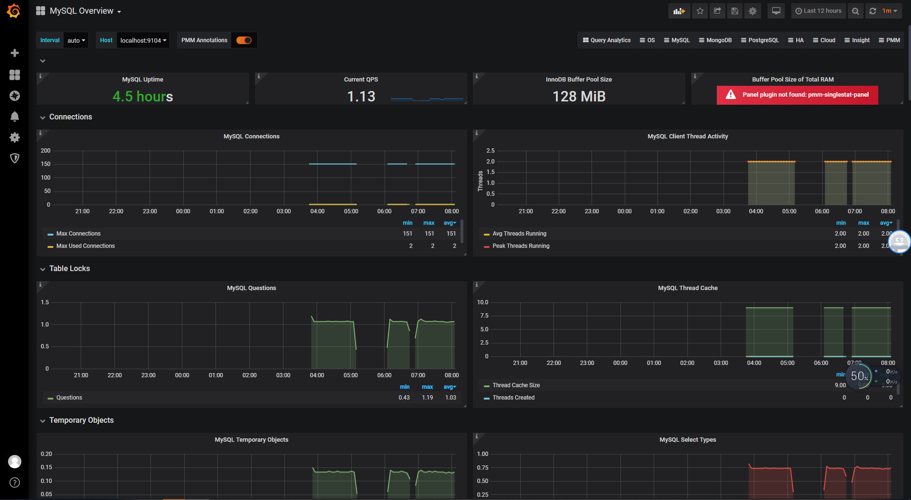

普罗米修斯是一个开源系统监控和警报工具包。
<!--more-->
## 简介

它能监控很多东西，比如机器，JMX，数据库，一些软件等。

git地址: [https://github.com/prometheus](https://github.com/prometheus)

### 组件
-  __Prometheus Server__ : 用于收集和存储时间序列数据。
-  __Client Library__ : 客户端库，为需要监控的服务生成相应的 metrics 并暴露给 Prometheus server。当Prometheus server 来 pull 时，直接返回实时状态的 metrics。
- __Push Gateway__ : 主要用于短期的 jobs。由于这类 jobs 存在时间较短，可能在 Prometheus 来 pull 之前就消失了。为此，这次 jobs 可以直接向 Prometheus server 端推送它们的 metrics。这种方式主要用于服务层面的metrics，对于机器层面的 metrices，需要使用 node exporter。
-  __Exporters__ : 用于暴露已有的第三方服务的 metrics 给 Prometheus。
-  __Alertmanager__ : 从 Prometheus server 端接收到 alerts 后，会进行去除重复数据，分组，并路由到对收的接受方式，发出报警。常见的接收方式有：电子邮件，pagerduty，OpsGenie, webhook 等。
- 一些其他的工具。

架构图：


### 特点
- 多维数据模型
  - 时间序列数据通过metric名和键值对来区分
  - 所有的metrics都是可以设置为多维标签
- 灵活的查询语句
- 高效
- 采用pull模式采集时间序列
- 可以采用push 的方式推送数据到gateway端
- 可以通过服务发现或者静态配置去获取监控的targets
### 工作流程
其大概的工作流程是：

- Prometheus server 定期从配置好的 jobs 或者 exporters 中拉 metrics，或者pull来自 Pushgateway 的 metrics，或者从其他的 Prometheus server 中拉 metrics。
- Prometheus server 在本地存储收集到的 metrics（保存在`data`目录下），并运行已定义好的 alert.rules，记录新的时间序列或者向 Alertmanager 推送警报。
- Alertmanager 根据配置文件，对接收到的警报进行处理，发出告警。
- 在图形界面中，可视化采集数据。

### 数据模型
Prometheus 中存储的数据为时间序列，是由 metric 的名字和一系列的标签（键值对）唯一标识的，不同的标签则代表不同的时间序列。

- metric 名字：该名字应该具有语义，一般用于表示 metric 的功能，例如：`http_requests_total`, 表示 http 请求的总数。
- 标签：使同一个时间序列有了不同维度的识别。例如 `http_requests_total{method="Get"}` 表示所有 http 请求中的 Get 请求。当 method="post" 时，则为新的一个 metric。
- 样本：实际的时间序列，每个序列包括一个 float64 的值和一个毫秒级的时间戳。
- 格式：`<metric name>{<label name>=<label value>, …}`，例如：`http_requests_total{method="POST",endpoint="/api/tracks"}`。

### 四种 Metric 类型
 __Counter__ ：一种累加的 metric，典型的应用如：请求的个数，结束的任务数， 出现的错误数等等。
 __Gauge__ ：可以任意加减。
 __Histogram__ ：
- 可以理解为柱状图，典型的应用如：请求持续时间，响应大小。
- 可以对观察结果采样，分组及统计。
 __Summary__ 
- 类似于 Histogram, 典型的应用如：请求持续时间，响应大小。
- 提供观测值的 count 和 sum 功能。
- 提供百分位的功能，即可以按百分比划分跟踪结果。

### 数据存储
- Prometheus将数据存储在本地或者与远程存储系统集成。
- 默认将数据两个小时分为一块
- 不足两个小时的数据存在内存中，并且通过存储zai`data/wal`下的日志防止崩溃
- 数据保存时间可自定义`--storage.tsdb.retention.time`


### 数据展示

在Prometheus中数据往往不够直观，可以使用Grafana来展示数据。

Grafana支持多种数据源，包括Prometheus。

Grafana的Dashboard的对应的json文件也都有提供，因此十分方便；当然最好是自定义


### 监控mysql的例子

 [Premetheus下载地址](https://github.com/prometheus/prometheus/releases)

#### 配置
配置服务端：`prometheus/prometheus.yml`文件
```yml
# my global config
global:
  scrape_interval:     15s # Set the scrape interval to every 15 seconds. Default is every 1 minute.
  evaluation_interval: 15s # Evaluate rules every 15 seconds. The default is every 1 minute.
  # scrape_timeout is set to the global default (10s).

# Alertmanager configuration
alerting:
  alertmanagers:
  - static_configs:
    - targets:
      # - alertmanager:9093

# Load rules once and periodically evaluate them according to the global 'evaluation_interval'.
rule_files:
  # - "first_rules.yml"
  # - "second_rules.yml"

# A scrape configuration containing exactly one endpoint to scrape:
# Here it's Prometheus itself.
scrape_configs:
  # The job name is added as a label `job=<job_name>` to any timeseries scraped from this config.
 # 监控自己
  - job_name: 'prometheus'

    # metrics_path defaults to '/metrics'
    # scheme defaults to 'http'.
    static_configs:
    - targets: ['localhost:9090']
#抓取的目标的名字，以及地址
  - job_name: 'mysql'
    static_configs: 
    - targets: ['localhost:9104']
```

启动prometheus.exe，此时在浏览器中输入`localhost:9090`，点击Status->Target



抓取自己的数据成功，由于mysql还没有暴露抓取的指标，因此还处于down。

#### 安装mysqld_exporter

- [下载地址](https://prometheus.io/download/)
- 在运行前可以先给mysql创建一个用户专门用来export指标数据
```sql
CREATE USER 'exporter'@'localhost' IDENTIFIED BY 'root' WITH MAX_USER_CONNECTIONS 3;
GRANT PROCESS, REPLICATION CLIENT, SELECT ON *.* TO 'exporter'@'localhost';
flush privileges;
```
- 在运行前需要配置暴露的数据源，直接添加环境变量
```
#swtest是要监控的数据库
set DATA_SOURCE_NAME=exporter:root@(localhost:3306)/swtest
set path=%path%;DATA_SOURCE_NAME='exporter:root@(localhost:3306)
```
- 启动
```
mysqld_exporter.exe
```
- 检验，在浏览器中输入`http://localhost:9104/metrics`,看到有非常多的数据表示成功，__如果仅仅只有几十条数据或者更少，说明暴露指标过程中有问题，一般是数据库登录问题__

在prometheus界面输一个指标name，比如`mysql_exporter_collector_duration_seconds`,点击execute，Graph，可以看见数据



#### 将数据展示在Grafana
- [下载地址](https://github.com/grafana/grafana/releases)，版本6.2.0
- [安装方法](https://grafana.com/docs/installation/debian/)
以windows举例：
下载，解压（解压前，右键选择属性，点击解除锁定）
复制`conf/sample.ini`为`conf/custom.ini`，编辑内容，更该`http_port`,默认为3000，建议更改
```
# The http port  to use
http_port = 10000

```
在命令行上启动，在浏览器中输入`localhost:10000`,登录`admin:admin`

### 配置数据源
登录后在侧边栏点击Configuration，选择dataSource，Grafana支持多种数据源


这里选择prometheus



填入对应数据，保存。

需要导入对应的dashboard，可以自定义，也可以使用已经写好的`https://github.com/percona/grafana-dashboards`,clone后在`dashboards目录下`有常用的dashboard的json文件。

在dashboard选择manage，选择import，然后上传`dashboards/MySQL_Overview.json`,然后点击import



成功界面：



### 其它监控

一法通万法通


参考:   
[https://prometheus.io/docs/introduction/overview/](https://prometheus.io/docs/introduction/overview/)   
[https://www.ibm.com/developerworks/cn/cloud/library/cl-lo-prometheus-getting-started-and-practice/index.html](https://www.ibm.com/developerworks/cn/cloud/library/cl-lo-prometheus-getting-started-and-practice/index.html)