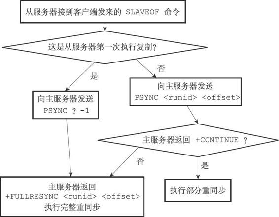
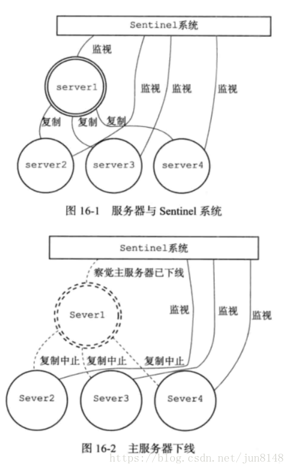
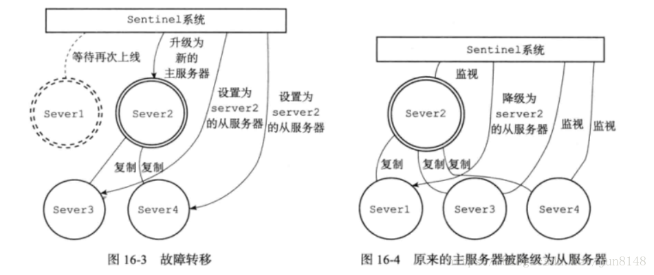
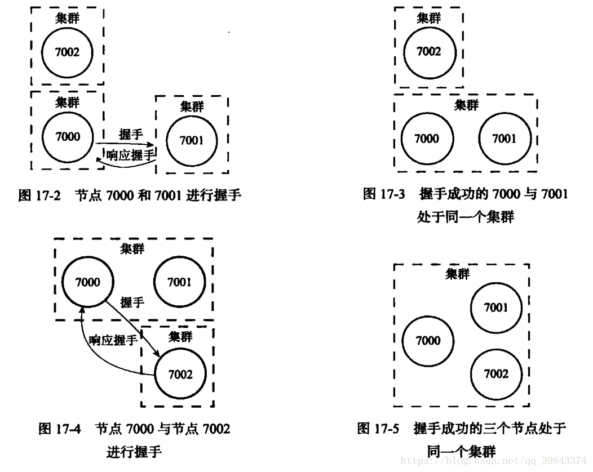

# Redis多机数据库

多机数据库面临的问题：数据一致性问题，选举，故障转移等。

<!--more-->
## 复制

数据库状态一致：主从服务器中的数据库中保存相同的数据库。为了保证这种一致性，可以使用复制的方法。

在Redis中可以使用 slaveof 命令让一个服务器复制另一个服务器，也就是让从服务器去复制主服务器。

### 方式
psync命令：
- 完整重同步：处理初次复制的情况，完整重同步是指主服务器的数据库生成RDB文件和在生成RDB文件期间缓存的命令，并发送给从服务器。
- 部分重同步：用于断线后复制的情况，允许将断线期间主服务器执行的写命令发送给从服务器进行同步（命令传播）。

## 实现
### 完整从同步的实现
完整从同步容易理解：生成RDB文件，保存缓存的命令，将其发送给从服务器，服务器将RDB恢复为运行时结构，再执行缓冲区里的命令。

### 部分从同步的实现
部分从同步：使用复制偏移量  
>主服务器和从服务器分别维护一个复制偏移量的变量，当主服务器每次向从服务器传播N个字节的数据，就将自己的偏移量+N，从服务器没接收到M个自己的数据，就将自己的复制偏移量+M。当数据一致时，两个偏移量相等，反之不相等。   

>假如某时，主服务器的偏移量10000，从服务器10000，突然从服务器和主服务器断线了，主服务器又传播了50字节，那么主服务器的偏移量10050，从服务器的偏移量10000，因此可以检测到数据不一致，主服务器会从新发送相应的数据（那么这些数据在哪呢）。

#### 复制积压缓冲区
复制积压缓冲区是主服务器维护的一个固定长度的先进先出的队列，默认大小为1M(可以更改)，缓冲区中存储了命令传播阶段的偏移量和对应的字符。

### 整体流程

### 心跳检测
在命令传播阶段，从服务器会默认每秒两次的频率发送命令

心跳检查可以检测主服务器的网络状态，检测是否命令丢失

## Sentinel

Sentinel是Redis高可用性解决方案:由多个Sentinel实例组成的Sentinel系统可以监控多个主服务器以及它们的从服务器.当某一个主服务器下线时,会将它下属的一个从服务器升级为主服务器,然后由新的主服务器代替已下线的主服务器继续处理命令请求。

    

### 获取主服务器信息
Sentinel默认每十秒一次向监视的主服务器发送info命令，获取主服务器的当前信息（包括该主服务器的从服务器的信息）

### 检测下线状态

#### 检测主观下线状态
sentinel以每秒一次的频率，向所有与它创建了命令连接的实例（主服务器，从服务器，其他的Sentinel）发送pin命令，通过回复判断实例是否在线。当一个实例在一定的时间内连续返回无效的恢复，则判断该实例已经下线。
#### 检测客观下线状态
当一个Sentinel将一个主服务器判断为主观下线之后，为了确认这个主服务器是否真的下线，还需要向其他的Sentinel求证，看它们是否也认为该服务器是否下线（可以是主观也可以是客观下线），当从其他的Sentinel那里接受到足够已下线的判断后，该Sentinel就会判定为该服务器客观下线，并对其进行故障转移操作。
### 故障转移
先选举出领头的Sentinel（Raft算法：先到先得，进行投票，超过哨兵的一般数量，就成为领头哨兵），然后根据从服务器的状态（在线，最近通信过，保存的数据较新，优先级较高）选择出最优的一个从服务器作为主服务器，然后修改其他从服务器的复制目标，将已经下线的主服务器设置为新主服务器的从服务器。

## 集群
Redis集群是Redis提供的分布式数据库方案，通过分片进行数据共享，提供复制和故障转移。

### 节点
一个集群通常有多个节点组成，一个节点就是一个redis服务器。节点与节点之间通过握手将节点连接起来。

### 槽指派
分片：集群的整个数据库被分为16384个槽（slat），每一个节点被指派管理不同区域的槽，然后进行传播该节点的槽指派的信息。

#### 在集群中执行命令

### 重新分片

## 复制与故障转移

### 复制
集群中主服务器用于处理槽，从服务器用于复制主服务器。

### 故障检测
集群中每一个节点都会定期向其他节点发送ping命令，检测对方是否在线，如果没有在预定时间内接受到对方的消息，就将其标记为疑似下线，当超过半数的节点都表及其为疑似下线，那么判定为其下线。

### 故障转移
选取一个从服务器成为主服务器，该主服务器也就是节点发送一条广播告知其他节点它已经成为了主节点。

图片来源于网络