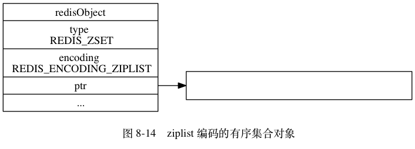

Redis使用5种对象来实现键值对数据库：字符串，列表，哈希，集合，有序集合对象。使用这么多对象方便了在不同情景下的使用。

<!--more-->

## 对象的类型与编码

~~~c
typedef struct redisObject{
    //类型
    unsigned type:4;
    //编码
    unsigned encoding:4;
    //指向底层数据结构的指针
    void *ptr;
    //引用计数
    int refcount;
    //空转时长
    unsigned lru:22;
} robj;
~~~

type即上述提到的五种对象类型，encoding属性记录了所使用的编码，也就是该对象使用了什么数据结构，使用引用计数实现内存回收机制，当计数为0时会释放该对象，空转时长记录最后一次命令访问此对象的时间。

type表示是什么对象   

| 类型常量     | 对象名称     |
| ------------ | ------------ |
| REDIS_STRING | 字符串对象   |
| REDIS_LIST   | 列表对象     |
| REDIS_HASH   | 哈希对象     |
| REDIS_SET    | 集合对象     |
| REDIS_ZSET   | 有序集合对象 |

编码：    

| 类型       | 编码       | 对象              |
| ---------- | ---------- | ----------------- |
| String     | int        | 整数值实现        |
| String     | embstr     | sds实现 <=32 字节 |
| String     | raw        | sds实现 > 32字节  |
| List       | ziplist    | 压缩列表实现      |
| List       | linkedlist | 双端链表实现      |
| Set        | intset     | 整数集合使用      |
| Set        | hashtable  | 字典实现          |
| Hash       | ziplist    | 压缩列表实现      |
| Hash       | hashtable  | 字典使用          |
| Sorted set | ziplist    | 压缩列表实现      |
| Sorted set | skiplist   | 跳跃表和字典      |

## 对象

### 字符串对象
字符串的编码可以是int，raw，embstr。
- int表示整数
- raw用以存储较长的字符串，需要两次分配内存空间，也需要两次释放内存空间
- embstr用来表示较短的（<=32KB）的字符串，embstr分配内存空间只需要一次，释放也只需要一次

编码的转换：
- 当执行命令使这个对象存的不再是整数，就会转换为raw
- 对于embstr，没有更改的操作，如果需要修改，会将其转换为raw

int型的string：  
   
raw型的string：   
   
embstr型的string：  
   

### 列表对象
列表的编码可以是ziplist，linkedlist。使用压缩列表主要是为了节省空间，只适用于较短的数据。

编码转换：
- 列表对象保存的素有字符串元素都小于64字节
- 列表中的元素个数小于512个

满足上述两个条件使用ziplist，否则使用linkedlist。不过这个条件是可以修改的。   
ziplist型的列表：   
   
linkedlsit型的列表：   

### 哈希对象
哈希对象的编码可以是ziplist或hashtable。

使用ziplist时：
- 添加哈希对象时先将键添加到压缩列表的尾部，再将值添加到尾部。
- 键值总是挨在一起，键在前值在后
- 先添加的总是在前，后添加的总是在后

使用hashtable：
- 每一个键都是字符串对象，对象中保存了键值对的键
- 每一个值都是一个字符串对象，对象中保存了键值对的值

编码转换：
- 哈希对象保存的所有键值对的字符串对象都小于64KB
- 哈希对象中的键值对的数量小于512

满足上述两个条件时使用ziplist，当然条件可以更改。  

ziplist的哈希：   
  
hashtable型的哈希：   
   
### 集合对象
集合对象的编码是intset或者hashtable。

编码转换：
- 所有元素都是整数
- 集合中元素的数量小于512个
满足上述两个条件使用intset，第二项条件的参数可以更改。

intset型的集合：   
   
hashtable型的集合(值为空)：   

### 有序集合对象
有序集合对象的编码可以是ziplist或者skiplist。

使用压缩列表时，集合内的元素按照分值排序。

skiplist编码的有序集合对象使用zset结构作为底层实现：
~~~c
typedef struct zset{

    zskiplist *zsl;

    dict *dict;
} zset;
~~~
使用zskiplist和dict是为了均衡有序和查找的效率，如果只是用dict那么在范围查找时需要每次排序，如果使用zskiplist查找时间复杂度会是O(logN)。使用两种数据结构可以时它们的时间复杂度都是O(1),典型的空间换时间。

编码转换：
- 有序集合对象元素的数量小于128个
- 所有元素的长度小于64字节
满足上诉两个条件使用ziplist，可以更改条件的参数

ziplist型的有序集合：  
    
   
skiplist型的有序集合：   

### 类型检查与命令多态
有一些命令对于所以对象都适用，这就是命令多态，实现命令多态依赖于类型判断，即判断当前是什么类型。

### 内存回收
使用引用计数法：当创建一个对象时，给该对象的refcount赋值为1，当该对象被一个新程序引用时refcount+=1，当不再被一个程序引用时refcount-=1，当refcount==0时释放此对象。

### 对象共享
对象共享会极大的节约空间，Redis在初始化服务器的时候会创建10000个字符串对象：0-9999来共享。

### 对象的空转时长
lru属性：记录该对象最后一次被命令程序访问的时间，这个属性会被用于内存回收。

## 持久化
由于Redis是内存数据库，因此为了防止服务器进程退出而数据消失，需要对数据库进行持久化。

持久化的方式有两种：RDB，AOF。

### RDB

#### 创建
有两个命令可用于生产RDB文件，一个是SAVE，BGSAVE。  
- SAVE会阻塞服务器进程直到创建完成，在此期间服务器不会处理任何命令请求。  
- BGSAVE不会阻塞，执行BGSAVE命令时会创建一个子进程来完成持久化。  
- 都不会包含过期键
#### 载入
Redis服务器启动时会自动加载RDB文件，不过如果开启了AOF功能，会优先使用AOF还原数据库状态。

### AOF
AOF通过保存Redis执行的写命令来记录数据库状态。

#### 创建
将执行的命令添加到一个缓冲区中，再将缓冲区的内容写入到文件中。

#### 载入
创建一个伪客户端，执行AOF中的命令，直到执行完所有的命令。
#### AOF重写
AOF文件会随着执行写命令的增加而增加，过于臃肿，因此可以对其重写：合并命令，删除对过期键的命令。在执行BGREWRITEAOF时，会创建一个缓冲区，其中写入了在重写期间执行的命令，在重写完成之后再追加到重写的AOF文件之后保证一致性。

