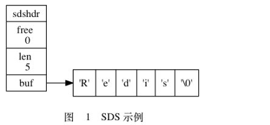
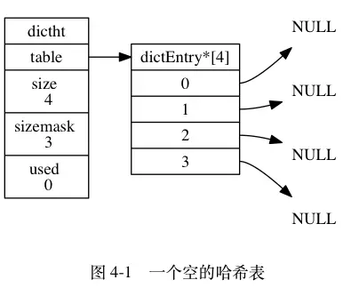
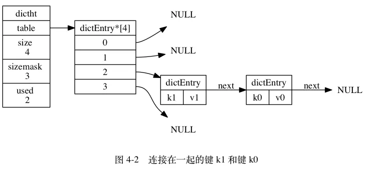
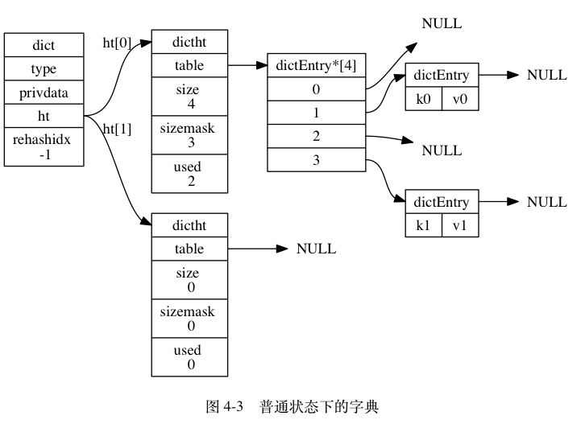
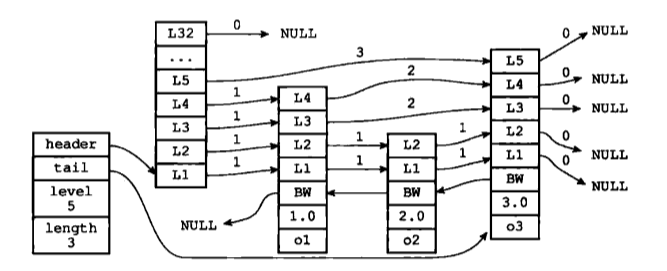
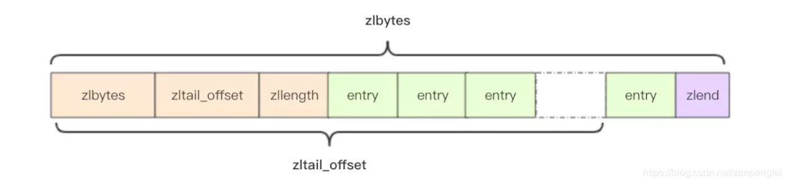

## 简介

Redis是一个开源的key-value数据库,基于内存,使用c语言编写,因此它很快。适合作用于缓存。

- Redis支持数据的持久化
- 提供多种数据结构：String，hash，list，set，zset五种对象
- Redis的所有操作都是原子性的
<!--more-->
## 数据结构

### SDS(简单动态字符串)
结构
~~~c
struct sdshdr{
    //已使用的字节长度
    int len;
    //未使用的字节长度
    int free;
    //字节数组
    char buf[];
};
~~~
比如Redes这个字符串的存储结构：  

#### 优点
- 常数时间获取长度
- 杜绝缓冲区溢出：当更改字符串时会检查SDS的缓冲区是否满足，如果不满足会扩充缓冲区的大小
- 减少修改字符串时内存重新分配的次数，因为具有缓冲区，分配缓冲区的大小为 < 1M
- 惰性空间释放，当字符串缩短之后，不会减少其缓冲区的大小
- 可以存储二进制数据

### 链表

Redis中使用双向链表，广泛由于列表键，发布与订阅，慢查询，监视器等

~~~c
typedef struct list{
    //头结点，尾节点，长度
    listNode *head;
    listNode *tail;
    unsigned long len;
    //一些函数
    ....
} list;
~~~

listNode的结构
~~~c
typedef struct listNode{
    struct listNode *prev;
    struct listNode *next;
    void *value;
} listNode;
~~~

#### 特点
- 双向链表，获取前置节点和后置节点时间复杂度O(1)
- 无环，表头节点的prev指针和表尾节点的next指针指向null
- lsit带表头节点和表尾节点时间复杂度O(1)
- 带有链表长度，获取长度O(1)
- 多态，使用void*保存节点

### 字典

字典使用哈希表作为底层实现   

#### 哈希表
~~~c
typedef struct dictht{
    //hash表数组
    dictEntry **table;
    //数组长度，长度永远为2^n
    unsigned long size;
    //掩码=size-1
    unsigned long sizemask;
    //节点的数量
    unsigned long used;
} dictht;
~~~

如图描绘了一个数组长度为4的空字典    

table是一个数组，数组中每一个元素都是一个指向了一个dictEntry的指针  
sizemask和一个对象的hash值确定了该对象应该在数组的哪一个位置

#### hash表节点的结构体
~~~c
typedef struct dictEntry{
    //键
    void *key;
    //值
    union{
        void *val;
        unint64_tu64;
        unint64_ts64;
    }
    //指向下一个节点
    struct dictEntry *next;

} dictEntry;
~~~

如图描绘了一个字典

#### 字典
字典使用到了上述的结构体  

~~~c
typedef struct dict{
    //类型特定函数
    dictType *type;
    私有数据
    void *privdata;
    //长度为2的哈希表
    dictht ht[2];
    //-1表示没有rehash
    int rehashidx;
} dict;
~~~

- type和privdata是为了针对不同类型的键值对，为了多态而创建的
- ht是一个长度为2的dictht数组，通常只是用ht[0],在rehash时会使用两个数组，rehash是在扩容或者收缩时更改数据的位置的动作
- rehashidx记录了当前rehash的进度，-1表示没有rehash

如图是一个没有rehash的字典  
  

通常解决hash冲突的方法有：链地址法，再哈希法，开放定址法，建立公共缓冲区。从上面的内容可以看出解决hash冲突的方法是链地址法。 

#### rehash
为了使负载因子维持在一个合理的范围之内，有时需要进行hash表长度的调整，此时需要使用dt[1]，将数据转移到dt[1]中再转移到dt[0]中。但是如果字典中数据很多的时候rehash效率低下，因此在Redis rehash过程是渐进式的。

渐进式rehash的过程：
1. 分配di[1]的空间，此时dict拥有连个hash表
2. 维护一个rehashidx值，将其设置为0，表示开始rehash
3. 每次对字典进行增删改查操作时，顺带将ht[0]在rehashidx索引上的所有键值对rehash到ht[1]中，rehashidx自增1
4. 最终在某一个时刻ht[0]上的所有键值对都rehash到了th[1]上，将rehashidx设置为-1，将ht[1]赋值给ht[0],ht[1]赋值为空，rehash结束

##### 优点
- 是由分而治之的方法，将rehash的计算量分摊，避免了集中rehash带来的性能降低
- 在进行rehash的过程当中，增删改查是在两个哈希表上执行的，但是保证了增只能在ht[1]上，保证ht[0]上数据只减不增，最后为空

### 跳跃表
跳跃表是一种有序的数据结构，通过维持多个指向其他节点的指针达到快速访问的目的，支持最快O(NlongN),最慢O(N)的时间复杂度

~~~c
typedef struct zskiplist{
    //头结点，尾节点
    struct zskiplistNode *header,*tail;
    //节点的数量
    unsigned long length;
    //表中层数最大的节点的层数
    int level;
} zskiplist;
~~~
其中zskiplistNode的结构如下：
~~~c
typedef struct zskiplistNode{
    //层
    struct zskiplistLevel{
        //前进指针
        struct zskiplistNode *forward;
        //跨度
        unsigned int span;
    } level[];
    //后退指针
    struct zskiplistNode *backward;
    //分值，按分值类排序
    double score;
    //成员对象
    robj *obj;
} zskiplistNode;
~~~

如下图：   

### 整数集合（intset）
整数集合是集合的底层实现之一，当一个集合只包含整数和整数数量不多时会使用到这种数据结构  

整数集合的结构
~~~c
typedef struct inset{
    //编码方式
    uint32_t encoding;
    //包含的元素数量，也就是数组的长度
    uint32_t length;
    //保存元素的数组
    int8_t contents[];
} inset;
~~~
在数组中每个元素唯一，并且升序排序。

如图所示：  

#### 升级
当添加一个太大或者太小的数时，可能需要降级，因为可能超出了encoding的范围，这个时候就需要升级。  
升级的步骤：
- 扩展数组的空间大小，为新元素分配空间
- 将其他数转化为现在的类型，将其放在正确的位置，在此过程中保持有序性
- 将新元素放入数组中

升级的好处：
- 提高灵活性
- 节约内存

### 压缩列表
压缩列表是列表键和哈希键的底层实现之一，是为了节约内存而开发的，是有一系列特殊编码的连续内存块组成的有序数据结构。

如图：  
  

- zlbytes表示列表总字节长度  
- zltail表示起始地址到尾节点的偏移量
- zllen表示节点长度
- entry是具体节点
- zlend标志压缩列表的末端

entry的结构体  
~~~c
struct entry {
    int<var> prevlen; // 前一个 entry 的字节长度
    int<var> encoding; // 元素类型编码
    optional byte[] content; // 元素内容
}
~~~
添加新节点可能或导致连锁更新，但是这种情况很少见，一般是连续的entry的内容为250--253字节之间，当增加一个新entry大于253那么可能导致连锁更新。   
原因:前一个字节长度如果小于244,那么prevlen就一个字节,否则4个字节,如果在连续的entry的内容为250--253字节之间的节点之间添加一个长度大于243的节点,那么之后的prevlen都会更新,从而后一个节点的长度也大于了253,所以会引发连锁更新。
