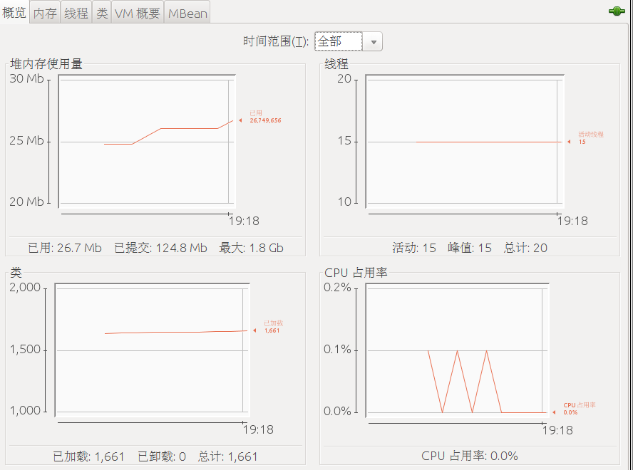

jdk自带一些工具来查看或更改java程序的信息。在程序出现问题时可以用它们分析。
<!--more-->
## jinfo

jinfo用来查看JVM的参数，更改参数等。

### 用法

```shell
$ jinfo   
Usage:
    jinfo [option] <pid>
        (to connect to running process)
    jinfo [option] <executable <core>
        (to connect to a core file)
    jinfo [option] [server_id@]<remote server IP or hostname>
        (to connect to remote debug server)

where <option> is one of:
    -flag <name>         to print the value of the named VM flag
    -flag [+|-]<name>    to enable or disable the named VM flag
    -flag <name>=<value> to set the named VM flag to the given value
    -flags               to print VM flags
    -sysprops            to print Java system properties
    <no option>          to print both of the above
    -h | -help           to print this help message
```

### 例子

先使用jps查找到所有的java进程，然后找到对应的pid。
```
jinfo -flags 19902
jinfo -flag InitialHeapSize 19902
jinfo -flag +PrintGC 19902 
jinfo -sysprops
```

### 问题

当出现错误:
```
Attaching to process ID 15927, please wait...
Error attaching to process: sun.jvm.hotspot.debugger.DebuggerException: Can't attach to the process: ptrace(PTRACE_ATTACH, ..) failed for 15927: 不允许的操作
sun.jvm.hotspot.debugger.DebuggerException: sun.jvm.hotspot.debugger.DebuggerException: Can't attach to the process: ptrace(PTRACE_ATTACH, ..) failed for 15927: 不允许的操作
	at sun.jvm.hotspot.debugger.linux.LinuxDebuggerLocal$LinuxDebuggerLocalWorkerThread.execute(LinuxDebuggerLocal.java:163)
	at sun.jvm.hotspot.debugger.linux.LinuxDebuggerLocal.attach(LinuxDebuggerLocal.java:278)
	at sun.jvm.hotspot.HotSpotAgent.attachDebugger(HotSpotAgent.java:671)
	at sun.jvm.hotspot.HotSpotAgent.setupDebuggerLinux(HotSpotAgent.java:611)
	at sun.jvm.hotspot.HotSpotAgent.setupDebugger(HotSpotAgent.java:337)
	at sun.jvm.hotspot.HotSpotAgent.go(HotSpotAgent.java:304)
	at sun.jvm.hotspot.HotSpotAgent.attach(HotSpotAgent.java:140)
	at sun.jvm.hotspot.tools.Tool.start(Tool.java:185)
	at sun.jvm.hotspot.tools.Tool.execute(Tool.java:118)
	at sun.jvm.hotspot.tools.JInfo.main(JInfo.java:138)
	at sun.reflect.NativeMethodAccessorImpl.invoke0(Native Method)
	at sun.reflect.NativeMethodAccessorImpl.invoke(NativeMethodAccessorImpl.java:62)
	at sun.reflect.DelegatingMethodAccessorImpl.invoke(DelegatingMethodAccessorImpl.java:43)
	at java.lang.reflect.Method.invoke(Method.java:498)
	at sun.tools.jinfo.JInfo.runTool(JInfo.java:108)
	at sun.tools.jinfo.JInfo.main(JInfo.java:76)
Caused by: sun.jvm.hotspot.debugger.DebuggerException: Can't attach to the process: ptrace(PTRACE_ATTACH, ..) failed for 15927: 不允许的操作
	at sun.jvm.hotspot.debugger.linux.LinuxDebuggerLocal.attach0(Native Method)
	at sun.jvm.hotspot.debugger.linux.LinuxDebuggerLocal.access$100(LinuxDebuggerLocal.java:62)
	at sun.jvm.hotspot.debugger.linux.LinuxDebuggerLocal$1AttachTask.doit(LinuxDebuggerLocal.java:269)
	at sun.jvm.hotspot.debugger.linux.LinuxDebuggerLocal$LinuxDebuggerLocalWorkerThread.run(LinuxDebuggerLocal.java:138)
```

执行：
```
　　echo 0 | sudo tee /proc/sys/kernel/yama/ptrace_scope
```
即可。

## jps

通过 jps 命令可以方便地查看 Java 进程的pid、启动类、传入参数和 Java 虚拟机参数等信息。
### 用法
```shell
$ jps -help
usage: jps [-help]
       jps [-q] [-mlvV] [<hostid>]

Definitions:
    <hostid>:      <hostname>[:<port>]
```
- -q：只输出进程 ID
- -m：输出传入 main 方法的参数
- -l：输出完全的包名，应用主类名，jar的完全路径名
- -v：输出jvm参数
- -V：输出通过flag文件传递到JVM中的参数

### 例子

```shell
$ jps -ml
15216 com.intellij.idea.Main
22020 sun.tools.jps.Jps -ml
15845 org.jetbrains.kotlin.daemon.KotlinCompileDaemon --daemon-runFilesPath /home/zzx/.local/share/kotlin/daemon --daemon-autoshutdownIdleSeconds=7200 --daemon-compilerClasspath /opt/idea-IU-191.7479.19/plugins/Kotlin/kotlinc/lib/kotlin-compiler.jar:/opt/jvm/jdk1.8.0_202/lib/tools.jar
15434 org.jetbrains.idea.maven.server.RemoteMavenServer
```


## jconsole

jconsole是基于 (JMX)的实时图形化监测工具，这个工具利用了内建到JVM里面的JMX指令来提供实时的性能和资源的监控，包括了Java程序的内存使用，Heap size, 线程的状态，类的分配状态和空间使用等等。

可以以图表化的形式显示各种数据。并可通过远程连接监视远程的服务器VM。

### 用法
```
用法: jconsole [ -interval=n ] [ -notile ] [ -pluginpath <path> ] [ -version ] [ connection ... ]

  -interval   将更新间隔设置为 n 秒 (默认值为 4 秒)
  -notile     初始不平铺窗口 (对于两个或多个连接)
  -pluginpath 指定 jconsole 用于查找插件的路径
  -version    输出程序版本

  connection = pid || host:port || JMX URL (service:jmx:<协议>://...)
  pid         目标进程的进程 ID
  host        远程主机名或 IP 地址
  port        远程连接的端口号

  -J          指定运行 jconsole 的 Java 虚拟机的输入参数
```

### 例子

```shell
$ jconsole -interval=5 22143
```



## jcmd

jcmd的功能更强

### 用法

```
$ jcmd -h
Usage: jcmd <pid | main class> <command ...|PerfCounter.print|-f file>
   or: jcmd -l                                                    
   or: jcmd -h                                                    
                                                                  
  command must be a valid jcmd command for the selected jvm.      
  Use the command "help" to see which commands are available.   
  If the pid is 0, commands will be sent to all Java processes.   
  The main class argument will be used to match (either partially 
  or fully) the class used to start Java.                         
  If no options are given, lists Java processes (same as -p).     
                                                                  
  PerfCounter.print display the counters exposed by this process  
  -f  read and execute commands from the file                     
  -l  list JVM processes on the local machine                     
  -h  this help             
```

### 例子

```
$ jcmd 25958 help            
25958:
The following commands are available:
JFR.stop
JFR.start
JFR.dump
JFR.check
VM.native_memory
VM.check_commercial_features
VM.unlock_commercial_features
ManagementAgent.stop
ManagementAgent.start_local
ManagementAgent.start
VM.classloader_stats
GC.rotate_log
Thread.print
GC.class_stats
GC.class_histogram
GC.heap_dump
GC.finalizer_info
GC.heap_info
GC.run_finalization
GC.run
VM.uptime
VM.dynlibs
VM.flags
VM.system_properties
VM.command_line
VM.version
help

For more information about a specific command use 'help <command>'.
```

```
$ jcmd 25958 help GC.class_histogram 
25958:
GC.class_histogram
Provide statistics about the Java heap usage.

Impact: High: Depends on Java heap size and content.

Permission: java.lang.management.ManagementPermission(monitor)

Syntax : GC.class_histogram [options]

Options: (options must be specified using the <key> or <key>=<value> syntax)
	-all : [optional] Inspect all objects, including unreachable objects (BOOLEAN, false)
```

## jstack

- 打印Java进程，线程堆栈跟踪.
- 死锁监测和HANG
- -l,可以打印java.util.concurrent.locks同步信息


```
$ jstack 
Usage:
    jstack [-l] <pid>
        (to connect to running process)
    jstack -F [-m] [-l] <pid>
        (to connect to a hung process)
    jstack [-m] [-l] <executable> <core>
        (to connect to a core file)
    jstack [-m] [-l] [server_id@]<remote server IP or hostname>
        (to connect to a remote debug server)

Options:
    -F  to force a thread dump. Use when jstack <pid> does not respond (process is hung)
    -m  to print both java and native frames (mixed mode)
    -l  long listing. Prints additional information about locks
    -h or -help to print this help message

```

参数：   
- F：强制dump
- -l：打印额外信息
- -m：打印混合堆栈信息(c++,java)


### 例子

```
$ jstack -F 25958
Attaching to process ID 25958, please wait...
Debugger attached successfully.
Server compiler detected.
JVM version is 25.202-b08
Deadlock Detection:

No deadlocks found.

Thread 26011: (state = BLOCKED)


Thread 25996: (state = IN_NATIVE)
 - java.net.SocketInputStream.socketRead0(java.io.FileDescriptor, byte[], int, int, int) @bci=0 (Interpreted frame)
 - java.net.SocketInputStream.socketRead(java.io.FileDescriptor, byte[], int, int, int) @bci=8, line=116 (Interpreted frame)
 - java.net.SocketInputStream.read(byte[], int, int, int) @bci=117, line=171 (Interpreted frame)
 - java.net.SocketInputStream.read(byte[], int, int) @bci=11, line=141 (Interpreted frame)
 - sun.nio.cs.StreamDecoder.readBytes() @bci=135, line=284 (Interpreted frame)
 - sun.nio.cs.StreamDecoder.implRead(char[], int, int) @bci=112, line=326 (Interpreted frame)
 - sun.nio.cs.StreamDecoder.read(char[], int, int) @bci=180, line=178 (Interpreted frame)
 - java.io.InputStreamReader.read(char[], int, int) @bci=7, line=184 (Interpreted frame)
 - java.io.BufferedReader.fill() @bci=145, line=161 (Interpreted frame)
 - java.io.BufferedReader.readLine(boolean) @bci=44, line=324 (Interpreted frame)
 - java.io.BufferedReader.readLine() @bci=2, line=389 (Interpreted frame)
 - com.intellij.rt.execution.application.AppMainV2$1.run() @bci=36, line=64 (Interpreted frame)


Thread 25988: (state = BLOCKED)


Thread 25985: (state = BLOCKED)
 - java.lang.Object.wait(long) @bci=0 (Interpreted frame)
 - java.lang.ref.ReferenceQueue.remove(long) @bci=59, line=144 (Interpreted frame)
 - java.lang.ref.ReferenceQueue.remove() @bci=2, line=165 (Interpreted frame)
 - java.lang.ref.Finalizer$FinalizerThread.run() @bci=36, line=216 (Interpreted frame)


Thread 25984: (state = BLOCKED)
 - java.lang.Object.wait(long) @bci=0 (Interpreted frame)
 - java.lang.Object.wait() @bci=2, line=502 (Interpreted frame)
 - java.lang.ref.Reference.tryHandlePending(boolean) @bci=54, line=191 (Interpreted frame)
 - java.lang.ref.Reference$ReferenceHandler.run() @bci=1, line=153 (Interpreted frame)


Thread 25960: (state = BLOCKED)
 - java.lang.Thread.sleep(long) @bci=0 (Interpreted frame)
 - com.zzx.quanxianxiushifu.b.a.d.B.main(java.lang.String[]) @bci=51, line=12 (Interpreted frame)

```

## jmap

jmap可是查看对中对象的信息，查看ClassLoader，finalizer队列等信息，dump 堆。

### 使用
```shell
$ jmap
Usage:
    jmap [option] <pid>
        (to connect to running process)
    jmap [option] <executable <core>
        (to connect to a core file)
    jmap [option] [server_id@]<remote server IP or hostname>
        (to connect to remote debug server)

where <option> is one of:
    <none>               to print same info as Solaris pmap
    -heap                to print java heap summary
    -histo[:live]        to print histogram of java object heap; if the "live"
                         suboption is specified, only count live objects
    -clstats             to print class loader statistics
    -finalizerinfo       to print information on objects awaiting finalization
    -dump:<dump-options> to dump java heap in hprof binary format
                         dump-options:
                           live         dump only live objects; if not specified,
                                        all objects in the heap are dumped.
                           format=b     binary format
                           file=<file>  dump heap to <file>
                         Example: jmap -dump:live,format=b,file=heap.bin <pid>
    -F                   force. Use with -dump:<dump-options> <pid> or -histo
                         to force a heap dump or histogram when <pid> does not
                         respond. The "live" suboption is not supported
                         in this mode.
    -h | -help           to print this help message
    -J<flag>             to pass <flag> directly to the runtime system
```

### 例子

```
jmap 12918
jmap -heap 12918
jmap -clstats 12918
jmap -histo:live 12918
jmap -finalizerinfo 12918
jmap -dump:format=b,file=heapdump 12918
```

## jhat
有了jmap生成的堆快照，当然也要对快照进行分析。   
jhat就是一个java 堆分析工具

### 使用
```
$ jhat -h      
Usage:  jhat [-stack <bool>] [-refs <bool>] [-port <port>] [-baseline <file>] [-debug <int>] [-version] [-h|-help] <file>

	-J<flag>          Pass <flag> directly to the runtime system. For
			  example, -J-mx512m to use a maximum heap size of 512MB
	-stack false:     Turn off tracking object allocation call stack.
	-refs false:      Turn off tracking of references to objects
	-port <port>:     Set the port for the HTTP server.  Defaults to 7000
	-exclude <file>:  Specify a file that lists data members that should
			  be excluded from the reachableFrom query.
	-baseline <file>: Specify a baseline object dump.  Objects in
			  both heap dumps with the same ID and same class will
			  be marked as not being "new".
	-debug <int>:     Set debug level.
			    0:  No debug output
			    1:  Debug hprof file parsing
			    2:  Debug hprof file parsing, no server
	-version          Report version number
	-h|-help          Print this help and exit
	<file>            The file to read

For a dump file that contains multiple heap dumps,
you may specify which dump in the file
by appending "#<number>" to the file name, i.e. "foo.hprof#3".

All boolean options default to "true"
```

### 例子

```
jhat -stack false -refs true -port 7878 -debug 1 heapdump
```


## jstat

主要对java堆和gc进行监控

### 使用
```
$ jstat
invalid argument count
Usage: jstat -help|-options
       jstat -<option> [-t] [-h<lines>] <vmid> [<interval> [<count>]]

Definitions:
  <option>      An option reported by the -options option
  <vmid>        Virtual Machine Identifier. A vmid takes the following form:
                     <lvmid>[@<hostname>[:<port>]]
                Where <lvmid> is the local vm identifier for the target
                Java virtual machine, typically a process id; <hostname> is
                the name of the host running the target Java virtual machine;
                and <port> is the port number for the rmiregistry on the
                target host. See the jvmstat documentation for a more complete
                description of the Virtual Machine Identifier.
  <lines>       Number of samples between header lines.
  <interval>    Sampling interval. The following forms are allowed:
                    <n>["ms"|"s"]
                Where <n> is an integer and the suffix specifies the units as 
                milliseconds("ms") or seconds("s"). The default units are "ms".
  <count>       Number of samples to take before terminating.
  -J<flag>      Pass <flag> directly to the runtime system.
```

- option： 参数选项
- -t： 可以在打印的列加上Timestamp列，用于显示系统运行的时间
- -h： 可以在周期性数据数据的时候，可以在指定输出多少行以后输出一次表头
- vmid： Virtual Machine ID（ 进程的 pid）
- interval： 执行每次的间隔时间，单位为毫秒
- count： 用于指定输出多少次记录，缺省则会一直打印

- -class 显示ClassLoad的相关信息；
- -compiler 显示JIT编译的相关信息；
- -gc 显示和gc相关的堆信息；
- -gccapacity 　　 显示各个代的容量以及使用情况；
- -gcmetacapacity 显示metaspace的大小
- -gcnew 显示新生代信息；
- -gcnewcapacity 显示新生代大小和使用情况；
- -gcold 显示老年代和永久代的信息；
- -gcoldcapacity 显示老年代的大小；
- -gcutil　　 显示垃圾收集信息；
- -gccause 显示垃圾回收的相关信息（通-gcutil）,同时显示最后一次或当前正在发生的垃圾回收的诱因；
- -printcompilation 输出JIT编译的方法信息；


## 总结

- jps：查看 Java 进程的pid、启动类、传入参数和 Java 虚拟机参数等信息。
- jinfo： 查看JVM的参数，更改参数
- jcmd：查看信息，执行操作
- jconsole：可视化监控jmx
- jstack：线程相关：打印Java进程，线程堆栈跟踪.死锁监测和HANG
- jmap：查看堆上的信息，转存堆快照
- jhat：分析堆快照
- jstat：主要对堆，gc进行监控