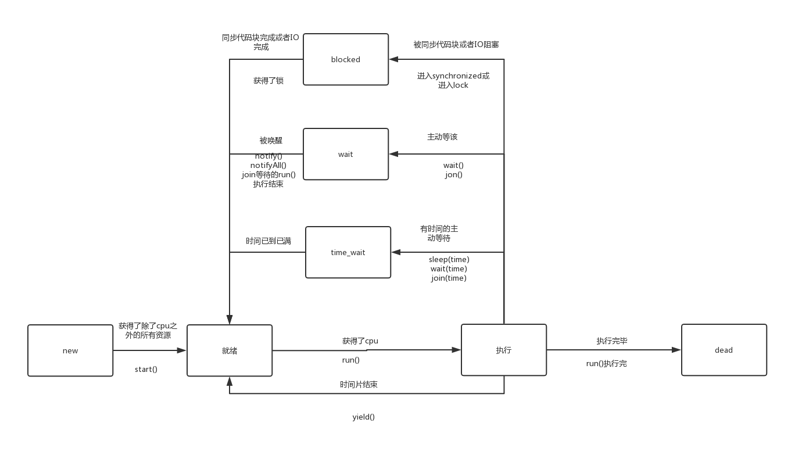

在学习java中对线程的支持之前，先了解线程的几种状态。

## 线程的几种状态
<!--more-->
线程从创建到死亡会经历很多的状态：创建，就绪，执行，阻塞，waiting，time_waiting，死亡。waiting和time_wait属于block

Thread内部类，线程的状态
```java
public enum State {
    //此时还没有调用start()
        NEW,
    //调用了start()，包含就绪和执行状态
        RUNNABLE,
    //阻塞状态：线程等待一个锁，当要进入synchronized代码块或者lock时可能进入这个状态
        BLOCKED,
    //线程正在等该什么，当调用wait(),join()，sleep等方法会进入这个状态
        WAITING,
    //带有时间限制的等待
        TIMED_WAITING,
    //终止状态，线程已完成任务
        TERMINATED;
    }
```

当需要一个线程时，我们创建一个线程，但是此时线程还无法工作，因为它可能需要一些资源例如文件，IO等；

当获取到除了cpu之外的资源时它进入到了就绪状态，只要获得cpu就能够执行；

当获取到cpu，线程进入执行状态；

等到cpu时间片结束就又进入了就绪状态；

但是如果在执行期间线程已经完成了工作，那么就直接死亡；

在执行期间可能会主动进入waiting状态，此时他会释放锁和资源；

在执行期间也可能进入sleep状态，但是不会释放自己所获得的资源（包括锁）；

如果在执行期间被同步代码块（获取不到锁）或者获取不到IO资源等会进入阻塞状态，此时他不会释放自己所获得的资源，例如两个线程需要a，b两个锁，线程x获得了a，线程Y获得了b，此时X想要获得b，Y想要获得a；那么它们都进入了阻塞状态，由于不释放资源，它们会死锁；





## 上下文切换

一颗cpu同一时刻只能被一个线程占有，那么cpu切换线程就意味着需要保存此时线程所有的状态，保证下一次执行时能够从现在的状态恢复。线程的切换代价较大，但是进程的切换代价更大。


## Thread类中的方法


1. currentThread()方法可以获得当前的线程对象

2. start()方法用来启动一个线程

3. run()，注意run方法不是用户调用的，它不会创建一个线程

4. sleep(long time)在指定的毫秒数内让当前正在执行的线程休眠（暂停执行），此操作受到系统计时器和调度程序精度和准确性的影响。该线程不丢失任何监视器的所属权。也就是不释放锁。

```java
public class Study2 extends Thread {
    private static final Object object=new Object();
        @Override
        public void run() {
            System.out.println("now thresd: "+getId()+" try to enter synchronized");
            synchronized (object){
                System.out.println("now thread: "+getId()+" is run and sleep");
                try {
                    sleep(4000);
                } catch (InterruptedException e) {
                    e.printStackTrace();
                }
            }
            System.out.println("now thread: "+getId()+" exit synchronized");
        }
    public static void main(String[] args) {

       Study2 study=new Study2();
       Study2 study1=new Study2();

       study.start();
       study1.start();
    }
}
```

输出结果：
```
now thresd: 12 try to enter synchronized
now thresd: 11 try to enter synchronized
now thread: 12 is run and sleep
now thread: 12 exit synchronized
now thread: 11 is run and sleep
now thread: 11 exit synchronized

Process finished with exit code 0
```

可以看见当一个线程sleep之后不释放资源，而且时间到了就会醒来继续执行，执行完才释放锁

5. join(long millis)：thread.join()方法会使调用join方法的线程先执行完或者执行一定的时间，再执行之后的数据，如果没有传入参数，会等待该线程结束。

接着上一个例子，将main方法改变为以下代码   
```java
public static void main(String[] args) throws InterruptedException {

        Study2 study=new Study2();
        Study2 study1=new Study2();

        study.start();
        study.join();
        System.out.println("wait "+study.getId()+" finish");
        study1.start();
    }
```

此时控制台输出：如下：永远都是study执行完了才开始执行接下来的内容
```
now thresd: 11 try to enter synchronized
now thread: 11 is run and sleep
now thread: 11 exit synchronized
wait 11 finish
now thresd: 12 try to enter synchronized
now thread: 12 is run and sleep
now thread: 12 exit synchronized
```

6. yield()方法暂停当前正在执行的线程对象，并执行其他线程，也就是交出cpu执行权，让线程重回就绪状态。调度程序可以忽略此方法。

7. interrupt()方法可以中断一个阻塞的线程


注意join(),join(time),sleep(time),yield()不释放锁


关于一些获取属性的方法，以get开头的方法，比如getId，getName等。

## Thread类源码分析

### 成员变量

比较常见的有：   

```java
    //线程的名字
    private volatile String name;
    //优先级
    private int            priority;
    //是否是守护线程
    private boolean     daemon = false;
    //任务
    private Runnable target;
    //当前线程所在的线程组
    private ThreadGroup group;
    //栈的深度
    private long stackSize;
    //id
    private long tid;
    //线程的状态
    private volatile int threadStatus = 0;
```


### 成员方法

1. start()

```java

public synchronized void start() {
        
        //检查状态是否是new状态
        if (threadStatus != 0)
            throw new IllegalThreadStateException();
        group.add(this);

        boolean started = false;
        //尝试开始启动线程，失败什么也不做
        try {
            start0();
            started = true;
        } finally {
            try {
                if (!started) {
                    group.threadStartFailed(this);
                }
            } catch (Throwable ignore) {
                
            }
        }
    }
```

2.sleep(long millis)是一个native方法，注意调用该方法不会失去monitor的所有权

```java
public static native void sleep(long millis) throws InterruptedException;
```

3. join()方法

```java
public final synchronized void join(long millis)
    throws InterruptedException {
        long base = System.currentTimeMillis();
        long now = 0;

        if (millis < 0) {
            throw new IllegalArgumentException("timeout value is negative");
        }
        //如果millis为0，那么它会一直wait
        if (millis == 0) {
            while (isAlive()) {
                wait(0);
            }
        } else {
            while (isAlive()) {
                long delay = millis - now;
                if (delay <= 0) {
                    break;
                }
                wait(delay);
                now = System.currentTimeMillis() - base;
            }
        }
    }
```


4. yield()也是一个native方法

```java
public static native void yield();
```


## 参考
[https://www.processon.com/diagrams](https://www.processon.com/diagrams)     
JDK