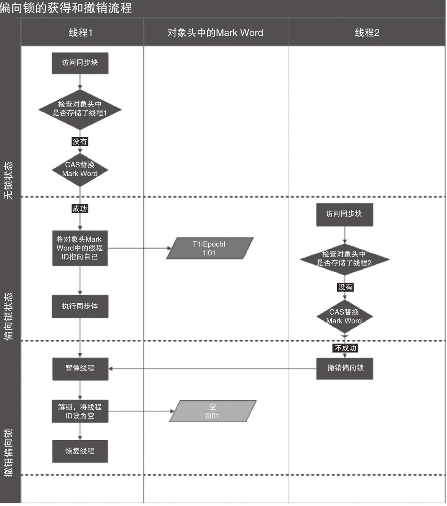
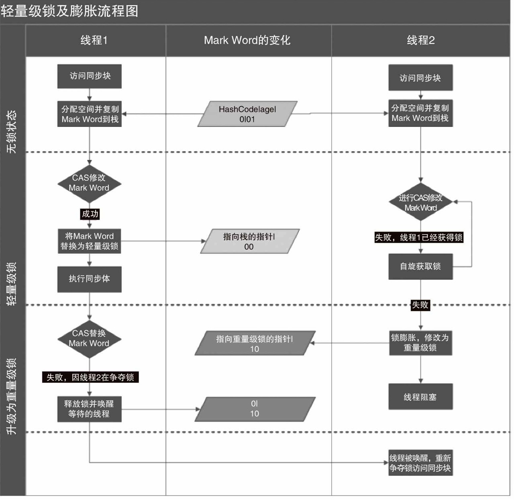

# java并发编程：synchronized与对象头

多线程提高了效率，但是也会出现同步的问题。为了解决这个问题，java提供了synchronized关键字和Lock类。

## synchronized的使用
<!--more-->

synchronized使用如下：

修饰普通方法：
```java
private synchronized void add(int val){
    this.res+=val;
}
```
锁住的是当前对象，如果一个线程进入了这个方法，那么其他线程不能再进入这个方法或者此类其他的被synchronized修饰的方法，但是可以进入普通的么有被synchronized修饰的方法。

修饰静态方法：
```java
private static synchronized void add(int val){
    this.res+=val;
}
锁住的是当前类的对应的Class对象，如果一个线程进入了这个方法，那么其他线程不能进入这个类的被synchronized锁住的静态方法，但是可以进入非静态的方法。


同步代码块：
```java
synchronized(xxx){
    ...
}
```
锁住的是xxx对象。


## 对象头
那么synchronized到底是怎么实现的呢？

它依赖与对象头。

HotSpot虚拟机中，对象在内存中存储的布局可以分为三块区域：对象头（Header）、实例数据（Instance Data）和对齐填充（Padding）。

在对象头中分为两个部分，第一部分是类型指针，用于表示是哪一个类的对象。第二部分存储了关于对象运行时的数据，比如GC年龄，hashcode，锁状态标志等，这一部分也被称为Mark Word。


如上所示，在32为系统中，对象头的数据长为32位。

在无锁的状态下:前25bit表示hashcode，然后4bit表示分代年龄，再后一bit表示是否是偏向锁，最后两位表示锁标志位。

在轻量级锁的状态下:前30bit是只想栈中所记录的指针，后两位表示轻量级锁

重量级锁与轻量级锁类似。

如果表示偏向锁：则会存储持有这个偏向锁的线程id，时间戳Epoch，分代年龄，是否偏向等等。


## synccharonized锁的级别

从上可以看出，锁可以是无所状态，偏向锁状态，轻量级锁状态，重量级锁状态。

偏向锁表示：如果这个线程获取了这个对象的锁，那么下一次就不需要在次获取这个对象的锁了，这适用于竞争非常小的情况。

轻量级锁：如果一个线程尝试CAS获取一个偏向锁，但是失败了，锁就会膨胀为轻量级锁

重量级锁：如果一个线程在一定的自旋次数中没有获得轻量级锁，那么此时锁会膨胀为重量级锁。


获取不同的锁的代价不同，偏向锁只需要一次CAS即可，二轻量级锁需要多次CAS，重量级需要用到系统的mutex，代价更大。但是如果一直使用偏向锁或者轻量级锁也不行，因为持续自旋很浪费cpu资源。这是java对synchronized的优化。





## 实现

```java
public static void main(String[] args) throws InterruptedException {
        Object o=new Object();
        synchronized (o){
            System.out.println("lcok");
        }
    }
```

反编译上面的字节码，会发现：
```
      11: monitorenter
      12: getstatic     #2                  // Field java/lang/System.out:Ljava/io/PrintStream;
      15: ldc           #28                 // String lcok
      17: invokevirtual #11                 // Method java/io/PrintStream.println:(Ljava/lang/String;)V
      20: aload_2
      21: monitorexit

```

在11行执行了monitorenter指令，然后执行了System.out.println("lcok");然后再执行monitorexit

## 参考
并发编程的艺术   
[https://www.cnblogs.com/dolphin0520/p/3923737.html](https://www.cnblogs.com/dolphin0520/p/3923737.html)
