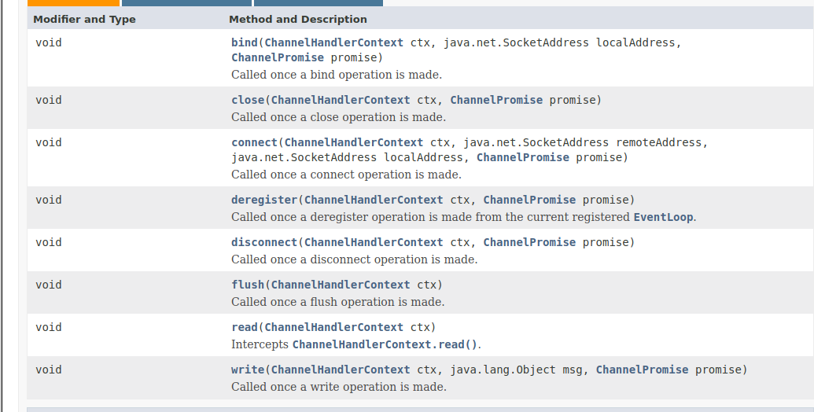
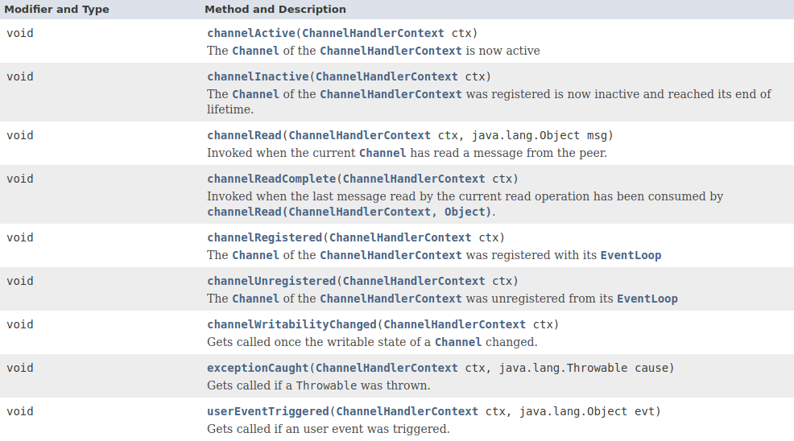
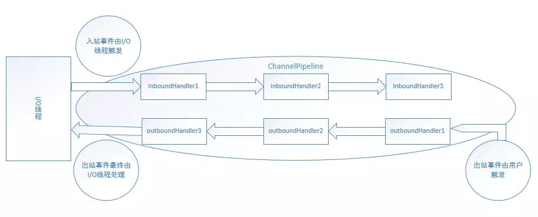

netty是基于事件驱动的，因此事件在netty中十分重要。当数据进入和出去时会发生事件，而我们会定义多个handler来处理这些事件，那么这些事件发生的顺序是怎样的呢，netty又是怎么实现的。
<!--more-->

在了解这些之前，需要了解几个类，`ChannelHandler`系列：包括`ChannelOutboundHandler`，`ChannelInboundHandler`等，还需要了解`ChannelPipeline`，`ChannelHandlerContext`系列。
## 核心类

### ChannelHandler

ChannelHandler用来处理I/O事件或者拦截I/O操作，并将其转发到ChannelPipeline中的下一个handler中。每一个ChannelHandler都有一个 ChannelHandlerContext对象，handler与它所属的ChannelPipeline（管道）对象联系，可以向通道的上游或者下游传递事件，动态的改变管道，或者存储一些信息。

Channel本身并没有提供很多的方法去处理事件，只有：
- handlerAdded(ChannelHandlerContext ctx)：
- handlerRemoved(ChannelHandlerContext ctx)
- Sharable注解

但是它有两个子接口：
- ChannelInboundHandler： to handle inbound I/O events
- ChannelOutboundHandler： to handle outbound I/O operations.

通常我们使用：
- ChannelInboundHandlerAdapter to handle inbound I/O events,
- ChannelOutboundHandlerAdapter to handle outbound I/O operations, and
- ChannelDuplexHandler to handle both inbound and outbound events

#### ChannelOutboundHandler

ChannelOutboundHandler用来处理出inbound事件，它提供了以下方法：



包括bind、connect、disconnect、close、deregister、read、write、flush等方法    
通常我们复写这些方法来处理自己事件的逻辑。

outbound的时候可能会触发这些事件，如果我们没有复写这些方法，那么会调用默认的方法。

#### ChannelInboundHandler

ChannelInboundHandler用来处理出outbound事件，它提供了以下方法：



提供了包括：通道激活，取消激活，可读，读完毕，通道注册到事件循环中，从事件循环中注销的事件，异常处理事件，用户的事件被触发的事件等。

在inbound中可能会触发这些事件，然后执行这些方法。


### ChannelPipeline

之前总是提及ChannelPipeline，ChannelPipeline可以看做是一个容器，一个双向链表，节点就是ChannelHandlerContext对象(包含ChannelHandler)，它们有一定的顺序。当数据传出或者传出时会流经管道上的ChannelHandlerContext，处理事件。

ChannelPipeline实现了拦截过滤器模式的高级形式，让用户完全控制如何处理事件以及管道中的通道处理程序如何相互作用。

注意：每个channel都有自己的ChannelPipeline，在创建新channel时会自动创建。

那么事件如何在Pipe中流通呢？   
下图描述了pipe中的 ChannelHandlers通常如何处理I/O事件。I/O事件由ChannelInboundHandler或者ChannelOutboundHandler处理，并通过调用 ChannelHandlerContext 中定义的事件传播方法，如 ChannelHandlerContext.fireChannelRead(Object) 和 ChannelOutboundInvoker.write(Object)来转发到最近的handler。

<pre>
                                             I/O Request
                                            via Channel or
                                        ChannelHandlerContext
                                                      |
  +---------------------------------------------------+---------------+
  |                           ChannelPipeline         |               |
  |                                                  \|/              |
  |    +---------------------+            +-----------+----------+    |
  |    | Inbound Handler  N  |            | Outbound Handler  1  |    |
  |    +----------+----------+            +-----------+----------+    |
  |              /|\                                  |               |
  |               |                                  \|/              |
  |    +----------+----------+            +-----------+----------+    |
  |    | Inbound Handler N-1 |            | Outbound Handler  2  |    |
  |    +----------+----------+            +-----------+----------+    |
  |              /|\                                  .               |
  |               .                                   .               |
  | ChannelHandlerContext.fireIN_EVT() ChannelHandlerContext.OUT_EVT()|
  |        [ method call]                       [method call]         |
  |               .                                   .               |
  |               .                                  \|/              |
  |    +----------+----------+            +-----------+----------+    |
  |    | Inbound Handler  2  |            | Outbound Handler M-1 |    |
  |    +----------+----------+            +-----------+----------+    |
  |              /|\                                  |               |
  |               |                                  \|/              |
  |    +----------+----------+            +-----------+----------+    |
  |    | Inbound Handler  1  |            | Outbound Handler  M  |    |
  |    +----------+----------+            +-----------+----------+    |
  |              /|\                                  |               |
  +---------------+-----------------------------------+---------------+
                  |                                  \|/
  +---------------+-----------------------------------+---------------+
  |               |                                   |               |
  |       [ Socket.read() ]                    [ Socket.write() ]     |
  |                                                                   |
  |  Netty Internal I/O Threads (Transport Implementation)            |
  +-------------------------------------------------------------------+
 
</pre>


   

入站事件一般由I/O线程触发，出站事件一般由用户触发。


一个例子：
```java
ChannelPipeline p = ...;
 p.addLast("1", new InboundHandlerA());
 p.addLast("2", new InboundHandlerB());
 p.addLast("3", new OutboundHandlerA());
 p.addLast("4", new OutboundHandlerB());
 p.addLast("5", new InboundOutboundHandlerX());

```
在给定的示例中，当事件进入时，处理程序的评估顺序是1、2、3、4、5。当事件出站时，顺序是5，4，3，2，1。除此之外，ChannelPipeline跳过对某些处理程序的评估，以缩短堆栈深度:   
入站顺序是125，出站顺序是543.

当然在上图中可以发现：handler必须调用ChannelHandlerContext中的事件传播方法，才能将事件转发给下一个处理程序。

### ChannelHandlerContext

ChannelHandler可以与pipe还有其他的ChannelHandler交互。在一个channel中一个handler对应着一个channelHandlerContext对应，当然一个pipe中可以有多个ChannelHandlerContext.


注意：ChannelHandlerContext.wtite()和ChannelHandlerContext.channel.write()的区别：   
ctx.channel().write()从tail节点开始传播，ctx.write()从当前节点开始传播。

当调用ctx.channel().write()方法时：调用以下方法
```java
public ChannelFuture write(Object msg) {
        return pipeline.write(msg);
    }
```

```java
private void write(Object msg, boolean flush, ChannelPromise promise) {
    //获取下一个outBoundContext，然后执行事件方法
        AbstractChannelHandlerContext next = findContextOutbound();
        final Object m = pipeline.touch(msg, next);
        EventExecutor executor = next.executor();
        if (executor.inEventLoop()) {
            if (flush) {
                next.invokeWriteAndFlush(m, promise);
            } else {
                next.invokeWrite(m, promise);
            }
        } else {
            final AbstractWriteTask task;
            if (flush) {
                task = WriteAndFlushTask.newInstance(next, m, promise);
            }  else {
                task = WriteTask.newInstance(next, m, promise);
            }
            if (!safeExecute(executor, task, promise, m)) {
                // We failed to submit the AbstractWriteTask. We need to cancel it so we decrement the pending bytes
                // and put it back in the Recycler for re-use later.
                //
                // See https://github.com/netty/netty/issues/8343.
                task.cancel();
            }
        }
    }
```

## 传播机制

inbound会从head开始:head->1->2->5传播;而outbound是：tail->5->4->3传播。


当我写了以下代码：
```java
ch.pipeline().addLast(new In1Handler())
                                    .addLast(new Out1Hadnler())
                                    .addLast(new Out2Handler())
                                    .addLast(new In2Handler());
```
那么此时的pine中的ChannelHandlerContext应该是：head-in1-out1-out2-in2-tail,入站和出站都是在这条链上进行。如果是出站，那么会依次寻找下一个outContext,直到结束；反之入站也一样。 

我认为：**所谓的事件传播其实就是事件在这条链表上移动。**


参考[netty文档](https://netty.io/4.1/api/index.html)