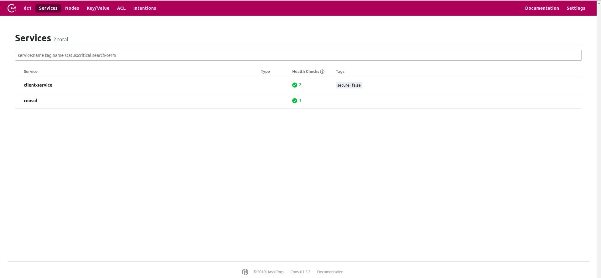

既然eureka不再维护，那么我们可以考虑其他的组件，比如consul。consul生态很好。
<!--more-->

## 简介

Consul的主要特点是：

服务发现：Consul的客户可以注册服务，并且其他客户可以使用Consul来发现给定服务的提供者。使用DNS或HTTP，应用程序可以轻松找到它们所依赖的服务。

运行状况检查：Consul客户端可以提供任意数量的运行状况检查，这些检查与给定服务（“是Web服务器返回200 OK”）或本地节点（“内存利用率低于90％”）相关联。可以使用此信息来监控群集运行状况，服务发现组件使用该信息将流量路由远离不健康的主机。

KV存储：应用程序可以将Consul的分层键/值存储用于任何目的，包括动态配置，功能标记，协调，选举等。

安全服务通信：Consul可以为服务生成和分发TLS证书，以建立相互的TLS连接。可用于定义允许哪些服务进行通信。

多数据中心：Consul支持多个数据中心。

以上是从官网翻译的结果。

它提供的这些功能可以很方便的搭建一个注册中心。

### 下载安装

它不想eureka那样需要新建一个java工程来启动它，官网有打包好的可执行文件，我们需要下载安装在机器上，然后配置，运行。

- 下载地址[https://www.consul.io/downloads.html](https://www.consul.io/downloads.html)  
- 解压，解压后是一个可执行二进制文件
- 设置环境变量方便使用
- 检查：在shell中输入`consul -v`，有输出表示安装无误


## 单机版搭建

- 启动consul `consul agent -dev`：agent代理，像是守护进程，-dev表示在开发环境中使用，可以快速搭建一个consul服务。但是所有的数据都不会持久化，仅用于开发。

- java工程

### 依赖
```xml
<!--注册-->
<dependency>
    <groupId>org.springframework.cloud</groupId>
    <artifactId>spring-cloud-starter-consul-discovery</artifactId>
    <version>2.1.0.RELEASE</version>
</dependency>
```
当然其它关于cloud和boot的依赖也得有

### 配置文件

```yml
spring:
  application:
    name: client-service
  cloud:
    consul:
    #consul服务的节点地址，这是默认值，可以在consul的配置文件中修改
      host: 127.0.0.1
      port: 8500
```

### 启动类
```java
@SpringBootApplication
//服务发现的注解
@EnableDiscoveryClient
public class ServiceApplication {
    public static void main(String[] args) {
        SpringApplication.run(ServiceApplication.class,args);
    }
}
```
### 效果

在浏览器中访问`http://localhost:8500`,可以看见以下页面：



还可以访问其它的信息，比如服务的健康信息，key/value,nodes等


当然consul还有更多的功能可以配置

## 集群搭建

为了保证注册中心的高可用，需要将注册中心搭建为集群。

在CAP理论中，Consul使用CP体系结构.
- 三台机器，或者使用vagrant模拟，或者使用docker镜像。

ip：172.20.20.20 ，172.20.20.21 ，172.20.20.22 

- 三台机器启动consul 

`consul agent -server -bootstrap-expect=3 -data-dir=/tmp/consul -node=consul-server-1  -bind=192.168.43.174 -client=0.0.0.0`

`consul agent -server -bootstrap-expect=3 -data-dir=/tmp/consul -node=consul-server-2  -bind=192.168.43.174 -client=0.0.0.0 -join 127.20.20.20`

`consul agent -server -bootstrap-expect=3 -data-dir=/tmp/consul -node=consul-server-3  -bind=192.168.43.174 -client=0.0.0.0 -join 127.20.20.21`

此时已经搭建了一个集群，在spring cloud中只需要配置任意一个consul节点就行了。

## consul参数
```
    acl            Interact with Consul's ACLs
    agent          Runs a Consul agent #运行consul代理
    catalog        Interact with the catalog
    connect        Interact with Consul Connect
    debug          Records a debugging archive for operators
    event          Fire a new event
    exec           Executes a command on Consul nodes
    force-leave    Forces a member of the cluster to enter the "left" state
    info           Provides debugging information for operators.
    intention      Interact with Connect service intentions
    join           Tell Consul agent to join cluster # 加入到一个集群
    keygen         Generates a new encryption key
    keyring        Manages gossip layer encryption keys
    kv             Interact with the key-value store
    leave          Gracefully leaves the Consul cluster and shuts down
    lock           Execute a command holding a lock
    login          Login to Consul using an auth method
    logout         Destroy a Consul token created with login
    maint          Controls node or service maintenance mode
    members        Lists the members of a Consul cluster #查看集群中的节点
    monitor        Stream logs from a Consul agent
    operator       Provides cluster-level tools for Consul operators
    reload         Triggers the agent to reload configuration files
    rtt            Estimates network round trip time between nodes
    services       Interact with services
    snapshot       Saves, restores and inspects snapshots of Consul server state
    tls            Builtin helpers for creating CAs and certificates
    validate       Validate config files/directories
    version        Prints the Consul version
    watch          Watch for changes in Consul
```

更多请参考[https://www.consul.io/docs/commands/index.html](https://www.consul.io/docs/commands/index.html)

### agent参数

- -server，表示该节点以server模式运行，会持久化数据，建议几个数据中心只有3-5个server
- -client，表示节点以client模式运行，client不会持久化数据，只做数据转发，client可以提高consul效率
- -bootstrap-expect，表示期待的server节点的个数，可以不配置，如果配置需要保持一致
- -data-dir，consul数据存储的位置
- -node 该节点的名字
- -client表示监听所有
- -bind，绑定一个地址，需要每个consul都能访问到，用来consul之间通信
- -join，加入到某一个集群，值为这个集群中某一节点的ip
- -config-dir，配置文件所属的文件夹，consul会按照字典序读取所有的".json" 或 ".hcl"文件，并且会合并配置：单配置覆盖，列表求并集
- -ui，web ui界面，在我的尝试中，不实用这个参数也能访问到web ui

这些如果全部写在命令中不合适，可以将其写在配置文件中，使用-config-dir 或 -config-file获得配置文件。

更多配置请参考[https://www.consul.io/docs/agent/options.html](https://www.consul.io/docs/agent/options.html)


## vs others

| feature | consul | zk | nacos | 
| --- | ---- | ---- | ---- |  
| 多数据中心 | 支持 | 支持  | 支持 |
| kv存储 | 支持 | 支持 | 支持 | 
|一致性 | raft | paxos | raft | 
|cap | cp | cp | cp |
|安全 | https/acl | acl(3.5.5支持https)| https |
| metrics | ok | no | ok |
另外nacos还可作为配置中心。

## 参考
[https://www.consul.io/](https://www.consul.io/)   
[https://blog.csdn.net/longgeqiaojie304/article/details/85259972](https://blog.csdn.net/longgeqiaojie304/article/details/85259972)