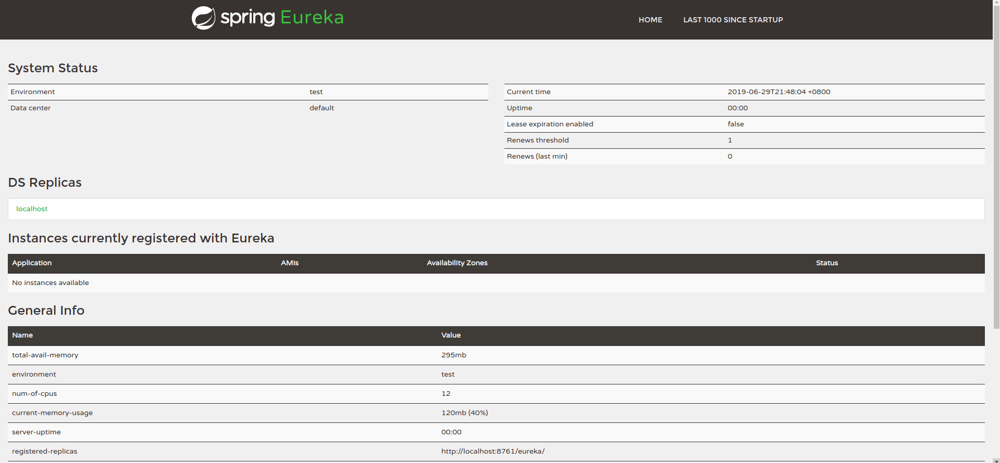
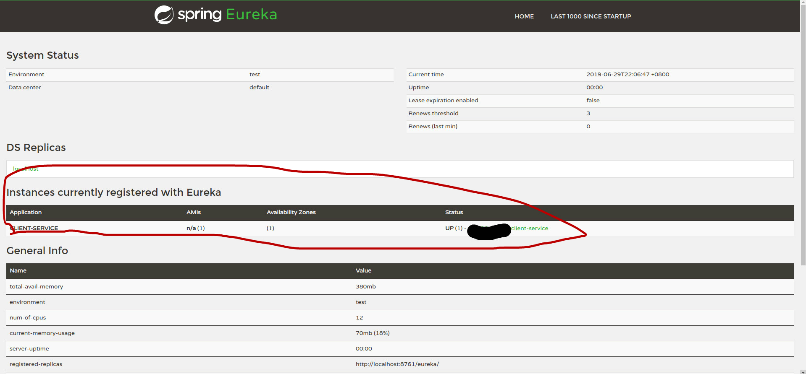

在springcloud中eureka被用来作为一个注册中心组件。
<!--more-->

但是eureka2.x已经不在维护了,不过目前使用还是没什么问题，而且1.x也够用了。而且还有多种注册中心可供选择，比如consul。

## eureka服务端搭建
### 依赖

```xml
<parent>
        <groupId>org.springframework.boot</groupId>
        <artifactId>spring-boot-starter-parent</artifactId>
        <version>2.1.5.RELEASE</version>
</parent>
<dependency>
        <groupId>org.springframework.cloud</groupId>
        <artifactId>spring-cloud-dependencies</artifactId>
        <version>Greenwich.RELEASE</version>
        <type>pom</type>
        <scope>import</scope>
</dependency>
<!--eureka服务服务端需要引入的依赖-->
<dependency>
        <groupId>org.springframework.cloud</groupId>
        <artifactId>spring-cloud-starter-netflix-eureka-server</artifactId>
</dependency>

```

### 配置文件

```yml
spring:
  application:
    name: eureka-server
server:
  port: 8761
eureka:
  client:
    serviceUrl:
      #与eureka客户端（将要注册的服务）交互的uri
      defaultZone: http://localhost:8761/eureka
      #不注册自己
    registerWithEureka: false
    fetchRegistry: false
```

### 启动类


```java
@SpringBootApplication
//启动eureka服务端的注解
@EnableEurekaServer
public class EurekaServerApplication {
    public static void main(String[] args) {
        SpringApplication.run( EurekaServerApplication.class, args );
    }
}
```

此时启动工程，在浏览器中输入[http://localhost:8761/](http://localhost:8761/),你将会看到以下界面，表示启动eureka服务启动成功了。



## 服务注册

### 依赖

```xml

<parent>
        <groupId>org.springframework.boot</groupId>
        <artifactId>spring-boot-starter-parent</artifactId>
        <version>2.1.5.RELEASE</version>
</parent>
<dependency>
        <groupId>org.springframework.cloud</groupId>
        <artifactId>spring-cloud-dependencies</artifactId>
        <version>Greenwich.RELEASE</version>
        <type>pom</type>
        <scope>import</scope>
</dependency>
<!--注册-->
        <dependency>
            <groupId>org.springframework.cloud</groupId>
            <artifactId>spring-cloud-starter-netflix-eureka-client</artifactId>
        </dependency>
<!--服务调用的依赖-->
```

### 配置

```yml
spring:
  application:
    name: client-service

eureka:
  client:
    serviceUrl:
    #总得知道在哪注册
      defaultZone: http:/localhost:8761/eureka/
```


### 启动类
添加上发现的注解`@EnableDiscoveryClient`

```java

@SpringBootApplication
@EnableDiscoveryClient
public class ServiceApplication {
    public static void main(String[] args) {
        SpringApplication.run(ServiceApplication.class, args);
    }
}


```

启动项目，然后刷新[http://localhost:8761/](http://localhost:8761/),你会发现有一个服务已经注册成功了。




## 流程简述

当eureka启动，开始监听8761端口，当client启动，会发送一条消息给localhost:8761，eureka收到消息后就将这条消息（含有该服务的地址与名字）给存起来，注册成功。

服务会周期性地向Eureka Server发送心跳以续约自己的信息。如果Eureka Server在一定时间内没有接收到某个微服务节点的心跳，将会注销该微服务节点

Eureka Client会缓存Eureka Server中的信息。即使所有的Server节点都宕掉，服务消费者依然可以使用缓存中的信息找到服务提供者。