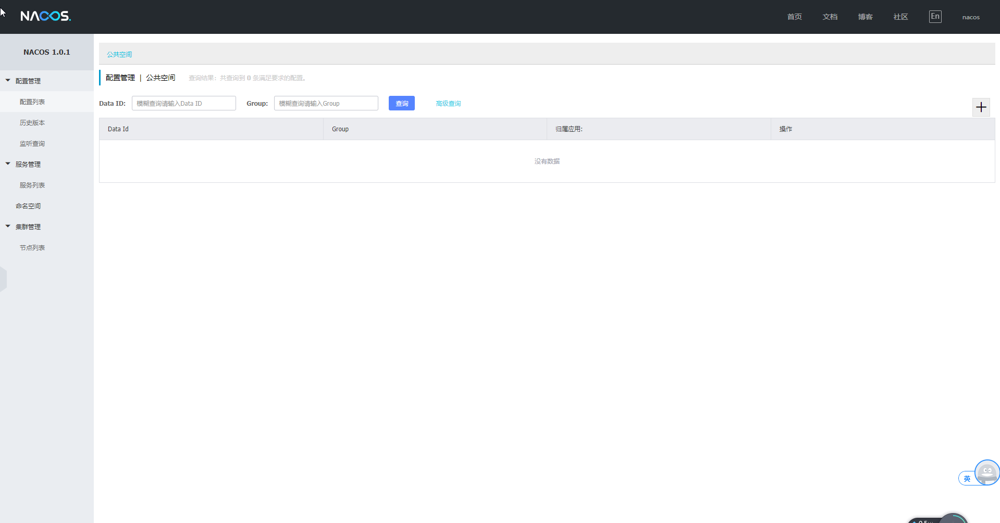

为什么要使用nacos？
<!--more-->

## nacos简介

nacos=consul+config，既可以作为配置中心，还可以作为注册中心，并且具有web ui，可以在线优雅的进行配置，服务下线，监控等。减少组件的集合。

Nacos 致力于帮助您发现、配置和管理微服务。Nacos 提供了一组简单易用的特性集，帮助您快速实现动态服务发现、服务配置、服务元数据及流量管理。

单论注册的功能来时，它与consul很像。

官方文档[https://nacos.io/zh-cn/docs/what-is-nacos.html](https://nacos.io/zh-cn/docs/what-is-nacos.html)

## 下载安装
- 下载： [下载地址](https://github.com/alibaba/nacos/releases)
- 解压
- 更改nacos/conf/application.properties文件中端口
- shell中运行：linux上`sh startup.sh -m standalone`;windows:`cmd startup.cmd`，这是单机模式
- 浏览器中输入`localhost:8844/nacos`；登录`user=nacos,password=nacos`




## 服务注册于发现
服务注册

`curl -X POST http://127.0.0.1:8848/nacos/v1/ns/instance?serviceName=nacos.naming.serviceName&ip=20.18.7.10&port=8080`

服务发现

`curl -X GET http://127.0.0.1:8848/nacos/v1/ns/instance/list?serviceName=nacos.naming.serviceName`

## 依赖
```xml
<parent>
        <groupId>org.springframework.boot</groupId>
        <artifactId>spring-boot-starter-parent</artifactId>
        <version>2.1.5.RELEASE</version>
</parent>
<dependencies>
        <dependency>
            <groupId>org.springframework.cloud</groupId>
            <artifactId>spring-cloud-dependencies</artifactId>
            <version>Greenwich.RELEASE</version>
            <type>pom</type>
            <scope>import</scope>
        </dependency>
</dependencies>
<!--注册-->
<dependency>
        <groupId>org.springframework.cloud</groupId>
        <artifactId>spring-cloud-starter-alibaba-nacos-discovery</artifactId>
        <version>0.9.0.RELEASE</version>
</dependency>
```
版本说明：[https://github.com/spring-cloud-incubator/spring-cloud-alibaba/wiki/%E7%89%88%E6%9C%AC%E8%AF%B4%E6%98%8E](https://github.com/spring-cloud-incubator/spring-cloud-alibaba/wiki/%E7%89%88%E6%9C%AC%E8%AF%B4%E6%98%8E)

## 配置文件
application.yaml
```yaml
spring:
  application:
    name: service
  cloud:
    nacos:
      discovery:
       #nacos的地址
        server-addr: 127.0.0.1:8844
```
## 启动类
```java
//加上此注解用于服务注册与发现
@EnableDiscoveryClient
@SpringBootApplication
public class ServiceApplication {
    public static void main(String[] args) {
        SpringApplication.run(ServiceApplication.class,args);
    }
}
```

观察nacos的ui上服务列表即可看见已经成功，还可以查看详细信息，编辑信息，使其下线

## 集群配置
### 部署nacos
- 在三台机器上安装nacos。
- 修改`nacos/conf/cluster.conf`，写入三台机器的ip：端口
- 以集群模式启动`start.cmd -m cluster`
- nacos会自动选举出一个leader

使用一台机器模拟集群：cluster.conf
```
10.xx.xx.6:8844
10.xx.xx.6:8845
10.xx.xx.6:8846
```
### application.yaml
```yaml
spring:
  application:
    name: service
  cloud:
    nacos:
      discovery:
       #nacos的集群
        server-addr: 127.0.0.1:8844,127.0.0.1:8845,127.0.0.1:8846
```
可以在web ui中看见有三个节点。

## 其它

虽然它还有不足，但是相信一定会更好。

## 参考
[https://nacos.io/zh-cn/docs/what-is-nacos.html](https://nacos.io/zh-cn/docs/what-is-nacos.html)