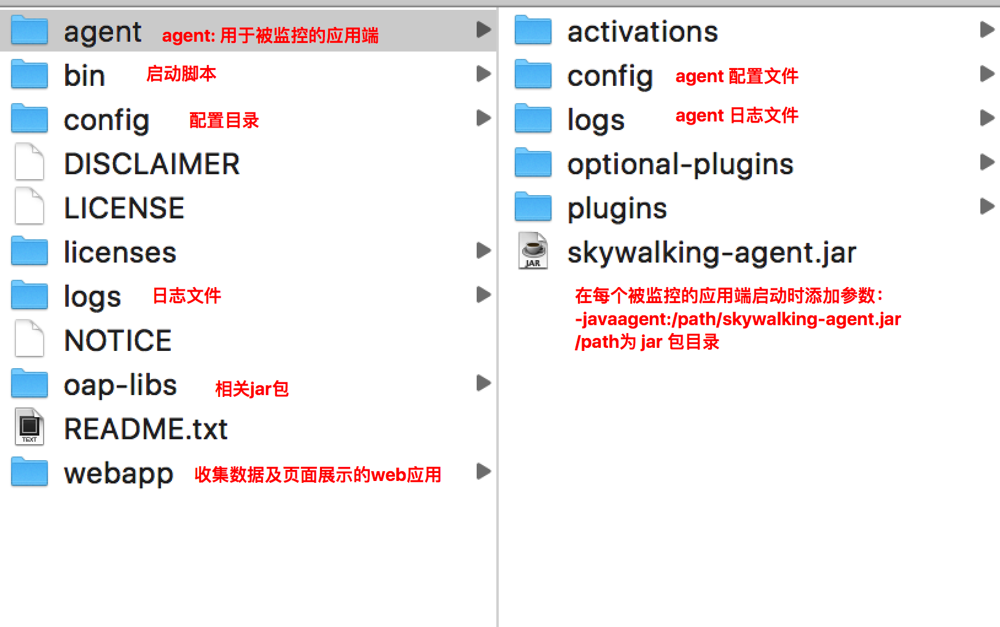

在一个微服务中，链路追踪能够准确监控所有调用链路，从而定位慢调用，失败调用。
<!--more-->
## 简介
skywalking是分布式系统的应用程序性能监视工具，专为微服务、云原生架构和基于容器（Docker、K8s、Mesos）架构而设计。

发起者是吴晟，现在是Apache项目。

[官方文档](https://skywalking.apache.org/zh/)

## 原理简介


- skywalking分为四个部分:探针，平台后端，存储，UI
- Probes,探针，探针因使用的语言不同而不通，收集数据并且格式化为skywalking所需的格式。
- Platform backend 平台后端，对应于zipkin server，可以集群部署，聚合，分析，将数据展示在UI中
- Storage：存储，可扩展的存储，可以使es，H2，MySQL集群
- UI 丰富的可视化功能，提供身份验证

## 搭建

### 下载
版本:6.0.0-GA
[下载地址](https://archive.apache.org/dist/incubator/skywalking/6.0.0-GA/apache-skywalking-apm-incubating-6.0.0-GA.zip)
解压
解压后目录




### 服务端配置

#### 数据持久化方式

##### MySQL
1. 创建一个数据库，例如`create database wstest;` 
2. 将MySQL的驱动包添加入解压后`/oap-libs`文件夹
3. 修改`config/application.yml`,注释storage下的h2，添加一下内容
```yml
storage:
  mysql:
```
4. 修改`config/datasource-settings.properties`,写入对应属性，例如
```properties
jdbcUrl=jdbc:mysql://localhost:3306/swtest?useSSL=false&serverTimezone=UTC
dataSource.user=root
dataSource.password=root
dataSource.cachePrepStmts=true
dataSource.prepStmtCacheSize=250
dataSource.prepStmtCacheSqlLimit=2048
dataSource.useServerPrepStmts=true
dataSource.useLocalSessionState=true
dataSource.rewriteBatchedStatements=true
dataSource.cacheResultSetMetadata=true
dataSource.cacheServerConfiguration=true
dataSource.elideSetAutoCommits=true
dataSource.maintainTimeStats=false
```
5. 启动服务端，运行`lib/startup.bat`
6. 检查，浏览器中输入`localhost:8080`
7. 其它，服务端默认使用端口：8080，11800(gRPC)，12800(HTTP)，可以在`webapp/webapp.yml`和`config/application.yml`中更改

#### 数据自动清理
在`config/application.yml`中可以设置数据过期时间
```yml
    downsampling:
    - Hour
    - Day
    - Month
    # Set a timeout on metric data. After the timeout has expired, the metric data will automatically be deleted.
    recordDataTTL: ${SW_CORE_RECORD_DATA_TTL:90} # Unit is minute
    minuteMetricsDataTTL: ${SW_CORE_MINUTE_METRIC_DATA_TTL:90} # Unit is minute
    hourMetricsDataTTL: ${SW_CORE_HOUR_METRIC_DATA_TTL:36} # Unit is hour
    dayMetricsDataTTL: ${SW_CORE_DAY_METRIC_DATA_TTL:45} # Unit is day
    monthMetricsDataTTL: ${SW_CORE_MONTH_METRIC_DATA_TTL:18} # Unit is month
```
#### 告警配置
在服务端`config/alarm-settings.yml`中配置，例如
```
rules:
  # Rule unique name, must be ended with `_rule`.
  service_resp_time_rule:
    indicator-name: service_resp_time
    op: ">"
    threshold: 1000
    period: 10
    count: 3
    silence-period: 5
    message: Response time of service {name} is more than 1000ms in 3 minutes of last 10 minutes.
```
- service_resp_time_rule：告警规则名称 ***_rule （规则名称可以自定义但是必须以’_rule’结尾）
- indicator-name：指标数据名称： 参见[https://github.com/apache/skywalking/blob/master/docs/en/setup/backend/backend-alarm.md#list-of-all-potential-metric-name](https://github.com/apache/skywalking/blob/master/docs/en/setup/backend/backend-alarm.md#list-of-all-potential-metric-name)
- op: 操作符： > , < , = 【当然你可以自己扩展开发其他的操作符】
- threshold：目标值：指标数据的目标数据 如sample中的1000就是服务响应时间，配合上操作符就是大于1000ms的服务响应
- period: 告警检查持续时间
- counts: 达到告警阈值的次数，在period内达到这个次数将被告警
- silence-period：在时间t告警，那么在`( t , t + period )`时间段内保持沉默，不再告警
- message：告警信息
- webhooks：服务告警通知服务地址
### 客户端

1. 将解压出来的agent拷贝到一个空目录
2. 将服务的jar包放入agent目录
3. 配置agent `agent/config/agent.config`,例如
```
# Licensed to the Apache Software Foundation (ASF) under one
# or more contributor license agreements.  See the NOTICE file
# distributed with this work for additional information
# regarding copyright ownership.  The ASF licenses this file
# to you under the Apache License, Version 2.0 (the
# "License"); you may not use this file except in compliance
# with the License.  You may obtain a copy of the License at
#
#     http://www.apache.org/licenses/LICENSE-2.0
#
# Unless required by applicable law or agreed to in writing, software
# distributed under the License is distributed on an "AS IS" BASIS,
# WITHOUT WARRANTIES OR CONDITIONS OF ANY KIND, either express or implied.
# See the License for the specific language governing permissions and
# limitations under the License.

# The agent namespace
# agent.namespace=${SW_AGENT_NAMESPACE:default-namespace}

# The service name in UI
#agent.service_name=${SW_AGENT_NAME:Your_ApplicationName}
agent.service_name=consumer
# The number of sampled traces per 3 seconds
# Negative number means sample traces as many as possible, most likely 100%
# agent.sample_n_per_3_secs=${SW_AGENT_SAMPLE:-1}

# Authentication active is based on backend setting, see application.yml for more details.
# agent.authentication = ${SW_AGENT_AUTHENTICATION:xxxx}

# The max amount of spans in a single segment.
# Through this config item, skywalking keep your application memory cost estimated.
# agent.span_limit_per_segment=${SW_AGENT_SPAN_LIMIT:300}

# Ignore the segments if their operation names start with these suffix.
# agent.ignore_suffix=${SW_AGENT_IGNORE_SUFFIX:.jpg,.jpeg,.js,.css,.png,.bmp,.gif,.ico,.mp3,.mp4,.html,.svg}

# If true, skywalking agent will save all instrumented classes files in `/debugging` folder.
# Skywalking team may ask for these files in order to resolve compatible problem.
# agent.is_open_debugging_class = ${SW_AGENT_OPEN_DEBUG:true}

# 配置集群时只需要添加多个address即可
# Backend service addresses.
collector.backend_service=${SW_AGENT_COLLECTOR_BACKEND_SERVICES:127.0.0.1:11800}

# Logging level
logging.level=${SW_LOGGING_LEVEL:DEBUG}
```
4. 启动服务，上述配置文件中的变量，既可以添加入环境变量，也可以写入到上述配置文件中
```
java:javaagent:/toAgentPath/skywalking-agent.jar -jar 自己的服务.jar
#例如
java -javaagent:skywalking-agent.jar -jar service1-1.0-SNAPSHOT.jar
```
5. 检查，发起一些请求，观察skywalking UI


### UI简介

[https://skywalking.apache.org/zh/blog/2018-12-18-Apache-SkyWalking-5-0-UserGuide.html](https://skywalking.apache.org/zh/blog/2018-12-18-Apache-SkyWalking-5-0-UserGuide.html)