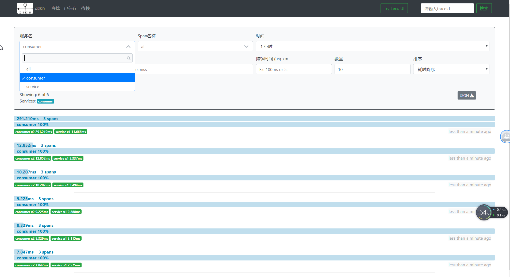
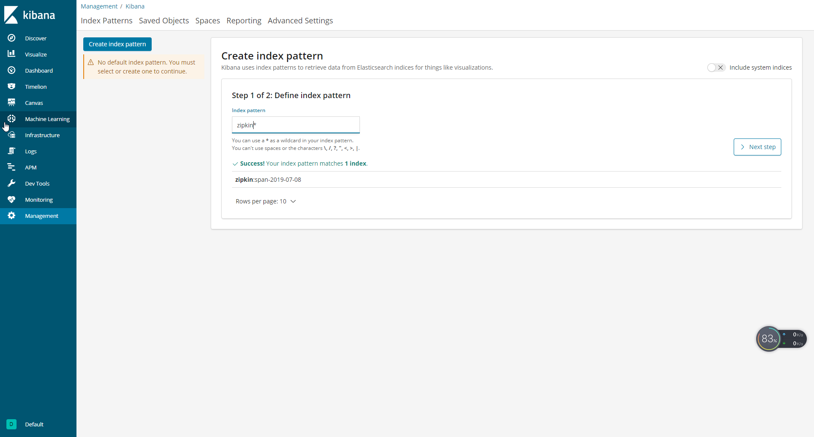
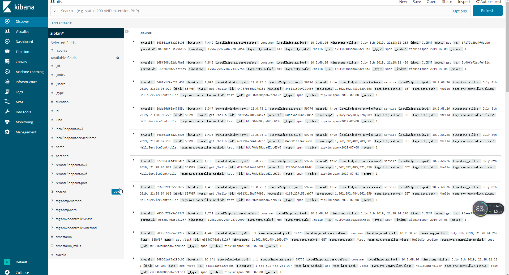

在分布式系统中，链路将总是十分重要。
<!--more-->

### 版本说明
| 组件   |  版本 | 说明 |
| ------ |  ------ | ----- |
| zipkin | 2.12.9 |  |
| rabbitmq | 3.7.15 | |
| erl   | 10.4 | rabbitmq依赖 |
| elasticsearch | 6.5.3| 使用7.x会与zipkin冲突  |
| kibana  | 6.5.3 | 使用7.x会与zipkin冲突  |
| logstash | 6.5.3  |使用7.x会与zipkin冲突  |
### 简介
Spring Cloud Sleuth 为服务之间调用提供链路追踪。了解到一个服务请求经过了哪些服务，每个服务处理花费了多长。从而让我们理清各微服务间的调用关系。

功能：
- 耗时分析: 获得每个采样（链路追踪可以不展示全部）请求的耗时;
- 可视化错误: 对于程序未捕捉的异常，可以通过集成 Zipkin 服务界面上看到;
- 链路优化: 对于调用比较频繁的服务，可以针对这些服务实施一些优化措施。

### 术语

- Span：基本工作单元，发送一个远程调度任务就会产生一个Span，Span是用一个64位ID唯一标识的，Trace是用另一个64位ID唯一标识的。Span还包含了其他的信息，例如摘要、时间戳事件、Span的ID以及进程ID。
- Trace：由一系列Span组成的，呈树状结构。请求一个微服务系统的API接口，这个API接口需要调用多个微服务单元，调用每个微服务单元都会产生一个新的Span，所有由这个请求产生的Span组成了这个Trace。
- Annotation：用于记录一个事件，定义一个请求的开始和结束，如下：
   - cs （Client Sent）：客户端发送一个请求，描述Span的开始。
   - sr （Server Received）：服务端获得请求并准备开始处理它，如果将其sr减去cs时间戳，便可得到网络传输的时间。
   - ss （Server Sent）：服务端发送响应，该注解表明请求处理的完成（当请求返回客户端），用ss的时间戳减去sr时间戳，便可以得到服务器请求的时间。
   - cr （Client Received）：客户端接收响应，此时Span结束，如果cr的时间戳减去cs时间戳，便可以得到整个请求所消耗的时间。

## Zipkin

Zipkin是一种分布式链路追踪系统。 收集链路中的数据，并且可以以界面的形式展现。

Zipkin UI还提供了一个依赖关系图，显示了每个应用程序通过的跟踪请求数。

zipkin已经不再支持开发者自己开发zipkin server，而是以一个jar包启动。

下载jar包

```bash
curl -sSL https://zipkin.io/quickstart.sh | bash -s
```
或者[https://search.maven.org/remote_content?g=io.zipkin.java&a=zipkin-server&v=LATEST&c=exec](https://search.maven.org/remote_content?g=io.zipkin.java&a=zipkin-server&v=LATEST&c=exec)
或者pull docker镜像
```bash
docker pull zipkin
```

## 示例


### 启动zipkin

```bash
java -jar zipkin.jar
```
默认端口为9411
### 依赖
所有的服务相对于zipkin server 都是client，因此所有的服务都需要以下依赖


```xml
<dependency>
       <groupId>org.springframework.cloud</groupId>
       <artifactId>spring-cloud-starter-sleuth</artifactId>
</dependency>

<dependency>
       <groupId>org.springframework.cloud</groupId>
       <artifactId>spring-cloud-starter-zipkin</artifactId>
</dependency>
```

### 配置文件
增加以下内容
```yaml
spring:
  #链路追踪
  sleuth:
    web:
      client:
        enabled: true
    # 采样比例，默认是0.1，最大为1，表示采集数据的比例
    sampler:
      probability: 1.0
#zipkin的地址
  zipkin:
    base-url: http://localhost:9411/

```

### 验证

代码不需要任何改动。

确保启动了consul，zipkin
在浏览器中输入`http://localhost:9411`
调用服务，可以在浏览器中搜索服务，获得链路追踪后的详细信息；还可以观察每一个服务的依赖关系。




## 使用rabbitmq进行链路数据传输(可选)

1 . 下载，安装，启动rabbitmq;在浏览器中输入`http://localhost:15672`检查是否成功

2 . 启动zipkin
zipkin启动需要读取一些环境变量来配置自己。


|属性 |环境变量 | 描述 |
| --- | --- | ----- |
| zipkin.collector.rabbitmq.addressed  | RABBIT_ADDRESSES  |  用逗号分隔的 RabbitMQ 地址列表，例如localhost:5672,localhost:5673  |
| zipkin.collector.rabbitmq.password  |  RABBIT_PASSWORD |  连接到 RabbitMQ 时使用的密码，默认为 guest  |
|zipkin.collector.rabbitmq.username   | RABBIT_USER  | 连接到 RabbitMQ 时使用的用户名，默认为guest   |
|zipkin.collector.rabbitmq.virtual-host   | RABBIT_VIRTUAL_HOST  |  使用的 RabbitMQ virtual host，默认为 /  |
| zipkin.collector.rabbitmq.use-ssl  |  RABBIT_USE_SSL | 设置为true则用 SSL 的方式与 RabbitMQ 建立链接   |
|zipkin.collector.rabbitmq.concurrency   | RABBIT_CONCURRENCY  | 并发消费者数量，默认为1   |
|zipkin.collector.rabbitmq.connection-timeout   | RABBIT_CONNECTION_TIMEOUT  | 建立连接时的超时时间，默认为 60000毫秒，即 1 分钟   |
|zipkin.collector.rabbitmq.queue   |  RABBIT_QUEUE | 从中获取 span 信息的队列，默认为 zipkin   |

**最好使用环境变量，在java命令中直接设置属性值会失效**

```bash
set RABBIT_ADDRESSES=localhost
set path=%path%;RABBIT_ADDRESSES
java -jar zipkin.jar
```

在浏览器中输入`http://localhost:9411/zipkin/`检查是否成功

3 . 引入依赖
```xml
<dependency>
        <groupId>org.springframework.cloud</groupId>
        <artifactId>spring-cloud-stream-binder-rabbit</artifactId>
</dependency>
```

4 . 修改配置文件
```yaml
spring:
# 使用rabbitmq后去掉
#  zipkin:
#    base-url: http://localhost:9411/
  zipkin:
    sender:
      type: rabbit
  rabbitmq:
    host: localhost
    username: guest
    password: guest
    port: 5672

```
注释 base-url，添加rabbitmq的配置

## 日志收集(可选)
### Elasticsearch+Kibana+Logstash

Logstash(收集服务器上的日志文件) -->然后保存到 ElasticSearch（搜索引擎） -->Kibana提供友好的web界面（从ElasticSearch读取数据进行展示）

1 .下载Elasticsearch和Kibana，Logstash，解压
2 .启动`elasticsearch.bat`，`kibana.bat` 
3 .配置Logstash并启动

在logstash安装目录/bin下新建文件logstash.conf，内容如下
```

input {
  beats {
    port => 5044
  }
}

filter {
       # pattern matching logback pattern
       grok {
              match => { "message" => "%{TIMESTAMP_ISO8601:timestamp}\s+%{LOGLEVEL:severity}\s+\[%{DATA:service},%{DATA:trace},%{DATA:span},%{DATA:exportable}\]\s+%{DATA:pid}\s+---\s+\[%{DATA:thread}\]\s+%{DATA:class}\s+:\s+%{GREEDYDATA:rest}" }
       }
}

output {
  elasticsearch {
    hosts => ["http://localhost:9200"]
    #index => "%{[@metadata][beat]}-%{[@metadata][version]}-%{+YYYY.MM.dd}"
    index => "zipkin-%{+YYYY.MM.dd}"
	#user => "elastic"
    #password => "changeme"
  }
}

```
启动logstash:`logstash -f logstash.conf`

4 .添加依赖
```xml
        <!--日志-->
        <dependency>
            <groupId>ch.qos.logback</groupId>
            <artifactId>logback-core</artifactId>
            <version>1.2.3</version>
        </dependency>
        <dependency>
            <groupId>net.logstash.logback</groupId>
            <artifactId>logstash-logback-encoder</artifactId>
            <version>4.11</version>
        </dependency>
```

5 .配置服务logback-spring.xml,以json格式将日志输出到文件,在项目目录/bulid下

```xml
<?xml version="1.0" encoding="UTF-8"?>
<configuration>
    <include resource="org/springframework/boot/logging/logback/defaults.xml"/>
    ​
    <springProperty scope="context" name="springAppName" source="spring.application.name"/>
    <!-- Example for logging into the build folder of your project -->
    <property name="LOG_FILE" value="${BUILD_FOLDER:-build}/${springAppName}"/>​

    <!-- You can override this to have a custom pattern -->
    <property name="CONSOLE_LOG_PATTERN"
              value="%clr(%d{yyyy-MM-dd HH:mm:ss.SSS}){faint} %clr(${LOG_LEVEL_PATTERN:-%5p}) %clr(${PID:- }){magenta} %clr(---){faint} %clr([%15.15t]){faint} %clr(%-40.40logger{39}){cyan} %clr(:){faint} %m%n${LOG_EXCEPTION_CONVERSION_WORD:-%wEx}"/>

    <!-- Appender to log to console -->
    <appender name="console" class="ch.qos.logback.core.ConsoleAppender">
        <filter class="ch.qos.logback.classic.filter.ThresholdFilter">
            <!-- Minimum logging level to be presented in the console logs-->
            <level>DEBUG</level>
        </filter>
        <encoder>
            <pattern>${CONSOLE_LOG_PATTERN}</pattern>
            <charset>utf8</charset>
        </encoder>
    </appender>

    <!-- Appender to log to file -->​
    <appender name="flatfile" class="ch.qos.logback.core.rolling.RollingFileAppender">
        <file>${LOG_FILE}</file>
        <rollingPolicy class="ch.qos.logback.core.rolling.TimeBasedRollingPolicy">
            <fileNamePattern>${LOG_FILE}.%d{yyyy-MM-dd}.gz</fileNamePattern>
            <maxHistory>7</maxHistory>
        </rollingPolicy>
        <encoder>
            <pattern>${CONSOLE_LOG_PATTERN}</pattern>
            <charset>utf8</charset>
        </encoder>
    </appender>
    ​
    <!-- Appender to log to file in a JSON format -->
    <appender name="logstash" class="ch.qos.logback.core.rolling.RollingFileAppender">
        <file>${LOG_FILE}.json</file>
        <rollingPolicy class="ch.qos.logback.core.rolling.TimeBasedRollingPolicy">
            <fileNamePattern>${LOG_FILE}.json.%d{yyyy-MM-dd}.gz</fileNamePattern>
            <maxHistory>7</maxHistory>
        </rollingPolicy>
        <encoder class="net.logstash.logback.encoder.LoggingEventCompositeJsonEncoder">
            <providers>
                <timestamp>
                    <timeZone>UTC</timeZone>
                </timestamp>
                <pattern>
                    <pattern>
                        {
                        "severity": "%level",
                        "service": "${springAppName:-}",
                        "trace": "%X{X-B3-TraceId:-}",
                        "span": "%X{X-B3-SpanId:-}",
                        "parent": "%X{X-B3-ParentSpanId:-}",
                        "exportable": "%X{X-Span-Export:-}",
                        "pid": "${PID:-}",
                        "thread": "%thread",
                        "class": "%logger{40}",
                        "rest": "%message"
                        }
                    </pattern>
                </pattern>
            </providers>
        </encoder>
    </appender>
    ​
    <root level="INFO">
        <appender-ref ref="console"/>
        <!-- uncomment this to have also JSON logs -->
        <appender-ref ref="logstash"/>
        <appender-ref ref="flatfile"/>s
    </root>
</configuration>
```
6 .启动consul,rabbitmq,Elasticsearch,Kibana,各个服务
7 .启动zipkin
```bash
set RABBIT_ADDRESSES=localhost
set STORAGE_TYPE=elasticsearch
set ES_HOSTS=http://localhost:9200
set ES_INDEX=zipkin
set path=%path%;RABBIT_ADDRESSES;STORAGE_TYPE;ES_HOSTS;ES_INDEX
java -jar zipkin.jar
```
8 .测试访问`http://localhost:9411/zipkin/`
9 .将数据通过kibana展示 
  - kibana默认端口是`5601`,在浏览器中输入`http://localhost:5601`
  - 单击“Management”按钮，然后单击“Add New”，添加一个index。ElasticSearch中写入链路数据的index配置为“zipkin”，那么在界面填写为“zipkin*”，单击“Create”按钮。



  - 点击Discover按钮查看数据


