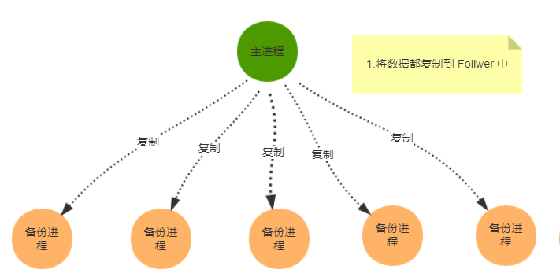
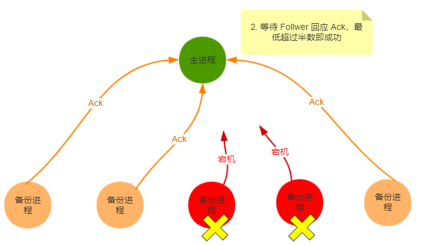
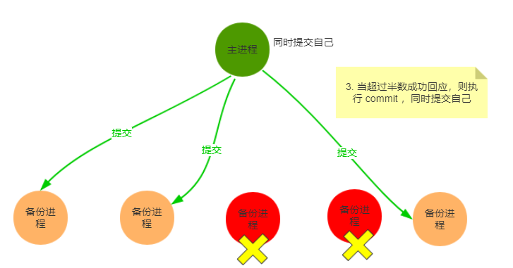

zookeeper选举机制
<!--more-->
- [请求，事务，标识符](#%e8%af%b7%e6%b1%82%e4%ba%8b%e5%8a%a1%e6%a0%87%e8%af%86%e7%ac%a6)
- [群首选举](#%e7%be%a4%e9%a6%96%e9%80%89%e4%b8%be)
- [Zab](#zab)
- [本地存储](#%e6%9c%ac%e5%9c%b0%e5%ad%98%e5%82%a8)
  - [日志](#%e6%97%a5%e5%bf%97)
  - [快照](#%e5%bf%ab%e7%85%a7)
- [参考](#%e5%8f%82%e8%80%83)

## 请求，事务，标识符
zookeeper服务器会在本地处理只读请求（exists、getData、getChildren），所以zookeeper在处理以只读请求为主的负载时，性能会很高。

那些会改变zookeeper状态的客户端请求（create、delete、setData、）会被转发到leader。leader执行相应的请求，完成状态的更新，称之为事务。

看一个例子:加入一个客户端提交了一个对/z节点的setData请求，setData会改变该znode的数据信息，并会增加该节点的版本号，因此这个请求的事务会有两个重要的字段：数据字段，新版本号。

**事务具有幂等性**，可以对一个事务执行多次，而得到的结果一致，幂等性使得在进行恢复处理很容易。

## 群首选举
（群首）leader是一个集群中被选举出来的一个服务器，它被其他服务器所认可。设置leader是为了对客户端发起的会改变zookeeper状态的请求进行排序，讲一个请求转换为一个事务，将这些事务发送个follower，确保既无奈按照顺序执行事务。leader只有一个，通过选举产生。

服务器的几种状态:
- LOOKING：寻找Leader状态。当服务器处于该状态时，它会认为当前集群中没有Leader，因此需要进入Leader选举状态。
- FOLLOWING：跟随者状态。表明当前服务器角色是Follower。
- LEADING：领导者状态。表明当前服务器角色是Leader。
- OBSERVING：观察者状态。表明当前服务器角色是Observer。

每个服务器启动会进入looking状态，然后会进行选举，如果leader已经存在了，那么不用再进行选举；否则进行选举。如果中途leader挂了，那么余下的非observer会进入looking状态，然后开始选举
1. 每个服务器发送一个投票
  在选举时服务器会发送选举信息vote(sid,zxid)，sid就是投票的服务器的id，zxid该服务器最近执行的事务的id，比如如果是（1,5）表示服务器sid为1，最近执行的事务的id是5.
2. 当一个服务器接受每个服务器的投票,检查是否合法，然后处理投票信息，将其与自己的投票信息进行pk，具体规则如下：
  - 如果接收的zxid比自己的投票的zxid大或者zxid相等并且对方的sid>mySid，那么更改自己的投票为接收的投票
  - 否则不改变投票信息，再次投票
  - 如果超过半数的服务器接受了某个投票，那么变选举出了leader
3. 更改各个服务器的状态

## Zab
ZAB 协议全称：Zookeeper Atomic Broadcast（Zookeeper 原子广播协议）。   

ZAB 协议定义：ZAB 协议是为分布式协调服务 Zookeeper 专门设计的一种支持 崩溃恢复 和 原子广播 协议。

当就收到一个请求后，follower会将其转发到leader，leader将其封装成一个事务，向每个follower发送一个proposal消息p，当follower接收到p后，会相应一个ack，通知leader已经接受到了该proposal，如果超过半数响应，那么leader开始发送消息通知follower开始进行commit，包括自己。

   
   
   

那么有一个疑问，如何保证数据数据一致呢，zookeeper有几个重要的保障：
- 如果leader按顺序广播了事务t和t1，那么每个服务器在提交t1之前会保证t已经提交完毕
- 如果某个服务器按照t，t1的顺序提交了事务，那么其他服务器也会咋集体及哦啊事务t1前提交事务t

如果leader崩溃了怎么办，zookeeper做出了以下保障
- 确保那些已经在 Leader 提交的事务最终会被所有服务器提交。
- 确保丢弃那些只在 Leader 提出/复制，但没有提交的事务。
如果让 Leader 选举算法能够保证新选举出来的 Leader 服务器拥有集群总所有机器编号（即 ZXID 最大）的事务，那么就能够保证这个新选举出来的 Leader 一定具有所有已经提交的提案。而且只需要将提议转发给各个follower而不需要从其他follower提交到leader。

那么又有一个问题，如何同步：   
如果follower之后leader不多，leader只需要**发送缺失的事务**即可（DIFF），如果缺失很多，leader直接发送**整个快照**。当所有的 Follwer 服务器都成功同步之后，Leader 会将这些服务器加入到可用服务器列表中。

## 本地存储

### 日志
服务器会通过日志来持久化事务，当接受一个事务，就将其写入到日志中，后面的事务会按顺序追加到后面，日志保存到磁盘中。

### 快照
快照是zookeeper的数据树的拷贝。服务器经常进行产生快照，在生成快照期间不会阻塞，可以继续处理请求。因此在生成快照是模糊的（fuzzy），不能反应在任意时间定的数据数的准确状态，例如：

此时有两个节点/z=1,z1=2    
开始生成快照,持久化的/z   
开始事务t，、/z=3   
事务t1，/z1=4   
持久化z1   
那么该快照不能反应任意时间点的状态

然而这不是个问题，服务器会重播事务，每一个快照会以开始快照前最后的事务的时间戳作为tag，记为TS，在加载快照时，会执行在TS之后的日志中的所有的事务，在这个例子中就是t和t1.由于幂等性，所以重复执行事务不会影响数据一致性。

## 参考
[https://www.cnblogs.com/stateis0/p/9062133.html](https://www.cnblogs.com/stateis0/p/9062133.html)   
zookeeper分布式过程协同技术详解