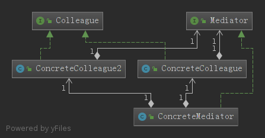

# 中介者模式

- 对象与对象之间存在大量的关联关系，这样势必会导致系统的结构变得很复杂，同时若一个对象发生改变，我们也需要跟踪与之相关联的对象，同时做出相应的处理。
-  对象之间的连接增加会导致对象可复用性降低。
-   系统的可扩展性低。增加一个新的对象，我们需要在其相关连的对象上面加上引用，这样就会导致系统的耦合性增高，使系统的灵活性和可扩展都降低。

为了解决这种情况，出现了中介者模式
<!--more-->
## 定义

中介者对象：使用一个中介者对象封装一系列的对象交互，中介者使个对象不需要显示的相互引用，从而使其耦合松散，而且可以独立改变它们之间的交互。

## 结构
- Mediator: 抽象中介者
- ConcreteMediator: 具体中介者
- Colleague: 抽象同事类
- ConcreteColleague: 具体同事类
## 例子

一个抽象中介者或者接口
~~~java
public interface Mediator {
    void send(String msg,Colleague colleague);

}
~~~
一个抽象同事类
~~~java
public interface Colleague {
    void notifyTo(String msg);
}
~~~

具体中介者类
~~~java
public class ConcreteMediator implements Mediator {

    private ConcreteColleague concreteColleague;
    private ConcreteColleague2 concreteColleague2;

    public void setConcreteColleague(ConcreteColleague concreteColleague) {
        this.concreteColleague = concreteColleague;
    }

    public void setConcreteColleague2(ConcreteColleague2 concreteColleague2) {
        this.concreteColleague2 = concreteColleague2;
    }

    @Override
    public void send(String msg, Colleague colleague) {
        if (colleague.getClass().equals(ConcreteColleague.class)){
            concreteColleague2.notifyTo(msg);
        }else {
            concreteColleague.notifyTo(msg);
        }
    }
}
~~~

具体同事类
~~~java

public class ConcreteColleague2 implements Colleague{

    private Mediator mediator;

    public void setMediator(Mediator mediator) {
        this.mediator = mediator;
    }

    public ConcreteColleague2(Mediator mediator) {
        this.mediator = mediator;
    }

    @Override
    public void notifyTo(String msg) {
        System.out.println("msg from two: "+msg);
    }
}

~~~
~~~java

public class ConcreteColleague implements Colleague {
    private Mediator mediator;

    public void setMediator(Mediator mediator) {
        this.mediator = mediator;
    }

    public ConcreteColleague(Mediator mediator) {
        this.mediator = mediator;
    }

    public void notifyTo(String msg){
        System.out.println("msg from one: "+msg);
    }
}

~~~
客户类
~~~java

public class Client {
    public static void main(String[] args) {

        ConcreteMediator mediator=new ConcreteMediator();
        ConcreteColleague c1=new ConcreteColleague(mediator);
        ConcreteColleague2 c2=new ConcreteColleague2(mediator);
        mediator.setConcreteColleague(c1);
        mediator.setConcreteColleague2(c2);
        mediator.send("One,how are you?",c1);//msg from two: One,how are you?
        mediator.send("Two,fine.",c2);//msg from one: Two,fine.
    }
}
~~~

由上可知：同事对象进行了解耦，只知道一个中介类，传递消息都有中介者类发送。

类图：  

## 优点
- 简化了对象之间的交互。
- 将各同事解耦。

## 缺点
- 在具体中介者类中包含了同事之间的交互细节，可能会导致具体中介者类非常复杂，使得系统难以维护。
