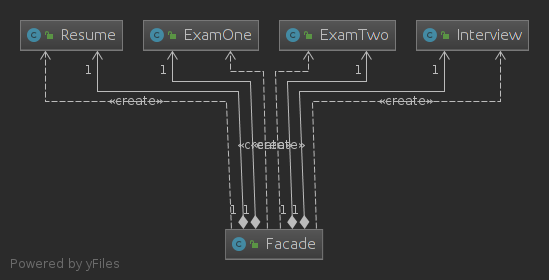

# 外观模式

## 定义
外部与一个子系统通信必须经过一个统一的外观对象进行，为子系统的一组接口提供一个一致的界面。外观模式定义了一个高层接口，这个接口使得子系统更加容易使用。

<!--more-->

## 结构
- Facade：外观角色
- SubSystem：子系统角色

## 例子

假如要进入一家公司，需要经过投简历，笔试，面试...   

简历
~~~java
public class Resume {
    public void SendResum(){

    }
}
~~~
笔试
~~~java
public class ExamOne {
    Random random=new Random();
    public boolean doExam(){
        int r=random.nextInt(1);
        return 1==r;
    }
}
~~~
~~~java

public class ExamTwo {
    Random random=new Random();
    public boolean doExam(){
        int r=random.nextInt(1);
        return 1==r;
    }
}
~~~

面试
~~~java

public class Interview {
    Random random=new Random();
    public boolean interview(){
        int r=random.nextInt(1);
        return 1==r;
    }
}
~~~

外观类：
~~~java

public class Facade {
    private Resume resume;
    private Interview interview;
    private ExamOne examOne;
    private ExamTwo examTwo;

    public Facade() {
        this.resume = new Resume();
        this.interview = new Interview();
        this.examOne = new ExamOne();
        this.examTwo = new ExamTwo();
    }

    public void sendResume(){
        resume.SendResum();
    }
    public boolean interview(){
        return interview.interview();
    }
    public boolean doExamOne(){
        return examOne.doExam();
    }
    public boolean doExamTwo(){
        return examTwo.doExam();
    }

}
~~~

客户类
~~~java
public class Client {
    public static void main(String[] args) {
        Facade facade=new Facade();
        facade.sendResume();
        if (facade.doExamOne()){
            if (facade.doExamTwo()){
                if (facade.interview()){
                    System.out.println("pass");
                }
            }
        }
    }
}
~~~

类图：

## 优点
- 对客户屏蔽子系统组件，减少了客户处理的对象数目并使得子系统使用起来更加容易。通过引入外观模式，客户代码将变得很简单，与之关联的对象也很少。
- 实现了子系统与客户之间的松耦合关系，这使得子系统的组件变化不会影响到调用它的客户类，只需要调整外观类即可。
## 缺点
- 不能很好地限制客户使用子系统类，如果对客户访问子系统类做太多的限制则减少了可变性和灵活性。

参考  
[https://design-patterns.readthedocs.io/zh_CN/latest/structural_patterns/facade.html](https://design-patterns.readthedocs.io/zh_CN/latest/structural_patterns/facade.html)
