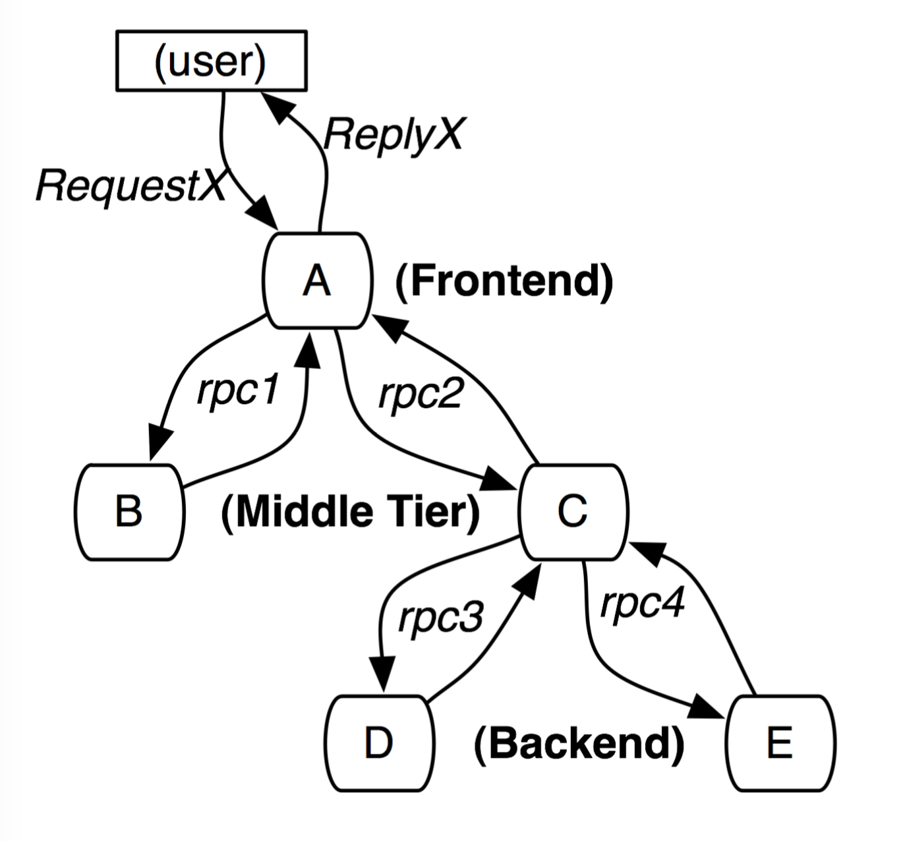
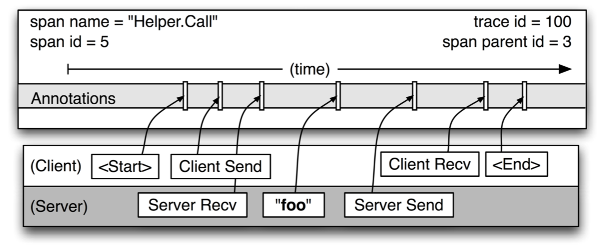

现代互联网服务通常是复杂的大规模分布式系统，持续跟踪与监控每个服务显然是必须的。

<!--more-->
- [背景](#%e8%83%8c%e6%99%af)
- [分布式跟踪](#%e5%88%86%e5%b8%83%e5%bc%8f%e8%b7%9f%e8%b8%aa)
  - [术语](#%e6%9c%af%e8%af%ad)
  - [性能](#%e6%80%a7%e8%83%bd)
  - [采样](#%e9%87%87%e6%a0%b7)
  - [数据收集](#%e6%95%b0%e6%8d%ae%e6%94%b6%e9%9b%86)
  - [安全与隐私](#%e5%ae%89%e5%85%a8%e4%b8%8e%e9%9a%90%e7%a7%81)
  - [trace生成的损耗](#trace%e7%94%9f%e6%88%90%e7%9a%84%e6%8d%9f%e8%80%97)
  - [数据展示与查询](#%e6%95%b0%e6%8d%ae%e5%b1%95%e7%a4%ba%e4%b8%8e%e6%9f%a5%e8%af%a2)
  - [服务告警](#%e6%9c%8d%e5%8a%a1%e5%91%8a%e8%ad%a6)
- [参考](#%e5%8f%82%e8%80%83)
## 背景

比如一个web搜索，前端服务器经一个web查询分发给上百台搜索服务器，每个服务器在自己的inedx上搜索，例如搜索新闻，图片，视频，音乐，博客等，还需要配合例如广告处理，拼写检查等服务，最后将这些搜索的结果返回给前端服务器，对于web搜索，用户对于时间延时很敏感，因此任何一个子系统出了问题，就可能导致延时产生。而工程师总体对于这种情况是很难分析的，因为涉及到了多个服务，多个机器。工程师无法准确地知道调用了哪些服务，也不能对于每一个服务都了如指掌，而服务和服务器可能被多个不同的客户端调用。

因此急需要一种分布式的链路追踪监控工具，可以还原调用链路以及链路调用间的一些属性，并且需要大规模部署，持续监控。并且还需要有以下目标：

- 低消耗：跟踪系统对于原有的服务的性能影响应该做到微乎其微
- 应用级透明：服务开发人员应该不能感知到跟踪系统，不能有代码侵入性，否则因为跟踪系统的bug而导致服务不可用是完全不可取的
- 可扩展性：服务架构变化迅速，集群扩容，因此必须要有良好的可扩展性
- 及时与准确性：对于监控的服务的数据应该及时拿到，并且分析；如果服务出了问题应该可以及时定位

不仅仅是大型的分布式系统需要这种追踪，如果是单机复杂的系统，调用链路复杂，依旧需要进行链路监控。

## 分布式跟踪

分布式的追踪系统需要记录在一次请求后系统完成的所有工作的信息。例如：下面有5台服务器，一个前端服务器A，连个中间层B，C，连个后端D,E。当用户对A调用的时候，A会RPC调用B，C；B会立刻返回，C还会继续RPC调用D，E，最后将信息返回给C，C返回给A，此时一个完整的链路才调用结束。对于这样一个链路，分布式追踪系统需要记录每台机器上每次发送和接收的信息标识符，时间戳，机器，服务的标识。

### 术语

- span：一个跟踪单元，比如A调用C就是一个span。span可以记录一些信息，比如span name，span id，parent id等，这样就可以构建出不同span之间的关系。没有parent的span就是根，也是trace的开始。
- trace：一条链路：由一系列Span组成的，树形结构，比如上述整个流程。trace也可以记录一些数据，比如trace id。这些span id，trace id都是唯一的，可以是64位的整数。
- annotation：cs,sr,ss,cr，可以通过这些annotation戳获得比如响应时间，网络延时时间等。不过由于span通常涉及两台机器，因此需要注意时钟偏差。
  - cs(client sent):客户端发送一条请求，span的开始
  - sr（server received）：服务端获取请求并开始准备处理它
  - ss（server sent）：服务端发送响应，该请求处理完成
  - cr（client received）：客户端接收响应，一个span结束

### 性能
跟踪系统本身不能太影响服务的性能。

- 当一个线程被跟踪时，可以将trace contex 存在ThreadLocal 中，而 trace context应该是小并且容易复制的，里面存储span id和trace id以及span属性。
- 监控者最好是独立于语言，一些开源监控工具往往提供多个语言的抓取者（Collector），而处理数据（Server）与展示（Dashboard）相同

### 采样
对于分布式系统中的所有链路不必要全部收集，实际上只需要收集其中一小部分就足够了。这样可以降低损耗。

可以设置采样率，比如0.01，全局的设置采样率；或者对于根据权重设置采样率；更好的如果可以自适应的设置采样率，比如经常发生问题的地方采样率自动调整高一些。

### 数据收集

首先，可以将数据存储在本地日志文件中，然后由一个追踪的守护进程将日志push给追踪的服务器。也可以是守护进程暴露这些日志给追踪服务器，由追踪服务器自己来pull。

### 安全与隐私

由于每个服务的信息，那么肯定有些数据是不能暴露给调试性能的工程师。

所以不能抓取用户数据，抓取的信息中有具体的机器的id，具体的服务名，url，时间戳等。可以定位问题，分析服务性能即可。既保证隐私也降低损耗。

### trace生成的损耗
由于span id和trace id都是全局唯一的，这是瓶颈。如果一个span被采样，那么为它分配span id就会很慢；如果仅仅是annotation，那么只关心自己，花费时间很少。

全局唯一id的生成策略通常有依赖数据库自增主键，雪花算法，uuid等方式。

### 数据展示与查询

当获取了链路数据后，展现给维护人员是很重要的。可以对数据先进行处理，然后在存储在一个地方，提供一些api供人员查询。

- 最好是可以以图形化的方式展示，千万行日志不如一个图表。
- 用户输入他们关心的数据，例如服务名，span id，trance id，机器id，或者响应时间，然后就会出现一个性能概要的表格，总结了与给定服务相关的所有分布式执行模式。
- 用户可以根据他们的需要对执行模式进行排序，并选择其中一个查看更多细节。
- 一旦选中一个分布式执行模式，用户则会看到关于这个执行模式的图形化描述。被选中的服务在图表中央被高亮显示。

### 服务告警

当出现问题时，比如服务调用失败、服务经常超时，应该发出告警。

## 参考
[https://ai.google/research/pubs/pub36356](https://ai.google/research/pubs/pub36356)   
[http://alphawang.com/blog/google-dapper-translation/](http://alphawang.com/blog/google-dapper-translation/)      