常见的设计模式
<!--more-->

- [面向对象设计七大原则](#%e9%9d%a2%e5%90%91%e5%af%b9%e8%b1%a1%e8%ae%be%e8%ae%a1%e4%b8%83%e5%a4%a7%e5%8e%9f%e5%88%99)
  - [例子](#%e4%be%8b%e5%ad%90)
    - [单一职责原则：](#%e5%8d%95%e4%b8%80%e8%81%8c%e8%b4%a3%e5%8e%9f%e5%88%99)
    - [里氏替换原则](#%e9%87%8c%e6%b0%8f%e6%9b%bf%e6%8d%a2%e5%8e%9f%e5%88%99)
    - [依赖倒置原则](#%e4%be%9d%e8%b5%96%e5%80%92%e7%bd%ae%e5%8e%9f%e5%88%99)
    - [开闭原则](#%e5%bc%80%e9%97%ad%e5%8e%9f%e5%88%99)
- [简单工厂模式（静态工厂方法）](#%e7%ae%80%e5%8d%95%e5%b7%a5%e5%8e%82%e6%a8%a1%e5%bc%8f%e9%9d%99%e6%80%81%e5%b7%a5%e5%8e%82%e6%96%b9%e6%b3%95)
  - [模式结构](#%e6%a8%a1%e5%bc%8f%e7%bb%93%e6%9e%84)
  - [分析：](#%e5%88%86%e6%9e%90)
  - [缺点](#%e7%bc%ba%e7%82%b9)
  - [适用场景](#%e9%80%82%e7%94%a8%e5%9c%ba%e6%99%af)
  - [JDK中的体现](#jdk%e4%b8%ad%e7%9a%84%e4%bd%93%e7%8e%b0)
- [工厂方法模式](#%e5%b7%a5%e5%8e%82%e6%96%b9%e6%b3%95%e6%a8%a1%e5%bc%8f)
  - [定义](#%e5%ae%9a%e4%b9%89)
  - [结构](#%e7%bb%93%e6%9e%84)
  - [举例](#%e4%b8%be%e4%be%8b)
  - [优点](#%e4%bc%98%e7%82%b9)
  - [缺点](#%e7%bc%ba%e7%82%b9-1)
- [抽象工厂模式](#%e6%8a%bd%e8%b1%a1%e5%b7%a5%e5%8e%82%e6%a8%a1%e5%bc%8f)
  - [定义](#%e5%ae%9a%e4%b9%89-1)
  - [结构](#%e7%bb%93%e6%9e%84-1)
  - [例子](#%e4%be%8b%e5%ad%90-1)
  - [优点](#%e4%bc%98%e7%82%b9-1)
  - [缺点](#%e7%bc%ba%e7%82%b9-2)
- [责任链模式](#%e8%b4%a3%e4%bb%bb%e9%93%be%e6%a8%a1%e5%bc%8f)
  - [定义：](#%e5%ae%9a%e4%b9%89)
  - [结构](#%e7%bb%93%e6%9e%84-2)
  - [例子](#%e4%be%8b%e5%ad%90-2)
  - [优点](#%e4%bc%98%e7%82%b9-2)
  - [缺点](#%e7%bc%ba%e7%82%b9-3)
  - [应用](#%e5%ba%94%e7%94%a8)
- [适配器模式](#%e9%80%82%e9%85%8d%e5%99%a8%e6%a8%a1%e5%bc%8f)
  - [定义](#%e5%ae%9a%e4%b9%89-2)
  - [结构](#%e7%bb%93%e6%9e%84-3)
  - [例子](#%e4%be%8b%e5%ad%90-3)
    - [类适配器](#%e7%b1%bb%e9%80%82%e9%85%8d%e5%99%a8)
    - [接口适配器](#%e6%8e%a5%e5%8f%a3%e9%80%82%e9%85%8d%e5%99%a8)
  - [优点](#%e4%bc%98%e7%82%b9-3)
  - [适用环境](#%e9%80%82%e7%94%a8%e7%8e%af%e5%a2%83)
- [观察者模式](#%e8%a7%82%e5%af%9f%e8%80%85%e6%a8%a1%e5%bc%8f)
  - [定义](#%e5%ae%9a%e4%b9%89-3)
  - [结构](#%e7%bb%93%e6%9e%84-4)
  - [例子](#%e4%be%8b%e5%ad%90-4)
  - [优点](#%e4%bc%98%e7%82%b9-4)
- [装饰器模式](#%e8%a3%85%e9%a5%b0%e5%99%a8%e6%a8%a1%e5%bc%8f)
  - [定义](#%e5%ae%9a%e4%b9%89-4)
  - [结构](#%e7%bb%93%e6%9e%84-5)
  - [例子](#%e4%be%8b%e5%ad%90-5)
  - [优点](#%e4%bc%98%e7%82%b9-5)
  - [缺点](#%e7%bc%ba%e7%82%b9-4)
  - [适用环境](#%e9%80%82%e7%94%a8%e7%8e%af%e5%a2%83-1)
- [策略模式](#%e7%ad%96%e7%95%a5%e6%a8%a1%e5%bc%8f)
  - [定义](#%e5%ae%9a%e4%b9%89-5)
  - [结构](#%e7%bb%93%e6%9e%84-6)
  - [例子](#%e4%be%8b%e5%ad%90-6)
  - [优点](#%e4%bc%98%e7%82%b9-6)
  - [缺点](#%e7%bc%ba%e7%82%b9-5)
- [桥接模式](#%e6%a1%a5%e6%8e%a5%e6%a8%a1%e5%bc%8f)
  - [定义](#%e5%ae%9a%e4%b9%89-6)
  - [结构](#%e7%bb%93%e6%9e%84-7)
  - [例子](#%e4%be%8b%e5%ad%90-7)
  - [优点](#%e4%bc%98%e7%82%b9-7)
  - [缺点](#%e7%bc%ba%e7%82%b9-6)
- [建造者模式](#%e5%bb%ba%e9%80%a0%e8%80%85%e6%a8%a1%e5%bc%8f)
  - [结构](#%e7%bb%93%e6%9e%84-8)
  - [例子](#%e4%be%8b%e5%ad%90-8)
  - [分析](#%e5%88%86%e6%9e%90)
  - [优点](#%e4%bc%98%e7%82%b9-8)
  - [缺点](#%e7%bc%ba%e7%82%b9-7)
  - [使用场景](#%e4%bd%bf%e7%94%a8%e5%9c%ba%e6%99%af)
- [外观模式](#%e5%a4%96%e8%a7%82%e6%a8%a1%e5%bc%8f)
  - [定义](#%e5%ae%9a%e4%b9%89-7)
  - [结构](#%e7%bb%93%e6%9e%84-9)
  - [例子](#%e4%be%8b%e5%ad%90-9)
  - [优点](#%e4%bc%98%e7%82%b9-9)
  - [缺点](#%e7%bc%ba%e7%82%b9-8)
- [命令模式](#%e5%91%bd%e4%bb%a4%e6%a8%a1%e5%bc%8f)
  - [定义](#%e5%ae%9a%e4%b9%89-8)
  - [结构](#%e7%bb%93%e6%9e%84-10)
  - [例子](#%e4%be%8b%e5%ad%90-10)
  - [优点](#%e4%bc%98%e7%82%b9-10)
  - [适用环境](#%e9%80%82%e7%94%a8%e7%8e%af%e5%a2%83-2)
- [单例模式](#%e5%8d%95%e4%be%8b%e6%a8%a1%e5%bc%8f)
  - [结构](#%e7%bb%93%e6%9e%84-11)
  - [实现](#%e5%ae%9e%e7%8e%b0)
    - [饿汉式（静态常量，线程安全）](#%e9%a5%bf%e6%b1%89%e5%bc%8f%e9%9d%99%e6%80%81%e5%b8%b8%e9%87%8f%e7%ba%bf%e7%a8%8b%e5%ae%89%e5%85%a8)
    - [饿汉式（静态代码块，线程安全）](#%e9%a5%bf%e6%b1%89%e5%bc%8f%e9%9d%99%e6%80%81%e4%bb%a3%e7%a0%81%e5%9d%97%e7%ba%bf%e7%a8%8b%e5%ae%89%e5%85%a8)
    - [懒汉式（线程安全）](#%e6%87%92%e6%b1%89%e5%bc%8f%e7%ba%bf%e7%a8%8b%e5%ae%89%e5%85%a8)
    - [懒汉式（线程安全）](#%e6%87%92%e6%b1%89%e5%bc%8f%e7%ba%bf%e7%a8%8b%e5%ae%89%e5%85%a8-1)
    - [静态内部类](#%e9%9d%99%e6%80%81%e5%86%85%e9%83%a8%e7%b1%bb)
  - [枚举](#%e6%9e%9a%e4%b8%be)
  - [CAS](#cas)
  - [例子](#%e4%be%8b%e5%ad%90-11)
  - [优点](#%e4%bc%98%e7%82%b9-11)
  - [适用情况](#%e9%80%82%e7%94%a8%e6%83%85%e5%86%b5)
- [代理模式](#%e4%bb%a3%e7%90%86%e6%a8%a1%e5%bc%8f)
  - [定义](#%e5%ae%9a%e4%b9%89-9)
  - [结构](#%e7%bb%93%e6%9e%84-12)
  - [代理方法](#%e4%bb%a3%e7%90%86%e6%96%b9%e6%b3%95)
    - [静态代理](#%e9%9d%99%e6%80%81%e4%bb%a3%e7%90%86)
    - [动态代理](#%e5%8a%a8%e6%80%81%e4%bb%a3%e7%90%86)
    - [cglib](#cglib)
  - [优点](#%e4%bc%98%e7%82%b9-12)
  - [与装饰器模式的区别](#%e4%b8%8e%e8%a3%85%e9%a5%b0%e5%99%a8%e6%a8%a1%e5%bc%8f%e7%9a%84%e5%8c%ba%e5%88%ab)
- [享元模式](#%e4%ba%ab%e5%85%83%e6%a8%a1%e5%bc%8f)
  - [定义](#%e5%ae%9a%e4%b9%89-10)
  - [结构](#%e7%bb%93%e6%9e%84-13)
  - [例子](#%e4%be%8b%e5%ad%90-12)
  - [优点](#%e4%bc%98%e7%82%b9-13)
  - [适用环境](#%e9%80%82%e7%94%a8%e7%8e%af%e5%a2%83-3)
- [中介者模式](#%e4%b8%ad%e4%bb%8b%e8%80%85%e6%a8%a1%e5%bc%8f)
  - [定义](#%e5%ae%9a%e4%b9%89-11)
  - [结构](#%e7%bb%93%e6%9e%84-14)
  - [例子](#%e4%be%8b%e5%ad%90-13)
  - [优点](#%e4%bc%98%e7%82%b9-14)
  - [缺点](#%e7%bc%ba%e7%82%b9-9)


## 面向对象设计七大原则


1. 单一职责原则
   - 一个类应该专注于一件事
   - 降低类的复杂性，逻辑简单，提高可读性可维护性，变更影响的风险降低。
2. 里氏替换原则
   - 超类存在的地方，子类可以替换
   - 软件中将一个基类替换为其他的子类对象，不会发生错误，反过来不成立
   - 在程序中应该尽量使用基类类型对子类进行定义，运行时再确定子类类型，使用子类替换父类对象
   - 子类的所有方法必须在父类中声明，或子类必须实现父类中声明的所有方法。尽量把父类设计为抽象类或者接口，让子类继承父类或实现父接口，并实现在父类中声明的方法，运行时，子类实例替换父类实例，我们可以很方便地扩展系统的功能，同时无须修改原有子类的代码，增加新的功能可以通过增加一个新的子类来实现。
3. 依赖倒置原则
   - 尽量依赖抽象，不依赖具体实现
   - 具体依赖抽象，上层依赖下层，假设B是较A低的模块，但B需要使用到A的功能，这个时候，B不应当直接使用A中的具体类；而应当由B定义一抽象接口，并由A来实现这个抽象接口，B只使用这个抽象接口；这样就达到了依赖倒置的目的，B也解除了对A的依赖，反过来是A依赖于B定义的抽象接口。
4. 接口隔离原则
   - 应该为客户端提供较小的单独的接口，而不是提供大的总的接口
   - 建立单一接口，不要建立庞大的接口，尽量细化接口，接口中的方法尽量少；当然这不是绝对的，比如在netty中就有几个大接口，这种情况使用时可以根据代理模式进行小化接口
5. 迪米特法则
   - 最小知识原则，一个软件实体应该尽量与其他实体发生相互作用
   - 类于类之间关系越密切，耦合度越高，应该降低耦合度
6. 开闭原则
   - 面向扩展开放，面向修改关闭
   - 有新的需求或变化时，可以对现有代码进行扩展，以适应新的情况。修改可能造成不好的后果。
7. 聚合、组合复用原则
   - 尽量使用组合，聚合达到复用，少用继承。一个类当中有另一个类的对象。
   - 组合/聚合复用原则可以使系统更加灵活，类与类之间的耦合度降低，一个类的变化对其他类造成的影响相对较少，因此一般首选使用组合/聚合来实现复用
   - 这也不是绝对的，面向对象是对现实世界对象的抽象，因此应该以现实为准


### 例子

#### 单一职责原则：

>当实现一个爬虫的时候，虽然可以把所有的逻辑封装到一个类中，这个类很复杂，可读性差，灵活性也不高，复用性也差（针对不同的的分析提取页面的逻辑都不一样）。当当想要爬取的页面变换的时候，就需要修改整个类；而且复用性差，对每一个爬虫都要写一个庞大的类。
>为了体现单一职责，可以将获取页面的逻辑封装到一个类中，将分析页面数据的类封装到一个类中。这样，页面更改时只需要更改爬取的类；爬取不同的类可以复用爬取的类

#### 里氏替换原则
>子类可以扩展父类的功能，但不能改变父类原有的功能。

- 子类可以实现父类的抽象方法，但是不能覆盖父类的非抽象方法。
- 子类中可以增加自己特有的方法。
- 当子类覆盖或实现父类的方法时，方法的前置条件（即方法的形参）要比父类方法的输入参数更宽松。
- 当子类的方法实现父类的抽象方法时，方法的后置条件（即方法的返回值）要比父类更严格。

#### 依赖倒置原则
>尽量依赖抽象，不依赖具体实现
>比如一个业务模块需要数据访问，业务模块应该依赖接口，数据访问依赖接口，当数据库改变的时候只要接口稳定即可，不需要更改太多代码
>通过引入抽象，对于高层模块而言，低层模块的实现是可替换的。

#### 开闭原则
>当实现一个计算器的类，可以将+-×/各种逻辑封装到不同类中，如果需要添加%功能，不需要更改以前的类，只需要添加一个类即可。

## 简单工厂模式（静态工厂方法）
创建型模式，可以根据参数的不同返回不同类的实例。

当需要获得某个对象时，只需要传入正确的参数就可以获得，不需要关注创建的细节。
### 模式结构
Factory：工厂：负责实现创建所有具体产品类的实例，可以被外界调用。
Product：抽象产品角色：是所有具体产品角色的父类，它负责描述所有实例所共有的公共接口。      
ConcreteProduct：具体产品;继承自抽象产品角色，一般为多个，是简单工厂模式的创建目标。    


举一个例子，一个人想要衣服，只需要给工厂说我需要衣服即可，不需要衣服是怎么来的。  

抽象产品角色
~~~java
public class Clothes {

}
~~~

具体产品类
~~~java
public class ClothesOne extends Clothes{

}
~~~
具体产品类
~~~java
public class ClothesTwo extends Clothes {

}
~~~
工厂类
~~~java
public class Factory {

    public static Clothes getClothes(String name) throws Exception {
        switch (name) {
            case "one":
                return new ClothesOne();
            case "two":
                return new ClothesTwo();
            default:
                throw new Exception("no that clothes");
        }
    }
    
}
~~~
客户想要衣服时
~~~java

public class Client {

    public static void main(String[] args) throws Exception {
        Clothes clothes;
        clothes=Factory.getClothes("one");
        System.out.println(clothes.getClass());//class designPattern.simpleFactory.ClothesOne
        clothes=Factory.getClothes("two");
        System.out.println(clothes.getClass());//class designPattern.simpleFactory.ClothesTwo
    }
}
~~~

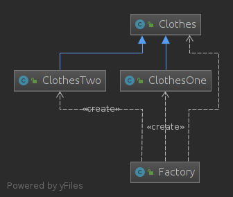

### 分析：
- 将对象的创建和对象本身业务处理分离可以降低系统的耦合度，使得两者修改起来都相对容易。  
- 在调用工厂类的工厂方法时，由于工厂方法是静态方法，使用起来很方便，可通过类名直接调用，而且只需要传入一个简单的参数即可，在实际开发中，还可以在调用时将所传入的参数保存在XML等格式的配置文件中，修改参数时无须修改任何源代码。   
- 简单工厂模式最大的问题在于工厂类的职责相对过重，增加新的产品需要修改工厂类的判断逻辑，这一点与开闭原则是相违背的。
- 简单工厂模式的要点在于：当你需要什么，只需要传入一个正确的参数，就可以获取你所需要的对象，而无须知道其创建细节。

### 缺点
- 由于工厂类集中了所有产品创建逻辑，一旦不能正常工作，整个系统都要受到影响。
- 使用简单工厂模式将会增加系统中类的个数，在一定程序上增加了系统的复杂度和理解难度。
- 系统扩展困难，一旦添加新产品就不得不修改工厂逻辑，在产品类型较多时，有可能造成工厂逻辑过于复杂，不利于系统的扩展和维护。
- 简单工厂模式由于使用了静态工厂方法，造成工厂角色无法形成基于继承的等级结构。

### 适用场景
- 工厂类负责创建的对象比较少：由于创建的对象较少，不会造成工厂方法中的业务逻辑太过复杂。

### JDK中的体现

Calendar创建不同的对象就是用了静态工厂方法

~~~java
private static Calendar createCalendar(TimeZone zone,
                                           Locale aLocale)
    {
        CalendarProvider provider =
            LocaleProviderAdapter.getAdapter(CalendarProvider.class, aLocale)
                                 .getCalendarProvider();
        if (provider != null) {
            try {
                return provider.getInstance(zone, aLocale);
            } catch (IllegalArgumentException iae) {
                // fall back to the default instantiation
            }
        }

        Calendar cal = null;

        if (aLocale.hasExtensions()) {
            String caltype = aLocale.getUnicodeLocaleType("ca");
            if (caltype != null) {
                switch (caltype) {
                case "buddhist":
                cal = new BuddhistCalendar(zone, aLocale);
                    break;
                case "japanese":
                    cal = new JapaneseImperialCalendar(zone, aLocale);
                    break;
                case "gregory":
                    cal = new GregorianCalendar(zone, aLocale);
                    break;
                }
            }
        }
        if (cal == null) {
            if (aLocale.getLanguage() == "th" && aLocale.getCountry() == "TH") {
                cal = new BuddhistCalendar(zone, aLocale);
            } else if (aLocale.getVariant() == "JP" && aLocale.getLanguage() == "ja"
                       && aLocale.getCountry() == "JP") {
                cal = new JapaneseImperialCalendar(zone, aLocale);
            } else {
                cal = new GregorianCalendar(zone, aLocale);
            }
        }
        return cal;
    }
~~~


参考  
[https://www.cnblogs.com/sunflower627/p/4718702.html](https://www.cnblogs.com/sunflower627/p/4718702.html)   
[https://design-patterns.readthedocs.io/zh_CN/latest/creational_patterns/simple_factory.html](https://design-patterns.readthedocs.io/zh_CN/latest/creational_patterns/simple_factory.html)


## 工厂方法模式

工厂方法模式进一步对简单工厂方法模式进行了抽象，更好地体现了开放封闭原则。属于创建型模式。

### 定义
工厂方法模式又叫工厂模式，虚拟构造器模式，多态工厂模式。

工厂父类/接口负责定义创建产品对象的公共接口，子类工厂对象负责创建具体的产品对象，将产品的实例化交由子类完成，通过子类来确定实例化哪一个对象。实际上利用到了多态（超类对象变量引用子类对象时，被引用对象的类型而不是引用变量的类型决定了调用谁的成员方法，而且这个方法必须在父类中定义过，在子类中复写过，但是它仍然要根据继承链中方法调用的优先级来确认方法）。

### 结构
工厂方法模式包含以下角色：
- Product：抽象产品类
- ConcreteProduct：具体产品类
- Factory：抽象产品类
- ConcreteFactory：具体工厂类


### 举例
一个人想要获取不同的衣服的场景  
抽象产品类
~~~java

interface ClothesInterface {
    
}
~~~

具体产品类
~~~java
public class ClothesOne implements ClothesInterface { 
    
}
~~~

~~~java
public class ClothesTwo implements ClothesInterface { 
    
}
~~~

抽象工厂了类
~~~java
public interface Factory {
    //定义获取衣服的方法，需要子类区具体实现，并且返回抽象产品类
    Clothes getClothes();
}
~~~
具体工厂类
~~~java
public class FactoryOne implements Factory {
    @Override
    public Clothes getClothes() {
        return new ClothesOne();
    }
}
~~~

~~~java
public class FactoryTwo implements Factory {
    @Override
    public Clothes getClothes() {
        return new ClothesTwo();
    }
}
~~~

客户类：
~~~java
public class Client {
    public static void main(String[] args) throws Exception {
        /*Clothes clothes;
        Factory factory=new FactoryOne();
        clothes=factory.getClothes();
        System.out.println(clothes.getClass());////class designPattern.simpleFactory.ClothesOne
        factory=new FactoryTwo();
        clothes=factory.getClothes();
        System.out.println(clothes.getClass());////class designPattern.simpleFactory.ClothesTwo
        */
        //使用反射
        Clothes clothes;
        Factory factory=(FactoryOne)Class.forName("designPattern.factoryMethod.FactoryOne").newInstance();
        clothes=factory.getClothes();
        System.out.println(clothes.getClass());//class designPattern.simpleFactory.ClothesOne
        factory=(FactoryTwo)Class.forName("designPattern.factoryMethod.FactoryTwo").newInstance();
        clothes=factory.getClothes();//class designPattern.simpleFactory.ClothesTwo
        System.out.println(clothes.getClass());
    }
}
~~~

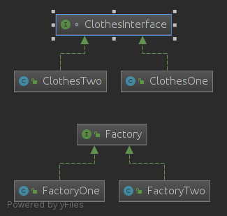


### 优点
- 基于工厂角色和产品角色的多态性设计是工厂方法模式的关键。它能够使工厂可以自主确定创建何种产品对象，而如何创建这个对象的细节则完全封装在具体工厂内部。工厂方法模式之所以又被称为多态工厂模式，是因为所有的具体工厂类都具有同一抽象父类。
- 在系统中加入新产品时，无须修改抽象工厂和抽象产品提供的接口，无须修改客户端，也无须修改其他的具体工厂和具体产品，而只要添加一个具体工厂和具体产品就可以了。这样，系统的可扩展性也就变得非常好，完全符合“开闭原则”。
- 利用面向对象的多态性和里氏代换原则，在程序运行时，子类对象将覆盖父类对象，从而使得系统更容易扩展。

### 缺点
- 在添加新产品时，需要编写新的具体产品类，而且还要提供与之对应的具体工厂类，系统中类的个数将成对增加。


## 抽象工厂模式

### 定义
提供一个为创建一系列相关或相互依赖的对象的接口，而无需指定它们具体的类。

概念：  
产品等级概念：产品等级结构即产品的继承结构，如一个抽象类是电视机，其子类有海尔电视机、海信电视机、TCL电视机，则抽象电视机与具体品牌的电视机之间构成了一个产品等级结构，抽象电视机是父类，而具体品牌的电视机是其子类。

产品族 ：在抽象工厂模式中，产品族是指**由同一个工厂生产的**，**位于不同产品等级结构中的一组产品**，如海尔电器工厂生产的海尔电视机、海尔电冰箱，海尔电视机位于电视机产品等级结构中，海尔电冰箱位于电冰箱产品等级结构中。

### 结构
- AbstractFactory：抽象工厂：提供创建产品的接口，创建产品家族。
- ConcreteFactory：具体工厂：实现抽象方法，完成具体产品的创建。
- AbstractProduct：抽象产品
- ConcreteProduct：具体产品


### 例子

假如要访问一个数据库,刚开始使用Mysql数据库，后来使用Oracle数据库，数据库中有两张表，user，goods 

使用抽象工厂模式，先分析一下：
>接口User，再下一个等级就是MysqlUser，OracleUser；
>接口Goods，再下一个等级就是MysqlGoods，OracleGoods；
>而goods，user在不同的数据库对象中都存在，MysqlUser和MysqlGoods就是一个产品族，OracleUser和OracleGoods也是一个产品族
>定义User，Goods接口；实现后MysqlUser，OracleUser，MySQLGoods，OracleGoods；
>定义AbstractFactory接口，其中有两个创建User和Goods的方法
>实现AbstractFactory，MySQLFactory，OracleFactory；分别用于创建不同的User和Goods；


~~~java
public interface Goods {
    Goods getGoods();
    int setGoods(Goods goods);
}
~~~
~~~java
public interface User {
    User getUser();
    int setUser(User user);
}
~~~

两个不同数据库的user和goods
~~~java

public class MysqlGoods  implements Goods{
    @Override
    public Goods getGoods() {
        Goods goods=new MysqlGoods();//关于Mysql数据库的具体操作
        return goods;
    }

    @Override
    public int setGoods(Goods goods) {
        return 0;
    }
}
~~~
~~~java
public class MysqlUser implements User {
    @Override
    public User getUser() {
        User user=new MysqlUser();//关于Mysql数据库的具体操作
        return user;
    }

    @Override
    public int setUser(User user) {
        return 0;
    }
}
~~~
~~~java
public class OracleGoods implements  Goods{
    @Override
    public Goods getGoods() {
        Goods goods=new OracleGoods();//关于Oracle数据库的具体操作
        return goods;
    }

    @Override
    public int setGoods(Goods goods) {
        return 0;
    }
}

~~~
~~~java
public class OracleUser implements User {

    @Override
    public User getUser() {
        User user=new OracleUser();//关于Oracle数据库的具体操作
        return user;
    }

    @Override
    public int setUser(User user) {
        return 0;
    }
}
~~~
抽象工厂类：用来创建不同的类

~~~java
public interface AbstractFactory {
    User createUser();
    Goods createGoods();
}

~~~
具体工厂类
~~~java
public class MysqlFactory implements AbstractFactory{

    @Override
    public User createUser() {
        return new MysqlUser();
    }

    @Override
    public Goods createGoods() {
        return new MysqlGoods();
    }
}
~~~
~~~java
public class OracleFactory implements AbstractFactory {
    @Override
    public User createUser() {
        return new OracleUser();
    }

    @Override
    public Goods createGoods() {
        return new OracleGoods();
    }
}

~~~
客户端使用
~~~java
public class Client {

    public static void main(String[] args) {
        //使用mysql
        AbstractFactory factory=new MysqlFactory();
        User user=factory.createUser();
        Goods goods=factory.createGoods();
        user.getUser();
        goods.setGoods(goods);
        //使用Oracle数据库，只需要更改一条语句
        factory=new OracleFactory();
        //其他不变
    }
}

~~~

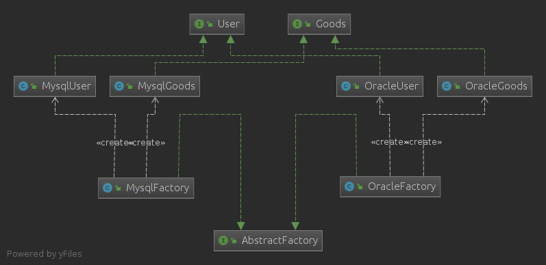


此时还可以优化：反射机制+配置文件+简单工厂模式

不过增加产品对象依旧需要更改EasyFactory类
~~~java
public class EasyFactory {

    private static final String PACK_NAME="designPattern.abstractFactory";

    private static  String dbName="Mysql";

    public static User createUser() throws Exception {
        String className=PACK_NAME+"."+dbName+"User";
        User user = (User) Class.forName(className).newInstance();
        return user;
    }

    public static Goods createGoods() throws Exception{
        String className=PACK_NAME+"."+dbName+"Goods";
        Goods goods=(Goods) Class.forName(className).newInstance();
        return goods;
    }

    //更改家族
    public static void SetDbName(String name){
        dbName=name;
    }
}
~~~

### 优点
- 抽象工厂模式隔离了具体类的生成，使得客户并不需要知道什么被创建。
- 当一个产品族中的多个对象被设计成一起工作时，它能够保证客户端始终只使用同一个产品族中的对象。

### 缺点
- 在添加新的产品对象时，难以扩展抽象工厂来生产新种类的产品，这是因为在抽象工厂角色中规定了所有可能被创建的产品集合，要支持新种类的产品就意味着要对该接口进行扩展，而这将涉及到对抽象工厂角色及其所有子类的修改，显然会带来较大的不便。比如上述增加一个对象：账单对象，那么就需要更改接口AbstractFactory，增加一个方法，而且在MySQLFactory和OracleFactory中也需要增加方法。
- 增加新的产品等级结构麻烦


参考  
[https://blog.51cto.com/zero01/2070033](https://blog.51cto.com/zero01/2070033)
[https://design-patterns.readthedocs.io/zh_CN/latest/creational_patterns/abstract_factory.html](https://design-patterns.readthedocs.io/zh_CN/latest/creational_patterns/abstract_factory.html)   


## 责任链模式

### 定义：
是多个对象都有机会处理请求，从而避免了发送者和接收者之间的耦合关系，键这些对象连接成一条链，并沿着这条链传递该请求，直到有一个对象处理它。


### 结构

Handler：抽象处理器
concreteHandler：具体处理器
Client：客户
### 例子

以大话设计模式中的例子来举例：   
需求：一个员工想要请求一系列的事情，但是处理请求的对象不一致，比如想要请假三天只需要经理批准即可，而如果需要请一个月假那么需要总监批准，如果需要涨薪需要总经理批准。

如果设计一个方法，在方法中进行大量的if else 判断显然不好，职责过大，不符合开闭原则。

我们可以做以下设计来减小耦合：设计一个责任链，在链上的对象如果不处理请求就将请求转发给下一个handler，总会有一个handler处理它

```java
public  class Manage {

    protected Manage next;
    public void setNext(Manage next){
        this.next=next;
    }

    public void handler(Request request){}
}

//经理
public class Jinli extends Manage {
    @Override
    public void handler(Request request){
        if ("请小假".equals(request.getType())){
            System.out.println("批准 "+request.getContext());
        }else {
            super.next.handler(request);
        }
    }
}
//总监
public class Zongjian extends Manage {
    @Override
    public void handler(Request request){
        if ("请大假".equals(request.getType())){
            System.out.println("批准 "+request.getContext());
        }else {
            super.next.handler(request);
        }
    }
}

//总经理
public class Zongjingli extends Manage {
    @Override
    public void handler(Request request){
        if ("涨薪".equals(request.getType())){
            System.out.println("批准 "+request.getContext());
        }else {
            super.next.handler(request);
        }
    }
}

//申请类
public class Request {

    private String type;
    private String context;

    public Request(String type, String context) {
        this.type = type;
        this.context = context;
    }

    ...
}
//实际调用
public class Client {

    public static void main(String[] args) {

        Manage jinli=new Jinli();
        Manage zongjian=new Zongjian();
        Manage zongjinli=new Zongjingli();
        //组装责任链
        jinli.setNext(zongjian);
        zongjian.setNext(zongjinli);
        //设置请求
        Request request=new Request("请小假","xxx请3天假");
        request.setType("涨薪");
        request.setContext("xxx申请涨薪1000");
        jinli.handler(request);
        //将请求放入链头
        jinli.handler(request);
    }
}

```

类图： 
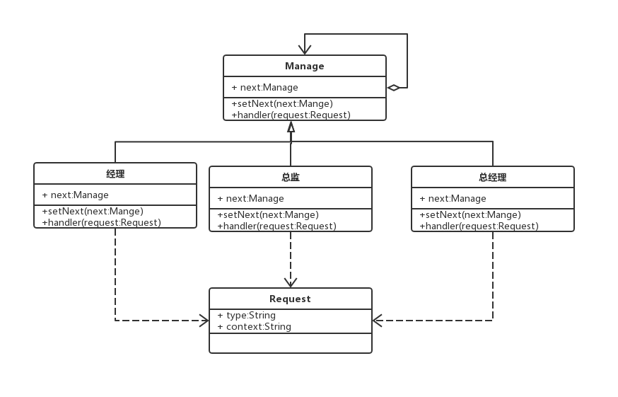

可以看见Manage自关联，而又依赖Request，耦合较轻

### 优点
- 解耦请求者和发送者。
- 简化具体责任对象，因为它不知道链的结构，只要处理自己对应的工作即可。
- 可以动态的增加或者删除责任对象。

### 缺点
- 如果出错，不太容易除错。可能需要到每个具体的责任对象一 一排查。
- 一个责任链需要整个具体责任链对象遍历，然后设置不同的层级。

### 应用
在netty中的ChannelHandler就是用了责任链的变种，转发请求。


## 适配器模式

### 定义
适配器模式：
将一个接口转换为客户希望的另一个接口，适配器类使那些接口不兼容的类可以一起工作，其别名为包装器，适配器模式既可以作为类结构型模式，也可以作为对象结构型模式。

### 结构

Target: 目标类/接口：抽象或者接口，提供一组方法的接口
Adapter：适配器类
Adaptee：适配类：被调用的用来适配的类

### 例子
有一个接口有两个方法，sort和reverse。想要利用以前实现的这两个方法。可以这样做：
#### 类适配器
目标类
~~~java
/**
 * 目标类，提供客户想要适用的接口
 */
public interface Target {
    void sort(int[] nums);
    void resverse(int[] nums);
}
~~~

待适配的类
~~~java
public class QuickSort {
    public void quickSort(int[] nums){
        Arrays.sort(nums);
    }

}
~~~
~~~java
public class Reverse {
    public void reverse(int[] nums){
        for (int i = 0; i <nums.length>>1 ; i++) {
            int temp=nums[i];
            nums[i]=nums[nums.length-i-1];
            nums[nums.length-i-1]=temp;
        }
    }

}
~~~

适配类：
~~~java

public class Adapter implements Target{

    private QuickSort quickSort;
    private Reverse reverse;

    public Adapter(QuickSort quickSort, Reverse reverse) {
        this.quickSort = quickSort;
        this.reverse = reverse;
    }

    @Override
    public void sort(int[] nums) {
        quickSort.quickSort(nums);
    }

    @Override
    public void resverse(int[] nums) {
        reverse.reverse(nums);
    }
}
~~~

客户类：
~~~java
public class Client {

    public static void main(String[] args) {
        Target target=new Adapter();
        int[] nums=new int[]{1,3,2,5,4};
        target.sort(nums);
        System.out.println(Arrays.toString(nums));//[1, 2, 3, 4, 5]
        target.resverse(nums);
        System.out.println(Arrays.toString(nums));//[5, 4, 3, 2, 1]
    }
}
~~~

类图：
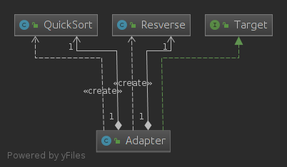


#### 接口适配器

当一个接口中有很多方法，但是我此时只需要其中一种方法，有时又需要其他的一种方法，可以这样：

接口：有很多方法
~~~java

public interface Many {
    void methed1();
    void methed2();
    void methed3();
    void methed4();
    void methed5();
    void methed6();
    void methed7();
}
~~~

适配器:一个类实现了该接口，但是都是空方法
~~~java

public class Adapter implements Many {
    @Override
    public void methed1() {

    }

    @Override
    public void methed2() {

    }

    @Override
    public void methed3() {

    }

    @Override
    public void methed4() {

    }

    @Override
    public void methed5() {

    }

    @Override
    public void methed6() {

    }

    @Override
    public void methed7() {

    }
}
~~~

target类
~~~java
public class One extends Adapter {
    @Override
    public void methed1(){
        System.out.println("one use methedOne");
    }
}
~~~
~~~java
public class Two extends Adapter{
    @Override
    public void methed2(){
        System.out.println("one use methedTwo");
    }
}
~~~

类图:
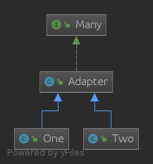


### 优点
- 实现代码复用，将目标类和适配者类解耦，通过引入一个适配器类来重用现有的适配者类，而无须修改原有代码。
- 灵活，可以更改适配器类

### 适用环境
- 系统需要使用现有的类，而这些类的接口不符合系统的需要。
- 想要建立一个可以重复使用的类，用于与一些彼此之间没有太大关联的一些类，包括一些可能在将来引进的类一起工作。

参考  
[https://design-patterns.readthedocs.io/zh_CN/latest/structural_patterns/adapter.html](设计模式/https://design-patterns.readthedocs.io/zh_CN/latest/structural_patterns/adapter.html)


## 观察者模式
建立一种对象与对象之间的依赖关系，一个对象发生改变时将自动通知其他对象，其他对象将相应做出反应。在此，发生改变的对象称为观察目标，而被通知的对象称为观察者，一个观察目标可以对应多个观察者，而且这些观察者之间没有相互联系，可以根据需要增加和删除观察者，使得系统更易于扩展，这就是观察者模式的模式动机。

### 定义

观察者模式：定义了一种一对多的依赖关系，让多个观察者对象同时监听一个对象。这个对象改变时，会通知观察者对象，使它们能够自动更新自己。

### 结构
- Subject: 目标,通常是一个接口或者抽象类，具有增删通知等方法
- ConcreteSubject: 具体目标
- Observer: 观察者，通常是一个接口或者抽象类
- ConcreteObserver: 具体观察者

### 例子

观察者的接口
~~~java
public interface Observer {
    void update();
}
~~~

被观察接口
~~~java
public interface Subject {

    void add(Observer o);
    void remove(Observer o);
    void notifyObservers();
}
~~~

具体观察者
~~~java
public class ObserverOne implements Observer{

    private Subject subject;

    public ObserverOne(Subject subject) {
        this.subject = subject;
    }

    @Override
    public void update() {

        System.out.println("subject"+ subject.toString()+" one");
    }
}
~~~

~~~java
public class ObserverTwo implements Observer{

    private Subject subject;

    public ObserverTwo(Subject subject) {
        this.subject = subject;
    }

    @Override
    public void update() {

        System.out.println("subject"+ subject.toString()+" two");
    }

}
~~~

具体被观察者
~~~java

public class ConcreteSubject implements Subject{
    private List<Observer> observers=new ArrayList<>();

    @Override
    public void add(Observer o) {
        observers.add(o);
    }

    @Override
    public void remove(Observer o) {
        observers.remove(o);
    }

    @Override
    public void notifyObservers() {
        for (Observer o:observers){
            o.update();
        }
    }
}

~~~
客户
~~~java

public class Client {

    public static void main(String[] args) {
        Subject s=new ConcreteSubject();
        Observer o1=new ObserverOne(s);
        Observer o2=new ObserverTwo(s);
        s.add(o1);
        s.add(o2);
        s.notifyObservers();

    }
}
~~~
类图：
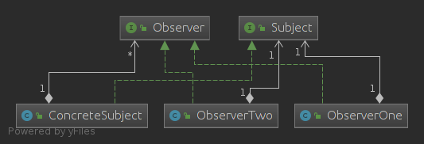

### 优点
- 定义了稳定的消息更新传递机制，抽象了更新接口，使得可以有各种各样不同的表示层作为具体观察者角色。
- 观察者模式在观察目标和观察者之间建立一个抽象的耦合。
- 观察者模式支持广播通信。


参考   
[https://design-patterns.readthedocs.io/zh_CN/latest/behavioral_patterns/observer.html](设计模式/https://design-patterns.readthedocs.io/zh_CN/latest/behavioral_patterns/observer.html)


## 装饰器模式
一般有两种方式可以实现给一个类或对象增加行为：

- 继承机制，使用继承机制是给现有类添加功能的一种有效途径，通过继承一个现有类可以使得子类在拥有自身方法的同时还拥有父类的方法。但是这种方法是静态的，用户不能控制增加行为的方式和时机。
- 关联机制，即将一个类的对象嵌入另一个对象中，由另一个对象来决定是否调用嵌入对象的行为以便扩展自己的行为，我们称这个嵌入的对象为装饰器(Decorator)

### 定义
装饰模式(Decorator Pattern) ：动态地给一个对象增加一些额外的职责(Responsibility)，就增加对象功能来说，装饰模式比生成子类实现更为灵活。它是一种对象结构型模式。

### 结构
- Component:抽象构建，通常是一个接口
- ConcreteComponent: 具体构件（可以被装饰）
- Decorator: 抽象装饰类
- ConcreteDecorator: 具体装饰类


### 例子
我有一辆车，想要给它添加不同的功能

Component
~~~java
public interface Car {

}
~~~

具体构建
~~~java
public class MyCar implements Car {
    
}
~~~
装饰类,实现了接口，并持有一个接口对象
~~~java
public class Decorator implements Car {
    Car car;

    public Decorator(Car car) {
        this.car = car;
    }
}
~~~

具体装饰器
~~~java
public class CarFlyDecorator extends Decorator {
    public CarFlyDecorator(Car car) {
        super(car);
    }
    public void fly(){
        System.out.println("fly");
    }
}

~~~
~~~java
public class CarSwimDecortor extends Decorator{
    public CarSwimDecortor(Car car) {
        super(car);
    }
    public void swim(){
        System.out.println("swim");
    }
}
~~~

客户:给指定的车，不同的车增加不同的功能
~~~java

public class Client {
    public static void main(String[] args) {
        Car mycar=new MyCar();
        //想给它添加新功能
        Decorator decorator=new CarFlyDecorator(mycar);
        ((CarFlyDecorator) decorator).fly();

        //想添加其他新功能
        decorator=new CarSwimDecortor(mycar);
        ((CarSwimDecortor) decorator).swim();
    }
}
~~~

### 优点
- 组合比继承更加灵活
- 动态扩展一个类，可以根据配置文件选择不同的装饰器
- 通过使用不同的具体装饰类以及这些装饰类的排列组合，可以创造出很多不同行为的组合

### 缺点
- 产生很多具体装饰类

### 适用环境
- 在不影响其他对象的情况下，以动态、透明的方式给单个对象添加职责。
- 需要动态地给一个对象增加功能，这些功能也可以动态地被撤销。
- 当不能采用继承的方式对系统进行扩充或者采用继承不利于系统扩展和维护时。
- 一个装饰类的接口必须与被装饰类的接口保持相同

参考  
[https://design-patterns.readthedocs.io/zh_CN/latest/structural_patterns/decorator.html](https://design-patterns.readthedocs.io/zh_CN/latest/structural_patterns/decorator.html)


## 策略模式

- 完成一项任务，往往可以有多种不同的方式，每一种方式称为一个策略，我们可以根据环境或者条件的不同选择不同的策略来完成该项任务。
- 可以定义一些独立的类来封装不同的算法，每一个类封装一个具体的算法，在这里，每一个封装算法的类我们都可以称之为策略(Strategy)，为了保证这些策略的一致性，一般会用一个抽象的策略类来做算法的定义，而具体每种算法则对应于一个具体策略类。

### 定义
策略模式：定义了算法家族，分别封装起来，让他们之间可以相互替换。

### 结构
- Strategy：抽象策略类
- Context：环境类
- ConcreteStrategy: 具体策略类

### 例子

需求：有三种人到图书馆借书，它们借书的权限不一样，如果是本科生最多借五本，研究生最多借十本，老师最多借二十本并且如果没有此书会给借这本书的学生发信息。

第一种方案：将其逻辑写入一个类中，那么不易变更，不符合开闭原则

第二种方案：抽象三个类代表三种方案

第三种方案：策略模式，将三种算法封装在三个不同的具体策略中，在使用的时候可以实时更换策略达到角色互换，并且易于扩展

Strategy接口
~~~java
//Strategy接口
public interface BorrowStrategy {
    void borrow();
}
~~~

具体策略类
~~~java
public class BorrowForBachlor implements BorrowStrategy {
    private int maxBooks;
    @Override
    public void borrow() {
        ////具体实现逻辑
    }
}


public class BorrowForMaster implements BorrowStrategy {

    private int maxBooks;

    @Override
    public void borrow() {
        ////具体实现逻辑
    }
}


public class BorrowForTeacher implements BorrowStrategy  {

    private int maxBooks;
    public void  borrow(){
       //具体实现逻辑
    }
}
~~~


环境类
~~~java
public class Borrower {
    BorrowStrategy borrowStrategy;
    public Borrower(){}
    public Borrower(BorrowStrategy borrowStrategy) {
        this.borrowStrategy = borrowStrategy;
    }
    public void setBorrowStrategy(BorrowStrategy borrowStrategy) {
        this.borrowStrategy = borrowStrategy;
    }
    public void borrow(){
        borrowStrategy.borrow();
    }
}
~~~

客户类
~~~java

public class Client {
    public static void main(String[] args) {
        Borrower b=new Borrower();
        BorrowForMaster master=new BorrowForMaster();
        //注入策略
        b.setBorrowStrategy(master);
        b.borrow();
        //实时更改
        b.setBorrowStrategy(new BorrowForBachlor());
        b.borrow();
    }

}
~~~

类图：   
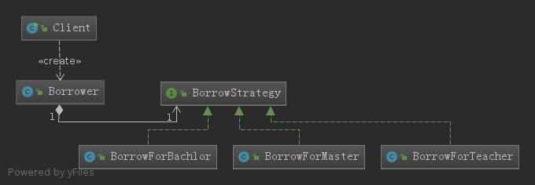


就是把具体的算法实现从业务逻辑中剥离出来，成为一系列独立算法类，使得它们可以相互替换。


### 优点
- 不修改原有系统的基础上选择算法或行为，也可以灵活地增加新的算法或行为。

### 缺点
- 客户端必须知道所有的策略类，并自行决定使用哪一个策略类。


## 桥接模式

当一个类有两个以上的维度的时候，使用继承将会使设计变得臃肿，于是使用关联模式（组合聚合）。

### 定义
将抽象部分与它的实现分离，使它们可以独立地变化，是一种对象结构型模式。

### 结构
- Abstraction：抽象类
- RefinedAbstraction：扩充抽象类
- Implementor：实现类接口
- ConcreteImplementor：具体实现类

### 例子
假如有一个对象是有颜色的形状，颜色是一个类，形状是一个类。那么可以使之成为组合关系。

颜色接口（Implementor）
~~~java
public interface Color {
    void drow();
}
~~~

颜色具体实现类
~~~java
public class Blue implements Color{
    @Override
    public void drow() {
        System.out.println("blue");
    }
}
~~~
~~~java
public class Yellow implements Color {
    @Override
    public void drow() {
        System.out.println("yellow");
    }
}
~~~

形状：抽象类,持有Color这个接口
~~~java

public abstract class Shape {
    public String shape;
    public Color color;

    public Shape(String shape, Color color) {
        this.shape = shape;
        this.color = color;
    }
}
~~~
扩充抽象类
~~~java
public class Square extends Shape {
    public Square(String shape, Color color) {
        super(shape, color);
    }
}
~~~
~~~java
public class Triangle extends Shape{

    public Triangle(String shape, Color color) {
        super(shape, color);
    }
}
~~~
类图：
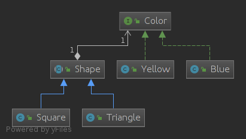
颜色这个接口也可以是一个类。

若是还需要什么形状带有什么颜色，只需要按需构造即可。

### 优点
- 桥接模式使用对象见的组合关系解耦了抽象和实现之间固有的绑定关系，使得抽象和实现可以沿着各自的维度来变化。形状是一个维度，颜色是一个维度。

### 缺点
- 桥接模式的引入会增加系统的理解与设计难度，由于聚合关联关系建立在抽象层，要求开发者针对抽象进行设计与编程。


## 建造者模式

建造者模式：将对象的创建与表示分离，使得同样的建造过程可以创建不同的对象。

如果需要创建一辆车，车依赖于轮胎，车灯，引擎。有很多中不同的车，创建很麻烦。因此可以将这些创建过程封装。

建造者模式是一步一步创建一个复杂的对象，它允许用户只通过指定复杂对象的类型和内容就可以构建它们，用户不需要知道内部的具体构建细节。建造者模式属于对象创建型模式。

### 结构
- Builder:抽象创建者，规范产品对象的各个组成部分的建造。这个接口规定要实现对象的哪些部分的创建，并不涉及具体的对象部件的创建。
- ConcreteBuilder：具体创建者，继承Builder，针对不同的业务逻辑，具体化对象的各部分的创建。在建造过程完成后，提供产品的实例。
- Director：指挥者，调用具体建造者来创建对象的各个部分，在指导者中不涉及具体产品的信息，只负责保证对象各部分完整创建或按某种顺序创建。
- Product：要创建的产品

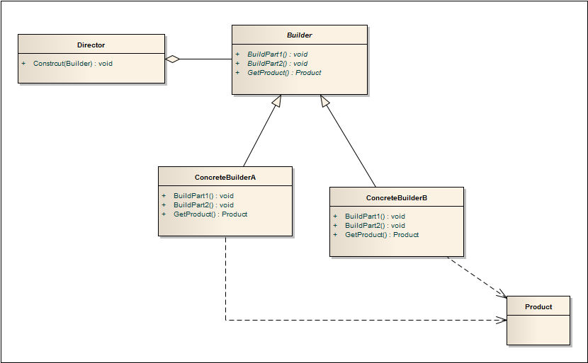


### 例子

需要建造一辆车，车子很复杂需要引擎，车灯，轮胎等，需要创建不同的车。

车子
~~~java

public class Car {
    private String eng;
    private String whell;
    private String light;

    public String getEng() {
        return eng;
    }

    public void setEng(String eng) {
        this.eng = eng;
    }

    public String getWhell() {
        return whell;
    }

    public void setWhell(String whell) {
        this.whell = whell;
    }

    public String getLight() {
        return light;
    }

    public void setLight(String light) {
        this.light = light;
    }

    @Override
    public String toString() {
        String s=eng+" "+whell+" "+light;
        return s;
    }
}
~~~


抽象建造者
~~~java
public abstract class Builder {

    abstract void  buildWhell();
    abstract void buildLigth();
    abstract void buildEng();
    abstract Car getCar();

}
~~~


封装第一种车的建造者
~~~java

public class BuildOne extends Builder {
    private Car car=new Car();
    @Override
    void buildWhell() {
        car.setWhell("whell");
    }

    @Override
    void buildLigth() {
        car.setLight("light");
    }

    @Override
    void buildEng() {
        car.setEng("eng");
    }

    @Override
    Car getCar() {
        return car;
    }
}
~~~

封装第二种车的建造者
~~~java

public class BuildTwo extends Builder {
    private Car car=new Car();

    @Override
    void buildWhell() {
        car.setWhell("two whell");
    }

    @Override
    void buildLigth() {
        car.setLight("two light");
    }

    @Override
    void buildEng() {
        car.setEng("two eng");
    }

    @Override
    Car getCar() {
        return car;
    }
}
~~~


指挥者:根据不同的建造者，创建对象，返回对象。
~~~java

public class Director {

    private Builder builder;

    public Director(Builder builder) {
        this.builder = builder;
    }

    public void setBuilder(Builder builder) {
        this.builder = builder;
    }

    public Car construct(){
        builder.buildEng();
        builder.buildWhell();
        builder.buildLigth();
        return builder.getCar();
    }
}

~~~

### 分析

实际上将复杂的建造过程封装，用户不需要知道这东西是怎么来的，由什么组成，只需要了解相应的建造者和指挥者即可。

对于Director类不太理解，construct()也可以添加到Build类也行？

TODO

### 优点
- 在建造者模式中， 客户端不必知道产品内部组成的细节，将产品本身与产品的创建过程解耦，使得相同的创建过程可以创建不同的产品对象。
- 每一个具体建造者都相对独立，而与其他的具体建造者无关，因此可以很方便地替换具体建造者或增加新的具体建造者， 用户使用不同的具体建造者即可得到不同的产品对象。增加新的具体建造者无须修改原有类库的代码。

### 缺点
- 建造者模式所创建的产品一般具有较多的共同点，其组成部分相似，如果产品之间的差异性很大，则不适合使用建造者模式，因此其使用范围受到一定的限制。
- 如果产品的内部变化复杂，可能会导致需要定义很多具体建造者类来实现这种变化，导致系统变得很庞大。

### 使用场景
- 需要生成的产品对象有复杂的内部结构，这些产品对象通常包含多个成员属性。
- 需要生成的产品对象的属性相互依赖，需要指定其生成顺序。

参考   
[https://design-patterns.readthedocs.io/zh_CN/latest/creational_patterns/builder.html](https://design-patterns.readthedocs.io/zh_CN/latest/creational_patterns/builder.html)   


## 外观模式

### 定义
外部与一个子系统通信必须经过一个统一的外观对象进行，为子系统的一组接口提供一个一致的界面。外观模式定义了一个高层接口，这个接口使得子系统更加容易使用。


### 结构
- Facade：外观角色
- SubSystem：子系统角色

### 例子

假如要进入一家公司，需要经过投简历，笔试，面试...   

简历
~~~java
public class Resume {
    public void SendResum(){

    }
}
~~~
笔试
~~~java
public class ExamOne {
    Random random=new Random();
    public boolean doExam(){
        int r=random.nextInt(1);
        return 1==r;
    }
}
~~~
~~~java

public class ExamTwo {
    Random random=new Random();
    public boolean doExam(){
        int r=random.nextInt(1);
        return 1==r;
    }
}
~~~

面试
~~~java

public class Interview {
    Random random=new Random();
    public boolean interview(){
        int r=random.nextInt(1);
        return 1==r;
    }
}
~~~

外观类：
~~~java

public class Facade {
    private Resume resume;
    private Interview interview;
    private ExamOne examOne;
    private ExamTwo examTwo;

    public Facade() {
        this.resume = new Resume();
        this.interview = new Interview();
        this.examOne = new ExamOne();
        this.examTwo = new ExamTwo();
    }

    public void sendResume(){
        resume.SendResum();
    }
    public boolean interview(){
        return interview.interview();
    }
    public boolean doExamOne(){
        return examOne.doExam();
    }
    public boolean doExamTwo(){
        return examTwo.doExam();
    }


}
~~~

客户类
~~~java
public class Client {
    public static void main(String[] args) {
        Facade facade=new Facade();
        facade.sendResume();
        if (facade.doExamOne()){
            if (facade.doExamTwo()){
                if (facade.interview()){
                    System.out.println("pass");
                }
            }
        }
    }
}
~~~

类图：


### 优点
- 对客户屏蔽子系统组件，减少了客户处理的对象数目并使得子系统使用起来更加容易。通过引入外观模式，客户代码将变得很简单，与之关联的对象也很少。
- 实现了子系统与客户之间的松耦合关系，这使得子系统的组件变化不会影响到调用它的客户类，只需要调整外观类即可。
### 缺点
- 不能很好地限制客户使用子系统类，如果对客户访问子系统类做太多的限制则减少了可变性和灵活性。

参考  
[https://design-patterns.readthedocs.io/zh_CN/latest/structural_patterns/facade.html](https://design-patterns.readthedocs.io/zh_CN/latest/structural_patterns/facade.html)


## 命令模式

### 定义
命令模式：将请求封装成对象，使你可用不同的请求对客户进行参数化，对请求排队或请求日志，以及支持可撤销操作。


### 结构
- Command抽象命令类：有执行方法以及命令接受者
- ConcreteCommand具体命令类：实现执行方法，实际上是调用命令接受者执行命令
- Receiver命令接受者：接受命令，并且具有执行功能
- Invoker调用者：请求排队，撤销，执行一些逻辑等等

### 例子

接受命令者，真正执行命令的对象
~~~java
public class Receiver {

    public void excute1(){
        System.out.println("one");
    }
    public void excute2(){
        System.out.println("two");
    }
}
~~~

抽象命令类，包含一个receiver
~~~java

public abstract class Command {
    Receiver receiver;

    public Command(Receiver receiver) {
        this.receiver = receiver;
    }

    abstract public void excute();
}
~~~

具体命令类
~~~java
public class ConcreteCommand extends Command {

    public ConcreteCommand(Receiver receiver) {
        super(receiver);
    }

    @Override
    public void excute() {
        receiver.excute1();
    }
}
~~~

~~~java
public class ConcreteCommand2 extends Command {

    public ConcreteCommand2(Receiver receiver) {
        super(receiver);
    }

    @Override
    public void excute() {
        receiver.excute2();
    }
}
~~~

调用类，也是核心类
~~~java

public class Invoker {
    private List<Command> commands=new ArrayList<>();

    //添加命令
    public void addCommand(Command c){
        commands.add(c);
    }
    //删除命令
    public void removeCommand(Command c){
        if (commands.contains(c)){
            commands.remove(c);
        }
    }
    //通知全部执行
    public void exeAll(){
        for(Command c:commands){
            c.excute();
        }
    }
}

~~~

客户
~~~java

    public static void main(String[] args) {
        Invoker invoker=new Invoker();
        Receiver receiver=new Receiver();
        Command c=new ConcreteCommand(receiver);
        invoker.addCommand(c);
        invoker.addCommand(new ConcreteCommand2(receiver));
        invoker.addCommand(new ConcreteCommand2(receiver));
        invoker.addCommand(new ConcreteCommand2(receiver));
        invoker.removeCommand(c);
        invoker.exeAll();
    }
}

~~~

类图：
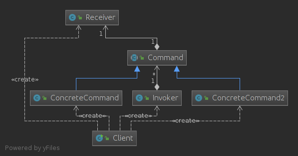

### 优点
- 降低系统的耦合度。
- 新的命令可以很容易地加入到系统中。
- 可以比较容易地设计一个命令队列。

### 适用环境
- 系统需要将请求调用者和请求接收者解耦，使得调用者和接收者不直接交互。
- 系统需要在不同的时间指定请求、将请求排队和执行请求。
- 系统需要支持命令的撤销(Undo)操作和恢复(Redo)操作。

参考  
[https://design-patterns.readthedocs.io/zh_CN/latest/behavioral_patterns/command.html](https://design-patterns.readthedocs.io/zh_CN/latest/behavioral_patterns/command.html)


## 单例模式

单例模式(Singleton Pattern)：单例模式确保某一个类只有一个实例，而且自行实例化并向整个系统提供这个实例，这个类称为单例类，它提供全局访问的方法。属于创建型模式。  

### 结构
Singleton:单例类

### 实现
单例模式的实现有很多种

一般分三步：声明一个私有的静态变量instance；私有化构造方法；提供一个共有的接口用于获取这个对象。

#### 饿汉式（静态常量，线程安全）
饿汉式也就是没有实现延迟加载。

单例模式的一种实现，使用静态常量，在类加载的过程中就已经初始化了INSTANCE这个常量，而类加载只需一次，而且由虚拟机保证线程安全，不过可能浪费系统资源。

~~~java

public class Singleton {
    private static final Singleton INSTANCE=new Singleton();
    private Singleton(){}
    public static Singleton getInstance(){
        return INSTANCE;
    }
}
~~~
#### 饿汉式（静态代码块，线程安全）

单例模式的一种实现，依旧没有实现延迟加载，在类加载的过程中就已经执行了静态代码块的内容。

~~~java

public class Singleton1 {
    private static Singleton1 INSTANCE;
    static {
        INSTANCE=new Singleton1();
    }
    public static Singleton1 getInstance(){
        return INSTANCE;
    }
}
~~~

#### 懒汉式（线程安全）
单例模式的一种实现，使用synchronized关键字对方法进行加锁，实际上对类进行加锁，不过在并发量较高的情况下效率不是很高。

~~~java

public class Singleton2 {
    private static Singleton2 instance;
    private Singleton2(){}
    public static synchronized Singleton2 getInstance(){
        if(instance==null){
            instance=new Singleton2();
        }
        return instance;
    }
}
~~~

#### 懒汉式（线程安全）

单例模式的一种实现，双检查方法

对变量使用volatile关键字修饰：可见性+禁止指令重排序   

如果不加volatile，多个线程调用getInstance()方法，当两个线程都进入到了a,当指令重排序后可能还没与执行new操作，已经释放了锁然后另外一个线程可能进入b


~~~java

public class Singleton3 {
    private static volatile Singleton3 instance;
    private Singleton3(){}
    public static Singleton3 getInstance(){
        if (instance==null){
            //a
            synchronized (Singleton3.class){
                if (instance==null){
                    //b
                    instance=new Singleton3();
                }
            }
        }
        return instance;
    }
}
~~~

#### 静态内部类

单例模式的一种实现，使用静态内部类，实际上静态内部类和外部类没有什么关系

当调用getInstance方法时，JVM才会加载内部类，因此实现了延迟加载，而类加载是线程安全的。

~~~java

public class Singleton4 {
    
    private Singleton4() {}
    
    private static class InClass {
        static final Singleton4 INSTANCE = new Singleton4();
    }

    public static Singleton4 getInstance() {
        return InClass.INSTANCE;
    }
}
~~~

### 枚举
~~~java
public enum  Singleton5 {
    INSTANCE;

}
~~~


### CAS
~~~java

/**
 * 单例模式的另一种实现方式：无锁，CAS
 */
public class Singleton6 {
    //需要额外的空间
    private static AtomicReference<Singleton6> singleton=new AtomicReference<>();
    private Singleton6(){

    }
    public static Singleton6 getInstance(){
        for (;;){
            //获取，如果不为空，表示已经有了实例
            Singleton6 instance=singleton.get();
            if (instance!=null){
                return instance;
            }
            //否则，使用cas比较并替换
            instance=new Singleton6();
            if (singleton.compareAndSet(null,instance)){
                return instance;
            }
        }
    }

}
~~~

### 例子
在java中，Runtime这个类就是用了饿汉式单例模式
~~~java
public class Runtime {
    private static Runtime currentRuntime = new Runtime();
    ...
~~~

### 优点
- 提供了对唯一实例的受控访问，为设计及开发团队提供了共享的概念。
- 节约系统资源，对于一些需要频繁创建和销毁的对象，单例模式无疑可以提高系统的性能。
- 允许可变数目的实例。我们可以基于单例模式进行扩展，使用与单例控制相似的方法来获得指定个数的对象实例。

### 适用情况
单例模式适用情况包括：
- 系统只需要一个实例对象；
- 客户调用类的单个实例只允许使用一个公共访问点。


参考  
[https://design-patterns.readthedocs.io/zh_CN/latest/creational_patterns/singleton.html](https://design-patterns.readthedocs.io/zh_CN/latest/creational_patterns/singleton.html)   
[https://www.cnblogs.com/zhaoyan001/p/6365064.html](https://www.cnblogs.com/zhaoyan001/p/6365064.html)   


## 代理模式

在某些情况下，一个客户不想或者不能直接引用一个对 象，此时可以通过一个称之为“代理”的第三者来实现 间接引用。代理对象可以在客户端和目标对象之间起到 中介的作用，并且可以通过代理对象去掉客户不能看到 的内容和服务或者添加客户需要的额外服务。（控制被代理的类）

### 定义
代理模式：给某个对象提供一个代理，并由代理对象控制对原对象的引用，是一种对象结构型模式。


### 结构

- 抽象角色
- 代理角色
- 具体被代理角色

### 代理方法

#### 静态代理
创建静态代理类


~~~java
public interface Book {

    void introduce();
}
~~~
实现接口
~~~java
public class MathBookImp implements Book {

    private String name;

    public MathBookImp(String name) {
        this.name = name;
    }

    @Override
    public void introduce() {
        System.out.println("I am "+name);
    }

}
~~~

静态代理类
~~~java

public class StaticProxyBook implements Book {

    public StaticProxyBook(Book book) {
        this.book = book;
    }

    private Book book;
    
    //扩充功能
    @Override
    public void introduce() {
        System.out.println("hhh");
        book.introduce();
        System.out.println("xxx");
    }
    public static void main(String[] args) {
        Book book=new MathBookImp("math");
        StaticProxyBook staticProxyBook=new StaticProxyBook(book);
        staticProxyBook.introduce();
    }

}
~~~
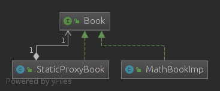


#### 动态代理
使用反射原理

接口
~~~java
public interface Person {

    void sayHello(String context);
    void sayGoodbye(String contet);

}
~~~

实现InvocationHandler接口  
~~~java


public class MyInvocationHandler implements InvocationHandler {

    Object target;

    public MyInvocationHandler(Object object) {
        this.target = object;
    }

    @Override
    public Object invoke(Object proxy, Method method, Object[] args) throws Throwable {

        //first()
        System.out.println("do something before");
        method.invoke(target,args);

        //last()
        System.out.println("do something  last");


        return null;
    }

    public static void main(String[] args) {
        //创建需要被代理的类
        PersonImp personImp=new PersonImp();

        // 创建被代理类的委托类,之后想要调用被代理类的方法时，都会委托给这个类的invoke(Object proxy, Method method, Object[] args)方法
        MyInvocationHandler myInvocationHandler=new MyInvocationHandler(personImp);

        //生成代理类
        Person proxy=(Person) Proxy.newProxyInstance(personImp.getClass().getClassLoader(),
                personImp.getClass().getInterfaces(),
                myInvocationHandler);

        proxy.sayGoodbye("mon");
        proxy.sayGoodbye("dad");


    }

}
~~~

还可以优化,使用泛型

~~~java

/**
 * 使用泛型，封装，更简洁
 */

public class DynamicProxy implements InvocationHandler {

    private Object target;

    public DynamicProxy(Object target) {
        this.target = target;
    }

    @Override
    public Object invoke(Object proxy, Method method, Object[] args) throws Throwable {
        System.out.println("do something before");
        method.invoke(target,args);
        System.out.println("do something  last");
        return null;
    }

    @SuppressWarnings("unchecked")
    public <T> T getProxy(){

       return (T) Proxy.newProxyInstance(target.getClass().getClassLoader(),target.getClass().getInterfaces(),this);

    }

    public static void main(String[] args) {
        //first example
        PersonImp student =new PersonImp();
        DynamicProxy dp=new DynamicProxy(student);
        Person person=dp.getProxy();
        person.sayHello("good ");

        //second example
        DynamicProxy dp2=new DynamicProxy(new MathBookImp("math"));
        Book book=dp2.getProxy();
        book.introduce();

    }

}
~~~

#### cglib

CGlib动态代理是通过继承业务类，生成的动态代理类是业务类的子类，通过重写业务方法进行代理、

### 优点
- 代理模式能够协调调用者和被调用者，在一定程度上降低了系统的耦合度。
- 保护代理可以控制对真实对象的使用权限。

### 与装饰器模式的区别

代理模式主要是代理类，控制访问被代理类，可以控制真实对象的使用权限。

装饰器模式是增强功能，不能影响原对象的功能。

参考  
[https://design-patterns.readthedocs.io/zh_CN/latest/structural_patterns/proxy.html](https://design-patterns.readthedocs.io/zh_CN/latest/structural_patterns/proxy.html)


## 享元模式

但在很多情况下需要在系统中增加类和对象的个数。当对象数量太多时，将导致运行代价过高，带来性能下降等问题。享元模式通过共享技术实现相同或相似对象的重用。

- 内部状态：可以共享的相同的内容。
- 外部状态：需要外部设置，不能共享的内容。
- 使用工厂模式维护一个享元池，存储可以共享的享元对象。
- 在实际使用中，能够共享的内部状态是有限的，因此享元对象一般都设计为较小的对象，它所包含的内部状态较少，这种对象也称为细粒度对象。享元模式的目的就是使用共享技术来实现大量细粒度对象的复用。

### 定义
享元模式（FlyWeight）：使用共享技术支持复用大量的细粒度对象。

### 结构

- 抽象享元类
- 具体享元类
- 非共享具体享元类
- 享元工厂类：创建享元类

### 例子

此时需要共享一个类Fly，但是只能共享100个  

共享类
~~~java
public class Fly {
    private String name;

    public String getName() {
        return name;
    }

    public void setName(String name) {
        this.name = name;
    }

    public Fly(String name) {
        this.name = name;
    }
}
~~~

静态工厂类
~~~java

public class Factory {
    private static Map<String,Fly> map=new HashMap<>();

    public static Fly getFly(String name){
        if (map.get(name)!=null){
            return map.get(name);
        }
        if (map.size()<100){
            map.put(name,new Fly(name));
            return map.get(name);
        }
        return new Fly(name);
    }
}
~~~

客户类
~~~java

public class Client {
    public static void main(String[] args) {
        for (int i = 0; i <200 ; i++) {
            Factory.getFly(String.valueOf(i));
        }
        Fly fly1=Factory.getFly("1");
        Fly fly2=Factory.getFly("1");
        Fly fly3=Factory.getFly("1000");
        Fly fly4=Factory.getFly("1000");
        System.out.println(fly1==fly2);//true
        System.out.println(fly3==fly4);//false
    }
}
~~~

类图：
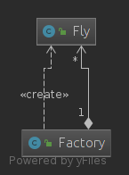

在这个例子中，实际上共享类和非共享类实际上只有一个数量的差别。在JDK中，String，基础类型的包装类都使用了享元模式,-128～127的Integer，Short等都是共享的类。

### 优点

- 减少内存中对象的数量

### 适用环境

- 一个系统有大量相同或者相似的对象，由于这类对象的大量使用，造成内存的大量耗费。
- 对象的大部分状态都可以外部化，可以将这些外部状态传入对象中。
- 使用享元模式需要维护一个存储享元对象的享元池，而这需要耗费资源，因此，应当在多次重复使用享元对象时才值得使用享元模式。


参考   
[https://design-patterns.readthedocs.io/zh_CN/latest/structural_patterns/flyweight.html](设计模式/https://design-patterns.readthedocs.io/zh_CN/latest/structural_patterns/flyweight.html)   


## 中介者模式

- 对象与对象之间存在大量的关联关系，这样势必会导致系统的结构变得很复杂，同时若一个对象发生改变，我们也需要跟踪与之相关联的对象，同时做出相应的处理。
- 对象之间的连接增加会导致对象可复用性降低。
- 系统的可扩展性低。增加一个新的对象，我们需要在其相关连的对象上面加上引用，这样就会导致系统的耦合性增高，使系统的灵活性和可扩展都降低。

为了解决这种情况，出现了中介者模式

### 定义

中介者对象：使用一个中介者对象封装一系列的对象交互，中介者使个对象不需要显示的相互引用，从而使其耦合松散，而且可以独立改变它们之间的交互。

### 结构
- Mediator: 抽象中介者
- ConcreteMediator: 具体中介者
- Colleague: 抽象同事类
- ConcreteColleague: 具体同事类
### 例子

一个抽象中介者或者接口
~~~java
public interface Mediator {
    void send(String msg,Colleague colleague);

}
~~~
一个抽象同事类
~~~java
public interface Colleague {
    void notifyTo(String msg);
}
~~~

具体中介者类
~~~java
public class ConcreteMediator implements Mediator {

    private ConcreteColleague concreteColleague;
    private ConcreteColleague2 concreteColleague2;

    public void setConcreteColleague(ConcreteColleague concreteColleague) {
        this.concreteColleague = concreteColleague;
    }

    public void setConcreteColleague2(ConcreteColleague2 concreteColleague2) {
        this.concreteColleague2 = concreteColleague2;
    }


    @Override
    public void send(String msg, Colleague colleague) {
        if (colleague.getClass().equals(ConcreteColleague.class)){
            concreteColleague2.notifyTo(msg);
        }else {
            concreteColleague.notifyTo(msg);
        }
    }
}
~~~

具体同事类
~~~java

public class ConcreteColleague2 implements Colleague{

    private Mediator mediator;

    public void setMediator(Mediator mediator) {
        this.mediator = mediator;
    }

    public ConcreteColleague2(Mediator mediator) {
        this.mediator = mediator;
    }

    @Override
    public void notifyTo(String msg) {
        System.out.println("msg from two: "+msg);
    }
}

~~~
~~~java

public class ConcreteColleague implements Colleague {
    private Mediator mediator;

    public void setMediator(Mediator mediator) {
        this.mediator = mediator;
    }

    public ConcreteColleague(Mediator mediator) {
        this.mediator = mediator;
    }

    public void notifyTo(String msg){
        System.out.println("msg from one: "+msg);
    }
}

~~~
客户类
~~~java

public class Client {
    public static void main(String[] args) {

        ConcreteMediator mediator=new ConcreteMediator();
        ConcreteColleague c1=new ConcreteColleague(mediator);
        ConcreteColleague2 c2=new ConcreteColleague2(mediator);
        mediator.setConcreteColleague(c1);
        mediator.setConcreteColleague2(c2);
        mediator.send("One,how are you?",c1);//msg from two: One,how are you?
        mediator.send("Two,fine.",c2);//msg from one: Two,fine.
    }
}
~~~

由上可知：同事对象进行了解耦，只知道一个中介类，传递消息都有中介者类发送。

类图：  
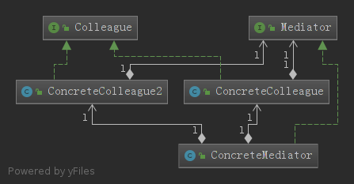


### 优点
- 简化了对象之间的交互。
- 将各同事解耦。

### 缺点
- 在具体中介者类中包含了同事之间的交互细节，可能会导致具体中介者类非常复杂，使得系统难以维护。
