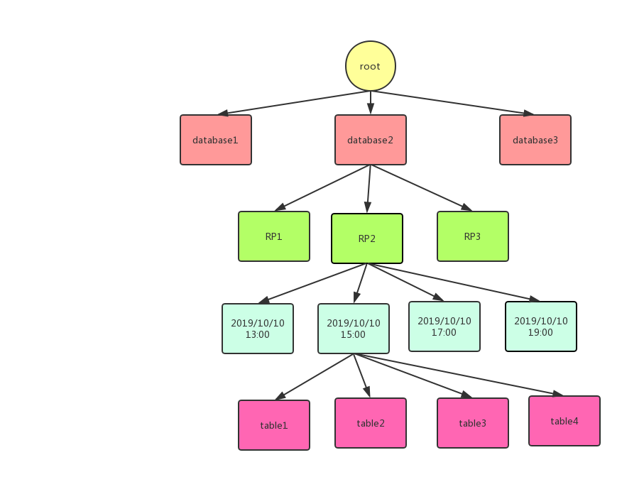
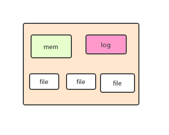
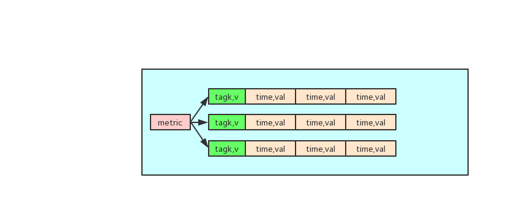
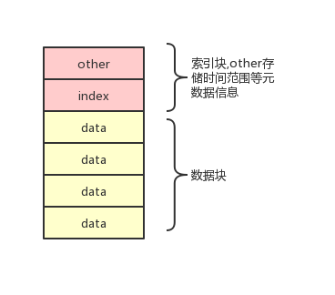

什么是时序数据库，能干什么，市面上有哪些实现，怎么实现的，能不能自己设计一款产品？
<!--more-->

- [什么是时间序列数据](#%e4%bb%80%e4%b9%88%e6%98%af%e6%97%b6%e9%97%b4%e5%ba%8f%e5%88%97%e6%95%b0%e6%8d%ae)
- [时序数据格式](#%e6%97%b6%e5%ba%8f%e6%95%b0%e6%8d%ae%e6%a0%bc%e5%bc%8f)
- [时序数据的应用场景](#%e6%97%b6%e5%ba%8f%e6%95%b0%e6%8d%ae%e7%9a%84%e5%ba%94%e7%94%a8%e5%9c%ba%e6%99%af)
- [时间序列数据的特点](#%e6%97%b6%e9%97%b4%e5%ba%8f%e5%88%97%e6%95%b0%e6%8d%ae%e7%9a%84%e7%89%b9%e7%82%b9)
- [常见时序数据库对比](#%e5%b8%b8%e8%a7%81%e6%97%b6%e5%ba%8f%e6%95%b0%e6%8d%ae%e5%ba%93%e5%af%b9%e6%af%94)
  - [opentsdb](#opentsdb)
  - [prometheus](#prometheus)
  - [influxdb](#influxdb)
- [设计一种时序数据库](#%e8%ae%be%e8%ae%a1%e4%b8%80%e7%a7%8d%e6%97%b6%e5%ba%8f%e6%95%b0%e6%8d%ae%e5%ba%93)
  - [功能点](#%e5%8a%9f%e8%83%bd%e7%82%b9)
  - [存储](#%e5%ad%98%e5%82%a8)
  - [读写流程](#%e8%af%bb%e5%86%99%e6%b5%81%e7%a8%8b)
  - [分布式存储](#%e5%88%86%e5%b8%83%e5%bc%8f%e5%ad%98%e5%82%a8)
  - [其它](#%e5%85%b6%e5%ae%83)

## 什么是时间序列数据
时间序列数据就是一个数据源会每隔一段时间产生一条数据，除了时间戳和值不一样，其他都相同。比如一个cpu的使用率，随着时间的变化不断变化，那么它产生的数据就是时间序列数据。

## 时序数据格式
时间序列数据的格式为：`key,timestamp,val`,实际上就是带有时间戳的键值对。当然这是最简单的格式，在现实的使用中，格式会更加复杂，复杂的主要是适应业务。举例

```
cpu_use{ip='10.27.120.7',id='3'} 948258276 14.5%
cpu_use{ip='10.27.120.7',id='3'} 948258286 14.0%
cpu_use{ip='10.27.120.7',id='3'} 948258296 13.5%
gc_count{ip='9.11.132.9',port='8976'} 948278275 18
```
这种数据格式的数据更加有用，对于第一条数据key就是cpu_use{ip='10.27.120.7',id='3'}，第二条数据key就是gc_count{ip='9.11.132.9',port='8976'}。

针对这种形式的时间序列，cpu_use就是metric，ip，id，port就是tag，每个tag对应着值。


## 时序数据的应用场景
时间序列数据多用于监控系统中，比如服务器的cpu利用率，io，内存等指标；对于jvm的有gc时长，次数，线程数，堆大小；对于业务有请求数，请求耗时等等。

在穿戴设备中也会用到时间序列，比如心率，体温随时间的变化。

## 时间序列数据的特点
1. 持续的稳定的产生着数据，除了值无法预见，其它都可以预见，不存在波峰波谷
2. 总是写多，不会修改，删除总是一段一段的删除
3. 读总是关注最近一段时间
4. 一段时间内的数据具有聚合价值
5. 多维，也就是多个tag

## 常见时序数据库对比
市面上有许多时间序列数据库，在[https://db-engines.com/en/ranking/time+series+dbms](https://db-engines.com/en/ranking/time+series+dbms)可以看见时间序列数据库的排名。最专业的应该是influxdb。这里对比三种opentsdb，prometheus，influxdb。

### opentsdb
opentsdb依赖hbase，opentsdb建立了4张表存储数据：
- tsdb: 存储实际的时序数据
- tsdb-uid: 存储 name 和 uid 的相互映射关系，也就是给字符串的键、值映射成数值，包括 metric、tagk、tagv 
- tsdb-meta: 元数据表：用来存储元数据
- tsdb-tree: 树形表

真实的数据存在tsdb上，rowkey的设计是``[salt]<metric_uid><timestamp><tagk1><tagv1>[...<tagkN><tagvN>]`，salt是为了防止热点数据集中，是hbase rowkey设计的常用方式，接下来是metric_uid，它对应着一个指标名，至于为什么不适用指标的字符串形式，是因为冗余太大，浪费空间，接下来是小时级别的时间戳，接下来是tag的key和value（也经过编码）。

这样设计意味着一个来自于同一个地方的指标名，一个小时一行数据，如果一秒一条数据的话就会有3600个列。只有一个列簇，列的设计不赘述。

根据时序数据的特点可以看出这样设计的好处：
1. 一个小时的数据一行，容易范围查询
2. 一个列簇，一个指标的数据在一个文件中

但是opentsdb的缺点显而易见：
1. 依赖hbase，增加维护hadoop和hbase的难度
2. hbase上多维查询困难
3. 有很多的数据冗余，比如指标uid会存储多次，tagk，tagv也会存储多次；虽然做了编码的工作，将字符串转化为3字节的数字，但是依旧有很大的冗余
4. 聚合能力不足

优点：
1. 水平扩展容易，开源
2. 使用编码，append优化了数据太过冗余


### prometheus
prometheus是一个监控系统的生态，它也实现了自己的时间序列数据库。对于监控系统来说它是很好的选择，拥有各种agent，支持多维读写，丰富的聚合函数，涵盖告警模块。关于它的介绍可以参考[https://gentlezuo.github.io/2019/07/12/Prometheus%E4%BB%8B%E7%BB%8D%E4%B8%8E%E7%9B%91%E6%8E%A7mysql/](https://gentlezuo.github.io/2019/07/12/Prometheus%E4%BB%8B%E7%BB%8D%E4%B8%8E%E7%9B%91%E6%8E%A7mysql/)

prometheus数据引擎：每两个小时一个文件夹，文件夹内存储了数据，索引，元数据，倒排索引等。与lsm树类似，每隔一段时间也会进行合并。


优点：
1. 生态很好，对于机器，各种开源软件的指标都有工具抓取
2. 提供远程读写接口，可以扩展

缺点：
1. 只有单机版，多实例需要自己搞定
2. 单机部署简单，但是多机复杂


### influxdb
influxdb是一款优秀的时序数据库。可以参考[http://hbasefly.com/2017/12/08/influxdb-1/](http://hbasefly.com/2017/12/08/influxdb-1/) 

它解决了opentsdb中的数据大量冗余的问题，高效压缩，还实现了倒排索引增强了多维条件查询的功能，拥有强大的聚合功能。


## 设计一种时序数据库
吸收上面几种数据库的营养，尝试自顶向下设计一款时序数据库以更好的了解它。（设计不周，只是为了更好的理解时序数据库而已）

### 功能点
1. 写数据，类似‘cpu_use{ip='10.27.120.7',id='3'}’格式
2. 读数据，按照指标名，tagk，tagv，时间过滤
3. 能够设置ttl
4. 具有一系列聚合函数

### 存储
1. 有一个database的概念，用于逻辑分组，区分不同的业务。


2. 类似influxdb，一个数据库下分为不同的Retention Policy，用于设置数据副本数，过期策略等。一个RP一个文件夹


3. 在RP文件夹下就是时间分区，比如每两个小时是一个文件夹，类似prometheus，这样可以使得范围查询和ttl很容易


4. 在时间分区下面应该就是表的概念或者是分组的概念，一个分组一个文件夹。可以按照metric分组，也可以按照tagk，tagv分组，也可以将它们结合起来分组。我认为应该选择第一种或者第二种，如果是第三种的话会造成很多的小文件，不仅不易管理，在查询的时候通常是有可能会查询几个分组的数据进行比较，造成很多随机IO。如果是按照metric分组，那么根据metric和模糊的tag查询很方便，如果是按照tag分组，那么一个分组代表了一个数据来源，通过来源查询更加容易，比如查询hostname 为xxx.yyy.com上的所有指标。但是在实际的情况中，总是对比同类的数据而不是同一个数据源的数据，所以这里选择第一种。（在influxdb中是按照metric+tagkv然后hash得到的分组。）

逻辑上已经设计完成。



5. 在一个分组中会有不同的tagk，tagv，如何保证读写的效率呢，如何存储呢？应该采用类似lsm树的tsm树，内存加磁盘。先写内存，内存中的数据结构应该是`Map<key,List<Entry>`，因为metric确定，索引key应该是tagk+tagv+valueType,值应该是一个列表`Entry{time,value}`。为了防止崩溃丢失数据，应该采用WAL机制，先顺序写log，再写内存。当内存到达阈值的时候或者是log文件大小达到阈值就flush，将其刷到磁盘中产生一个文件。而且每个一段时间会进行将小文件合并。并且每隔一段时间删除过期的日志。   



数据在文件或内存中的逻辑格式：   


在磁盘上又应该如何存储呢？首先，一定有索引，选取tagk+tagv为索引，然后将entry按顺序存储在一起，类似redis压缩列表。因此将索引存放在文件的首部，将data存放于后面。在首部应该还有一个[startTime,endTime]用于范围查询过滤。一个文件内部有多个tagk，tagv，那么是否需要进行布隆过滤器呢？不需要的原因，每个指标每时每刻都在产生数据，所以在这一定存在；需要的理由，防止空查。因此文件可以分为两个部分：首部和data部。如下图，other中放置布隆过滤器，时间片，metric名等元数据信息。至于索引的格式，一颗树就行。




目前使用metric+tagk+tagv很方便查询，但是如果只有tagk和tagv那么不方便，所以需要一个倒排索引。倒排索引不应该放在每一个flush后产生文件里，这样没有作用，应该放在时间分区下一个单独的文件。

第一种：倒排索引格式应该是`Map<tagk,Map<tagv,List<分组id>>>`，这样根据tag查询，先查该文件，得到对应的分组id的列表，然后进入对应的分组，先查内存，再查文件，在文件中由于是以tagk和tagv建立的索引，因此效率较高。

第二种：使用bitmap，bitmap的文件也应该放在时间分区小，每一个tag的每一个tagv对应有一个bit数组，一个数组的槽对应一个metric，也就是一个分组。这样查询的时候直接找bitmap文件中对应的几个数组然后求交集就能得到哪些metric包含这些tag。

如何进行compaction？选择一定数目的文件，将其加载到内存中，然后进行归并。选择的策略可以是文件的大小，先合并小文件。最终合并为一个文件。

线程：
- 一个线程组写
- 一个线程组读
- 一个线程组用于计算
- 一个线程组用来合并文件，删除过期日志，删除过期数据

### 读写流程
写入数据流程：
1. 判断写入的Retention Policy
2. 进入对应的RP后，写入WAL日志，然后写入mem的Map中
3. 当mem大小到达阈值，将mem中的数据写入一个file中
4. 后台线程进行文件合并

读数据：
1. 进入对应的RP
2. 根据时间间隔找到对应的一个或者几个时间分区，进入时间分区
3. 如果有metric，那么根据metric进入一个分组，然后根据tag索引进行过滤，得到数据；如果没有metric只有tag，从倒排索引文件中，获得拥有该tag的metric，然后根据metric查询对应的文件。查询的时候如果是两个小时前的数据那么一个metric对应的文件已经合并为一个文件了；如果不是，那么可能存储在多个文件，需要进行过滤，将文件的首部加载到内存中，然后根据布隆过滤器，时间段等进行过滤，之后将符合的文件索引块加载进内存，然后根据索引加载对应的数据
4. 如果涉及多个时间分区，那么查询的数据应该进行归并。如果数据太大，一次性将数据传给客户端会造成网络阻塞，因此可以更具一定的策略进行采样。
5. 如果是需要进行聚合计算的话，直接计算然后返回结果。通常计算都是计算一个窗口内的数据，因此计算可以使用滑动窗口。

### 分布式存储
分布式解决方案：分布式也就是设计分区的问题。

暂时没有分区的好想法，但应该是主从结构，应该有一个zk或者master存储分区元数据，其它的从节点负责读写请求。

### 其它
太过简陋，很多情况没有考虑，比如编码压缩，线程之间如何交互；细节不足，比如文件具体格式；设计有缺陷，如果一个metric的来源很大，容易造成热点数据集中，导致读、写、存、合并问题