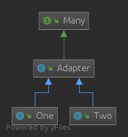

## 定义
适配器模式：
将一个接口转换为客户希望的另一个接口，适配器类使那些接口不兼容的类可以一起工作，其别名为包装器，适配器模式既可以作为类结构型模式，也可以作为对象结构型模式。

## 结构
<!--more-->
Target: 目标类/接口：抽象或者接口，提供一组方法的接口
Adapter：适配器类
Adaptee：适配类：被调用的用来适配的类

## 例子
有一个接口有两个方法，sort和reverse。想要利用以前实现的这两个方法。可以这样做：
### 类适配器
目标类
~~~java
/**
 * 目标类，提供客户想要适用的接口
 */
public interface Target {
    void sort(int[] nums);
    void resverse(int[] nums);
}
~~~

待适配的类
~~~java
public class QuickSort {
    public void quickSort(int[] nums){
        Arrays.sort(nums);
    }

}
~~~
~~~java
public class Reverse {
    public void reverse(int[] nums){
        for (int i = 0; i <nums.length>>1 ; i++) {
            int temp=nums[i];
            nums[i]=nums[nums.length-i-1];
            nums[nums.length-i-1]=temp;
        }
    }

}
~~~

适配类：
~~~java

public class Adapter implements Target{

    private QuickSort quickSort;
    private Reverse reverse;

    public Adapter(QuickSort quickSort, Reverse reverse) {
        this.quickSort = quickSort;
        this.reverse = reverse;
    }

    @Override
    public void sort(int[] nums) {
        quickSort.quickSort(nums);
    }

    @Override
    public void resverse(int[] nums) {
        reverse.reverse(nums);
    }
}
~~~

客户类：
~~~java
public class Client {

    public static void main(String[] args) {
        Target target=new Adapter();
        int[] nums=new int[]{1,3,2,5,4};
        target.sort(nums);
        System.out.println(Arrays.toString(nums));//[1, 2, 3, 4, 5]
        target.resverse(nums);
        System.out.println(Arrays.toString(nums));//[5, 4, 3, 2, 1]
    }
}
~~~

类图：

### 接口适配器

当一个接口中有很多方法，但是我此时只需要其中一种方法，有时又需要其他的一种方法，可以这样：

接口：有很多方法
~~~java

public interface Many {
    void methed1();
    void methed2();
    void methed3();
    void methed4();
    void methed5();
    void methed6();
    void methed7();
}
~~~

适配器:一个类实现了该接口，但是都是空方法
~~~java

public class Adapter implements Many {
    @Override
    public void methed1() {

    }

    @Override
    public void methed2() {

    }

    @Override
    public void methed3() {

    }

    @Override
    public void methed4() {

    }

    @Override
    public void methed5() {

    }

    @Override
    public void methed6() {

    }

    @Override
    public void methed7() {

    }
}
~~~

target类
~~~java
public class One extends Adapter {
    @Override
    public void methed1(){
        System.out.println("one use methedOne");
    }
}
~~~
~~~java
public class Two extends Adapter{
    @Override
    public void methed2(){
        System.out.println("one use methedTwo");
    }
}
~~~

类图:

## 优点
- 实现代码复用，将目标类和适配者类解耦，通过引入一个适配器类来重用现有的适配者类，而无须修改原有代码。
- 灵活，可以更改适配器类

## 适用环境
- 系统需要使用现有的类，而这些类的接口不符合系统的需要。
- 想要建立一个可以重复使用的类，用于与一些彼此之间没有太大关联的一些类，包括一些可能在将来引进的类一起工作。

参考  
[https://design-patterns.readthedocs.io/zh_CN/latest/structural_patterns/adapter.html](https://design-patterns.readthedocs.io/zh_CN/latest/structural_patterns/adapter.html)